# APIゲートウェイ(Apigw)

さくらのクラウドのAPIゲートウェイ(Apigw)サービスを管理できます。バックエンドのAPIサーバー(Service)を、公開用のホスト・パス・HTTPメソッド等を指定した経路(Route)経由でインターネットに公開する仕組みです。独自ドメイン・TLS証明書の紐付けや、Basic認証等のためのユーザー・グループ管理も行えます。

## 全体像

- **サブスクリプション(Subscription)**: プラン(Plan)への契約。Serviceを作成するには、事前に未使用のサブスクリプションを1つ契約しておく必要がある(1 サブスクリプション : 1 Service)
- **サービス(Service)**: バックエンドのAPIサーバー(プロトコル・ホスト・パス・ポート等)の接続情報。契約済みのサブスクリプションに紐付けて作成する
- **ルート(Route)**: サービスをインターネットに公開する経路。公開パス・許可HTTPメソッド・HTTPSリダイレクト等を設定する。サービスの詳細ページから管理する
- **ユーザー(User)** / **グループ(Group)**: Basic認証等でRouteへのアクセスを制限する際の認証主体。ユーザーは複数のグループに所属できる
- **ドメイン(Domain)** / **証明書(Certificate)**: 独自ドメインでサービスを公開する場合に使う。証明書はドメインに紐付ける

いずれもゾーンに依存しないグローバルリソースで、サイドバーの「グローバルリソース」内「APIゲートウェイ」から一覧に入り、タブで切り替えます。

## サービス(Service)

一覧には各サービスの名前・プロトコル・接続先(ホスト:ポート+パス)・紐づくサブスクリプション・公開ホスト・作成日が表示されます。行をクリックすると詳細ページに遷移します。

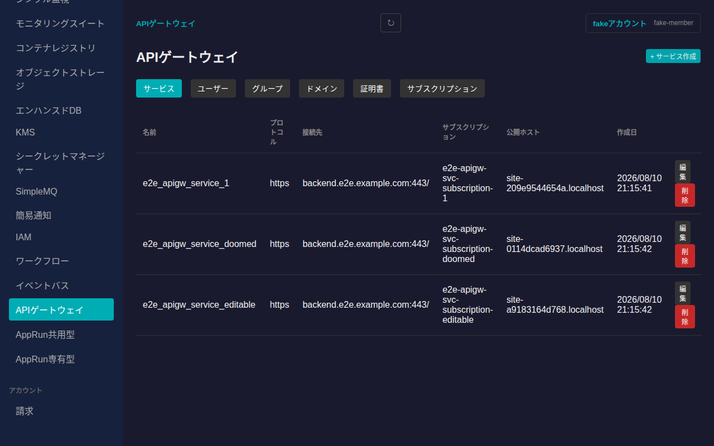

「+ サービス作成」から新規作成できます。名前は半角英数字とアンダースコアのみ使用できます。サブスクリプションは未使用のもの(まだ他のサービスに紐づいていないもの)のみ選択肢に表示され、選択肢が無い場合は先にサブスクリプションタブで契約する必要があります(ボタンが無効化され、その旨がツールチップで表示されます)。

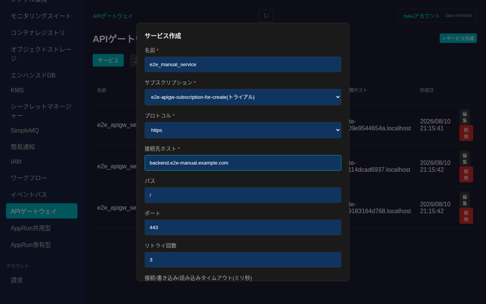

### サービス詳細

サービス名をクリックすると、基本情報(接続先・公開ホスト・タイムアウト等、インライン編集可能)と、そのサービスに属するルート一覧が表示されます。

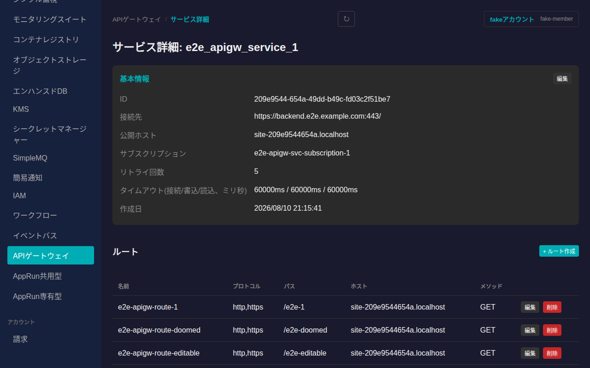

「+ ルート作成」から新規ルートを作成できます。名前は必須です。プロトコル(http/https)、公開パス、ホスト(未指定時は自動発行ホストを使用)、許可するHTTPメソッド(未選択時は全メソッド許可)、HTTPSリダイレクトのステータスコード、正規表現優先度、stripPath(リクエストパスからルートのパスを削除するか)、preserveHost(Hostヘッダーを保持するか)を指定できます。

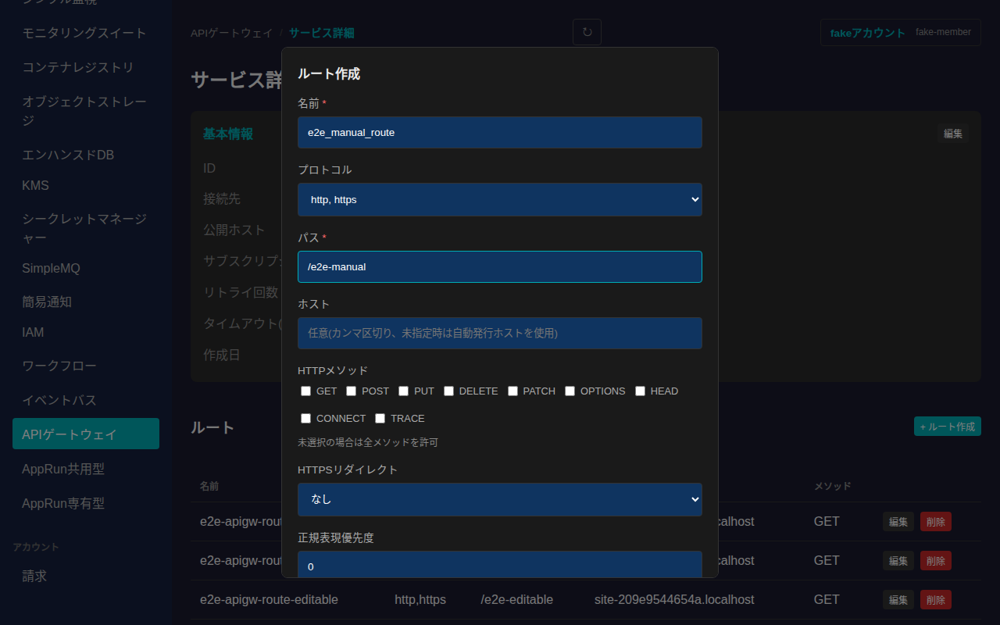

作成したルートは各行の「編集」「削除」から変更・削除できます。

## ユーザー(User)

一覧には各ユーザーの名前・カスタムID・所属グループ・タグ・作成日が表示されます。

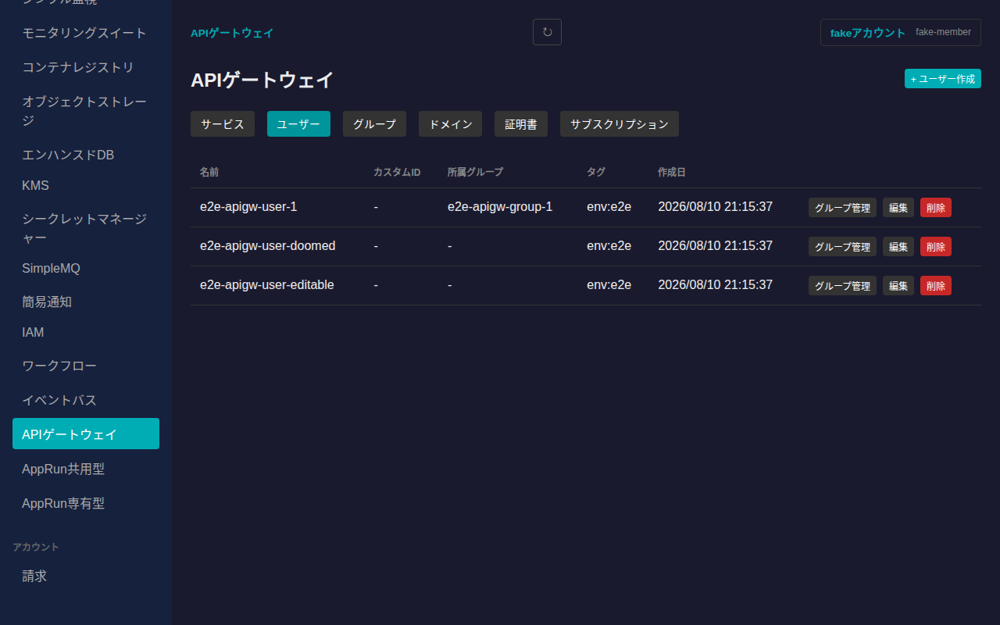

APIの仕様上、グループへの所属はユーザー作成時には設定できず、作成後に各行の「グループ管理」から個別に割り当てます。モーダルでチェックボックスを切り替えると即座に反映されます。

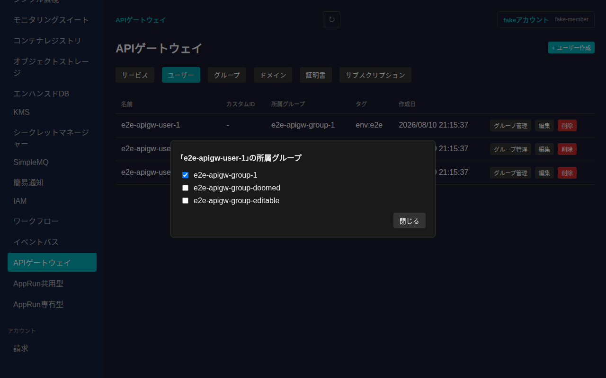

## グループ(Group)

一覧には各グループの名前・タグ・作成日が表示されます。「+ グループ作成」から作成、各行の「編集」「削除」から変更・削除できます。

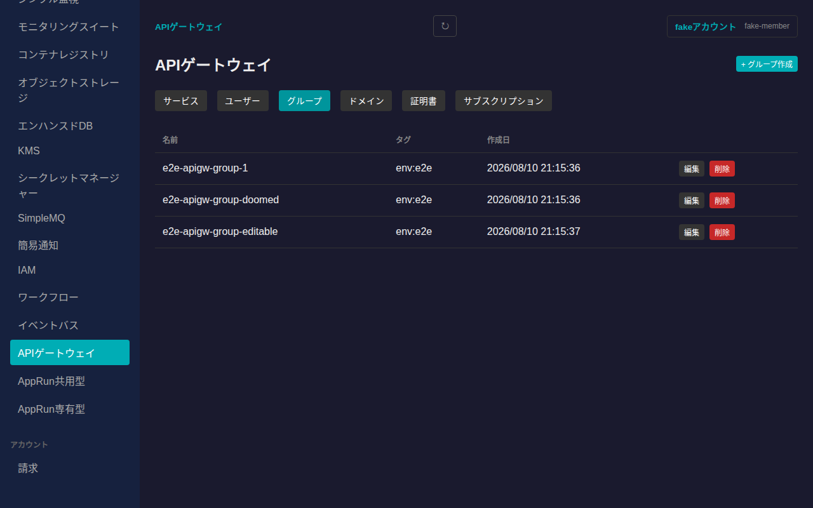

## ドメイン(Domain)

一覧には各ドメインのドメイン名・紐づく証明書が表示されます。「+ ドメイン作成」で新規ドメインを登録し、各行の「編集」で紐づける証明書を変更できます(証明書は後から未設定/変更が可能)。

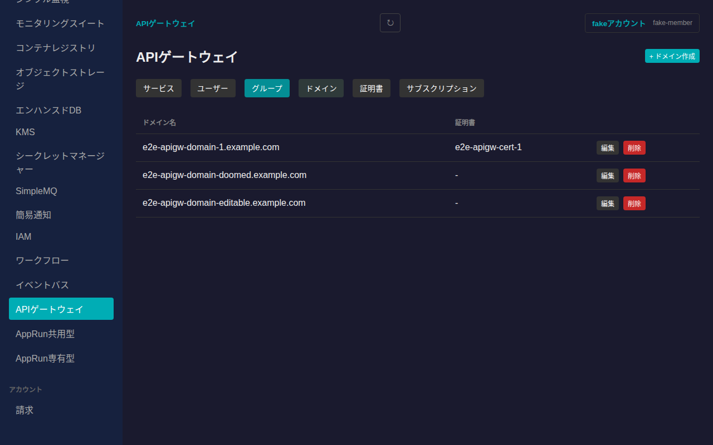

## 証明書(Certificate)

一覧には各証明書の名前・RSA/ECDSA証明書の有効期限・作成日が表示されます。証明書本体・秘密鍵はAPI仕様上書き込み専用でレスポンスにエコーバックされないため、一覧や編集フォームの初期値には表示されません(更新する場合のみ入力してください)。RSA・ECDSAのいずれか一方または両方を指定できます。

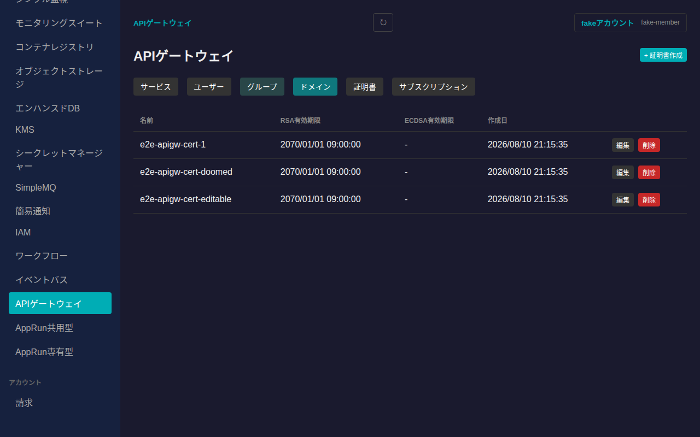

## サブスクリプション(Subscription)

一覧には各サブスクリプションの名前・プラン・紐づくサービス・今月のリクエスト数が表示されます。

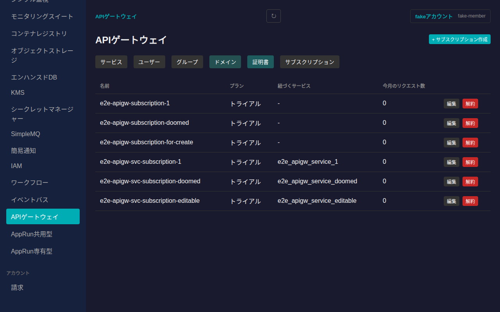

「+ サブスクリプション作成」からプランを選んで契約できます。プランごとの月額料金・最大サービス数等はここで確認できます。

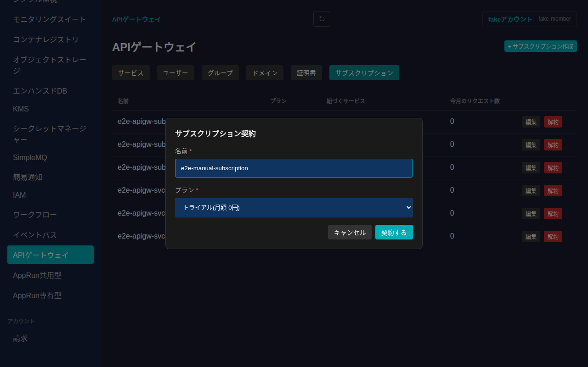

サービスが紐づいているサブスクリプションは解約できません。先に紐づくサービスを削除してください。

## 削除

サービス・ルート・ユーザー・グループ・ドメイン・証明書・サブスクリプションいずれも、各行の「削除」(サブスクリプションのみ「解約」)ボタンから削除できます。取り消し不可である旨を明記した確認ダイアログが表示されます。

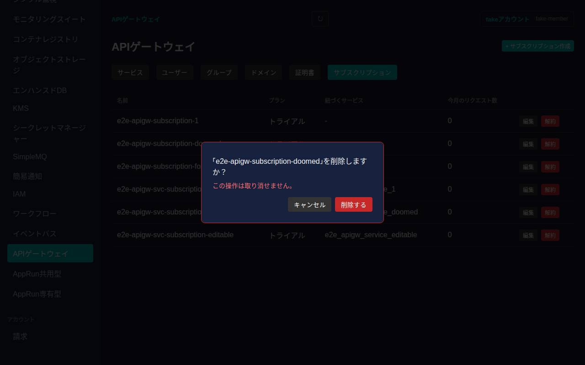
