# AppRun専有型

さくらのクラウドのAppRun専有型を、クラスタ → アプリケーション/Auto Scaling Group(ASG) → バージョン/ロードバランサーという階層で操作します。クラスタ・アプリケーション・ASG・ロードバランサーの作成/削除、新バージョンのデプロイ、バージョンのアクティブ化/非アクティブ化ができます。

## クラスタ一覧

サイドバーの「グローバルリソース」内「AppRun専有型」から一覧に入ります。クラスタはゾーンに依存しないグローバルリソースです。

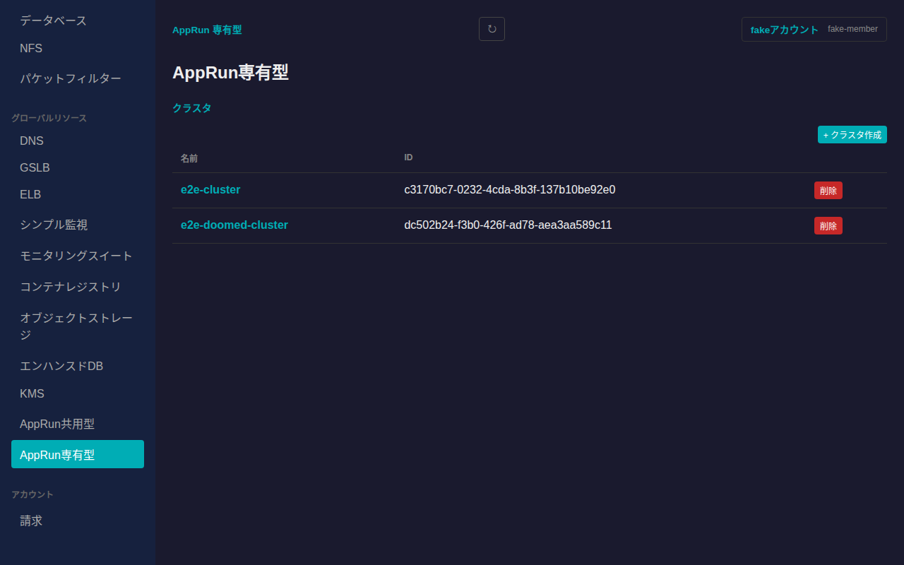

一覧右上の「+ クラスタ作成」から、名前・Let's Encrypt用メールアドレス・サービスプリンシパルID・公開ポートを指定してクラスタを新規作成できます。

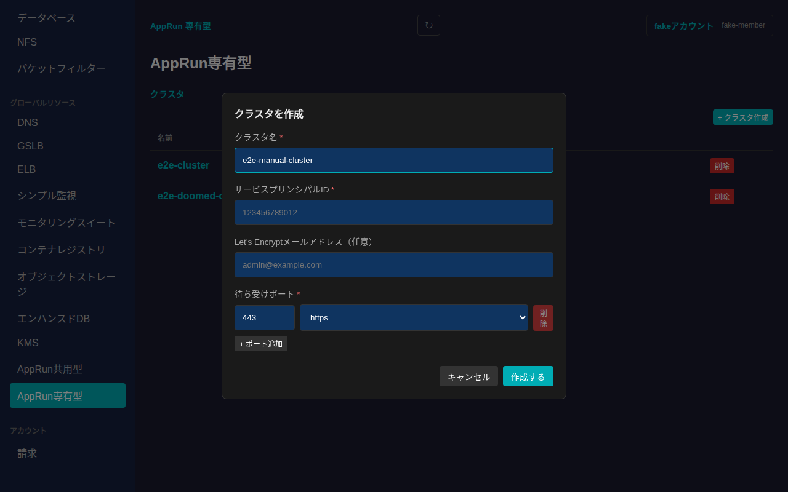

## クラスタ詳細

一覧で名前をクリックするとクラスタ詳細に遷移し、パンくずリスト(「クラスタ / <クラスタ名>」)で一覧に戻れます。アプリケーション一覧・Auto Scaling Group一覧・証明書一覧が表示されます。

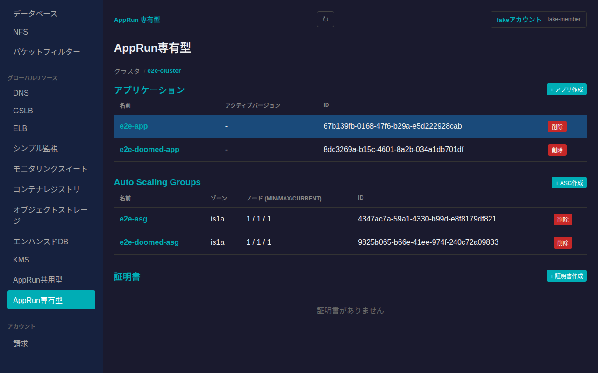

「+ アプリ作成」「+ ASG作成」「+ 証明書作成」からそれぞれ新規作成できます(ASGの作成にはスイッチ等のネットワーク情報の指定が必要です)。各行の「削除」から個別に削除できます。

## アプリケーション: バージョン一覧とデプロイ

アプリケーション行をクリックするとバージョン一覧に遷移します。

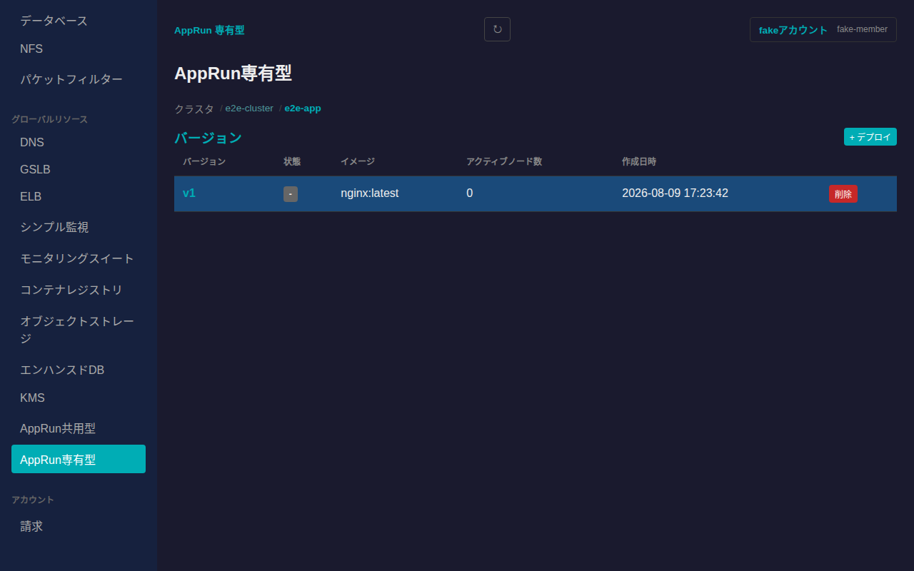

「+ デプロイ」から新しいバージョンをデプロイできます。コンテナイメージは必須項目で、CPU/メモリ・スケーリング設定(手動/CPU使用率)・コマンド・公開ポート・環境変数を指定できます。

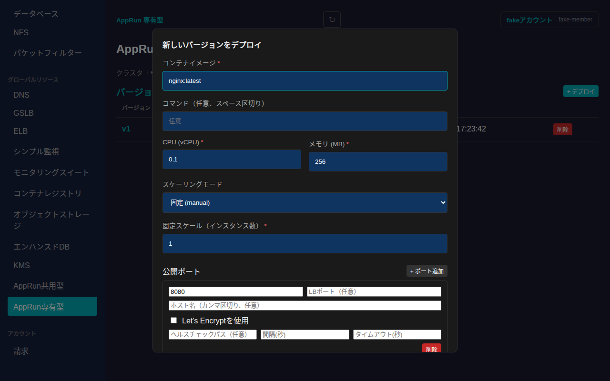

「デプロイする」を押すと新しいバージョンが一覧に追加されます。

### バージョンのアクティブ化・非アクティブ化

バージョン行をクリックすると詳細に遷移します。右上の「⋯」から操作メニューを開けます。

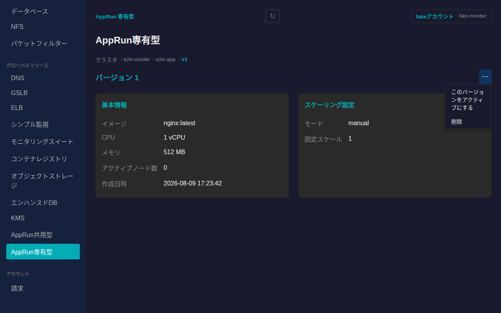

「このバージョンをアクティブにする」を選ぶと、そのバージョンがアクティブになりトラフィックを受け付けます。パンくずでバージョン一覧に戻ると、アクティブなバージョンの行に「非アクティブ化」ボタンが表示されます。

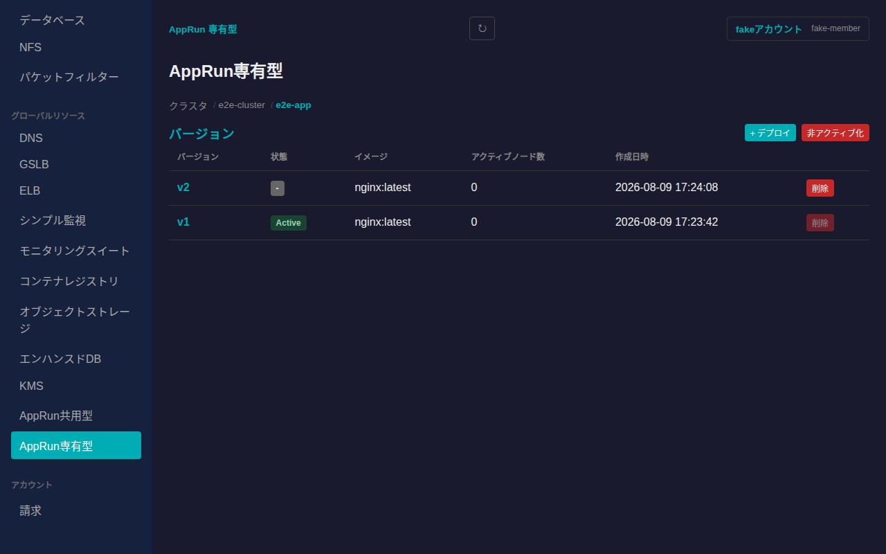

「非アクティブ化」を押すとトラフィックの受け付けを停止します。

## ASG詳細: ロードバランサーとワーカーノード

ASG行をクリックするとASG詳細に遷移し、配下のロードバランサー(ノードの状態・IPアドレス)とワーカーノード(状態・Draining状態・IPアドレス)が確認できます。

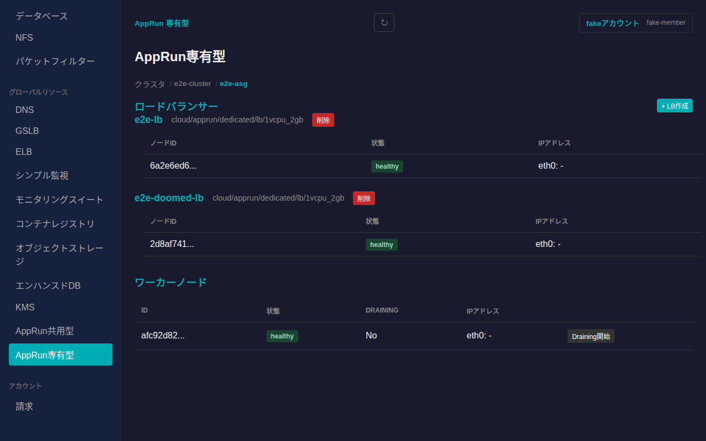

「+ LB作成」から新しいロードバランサーを追加できます。各ロードバランサーの「削除」を押すと、取り消し不可である旨を明記した確認ダイアログが表示されます。

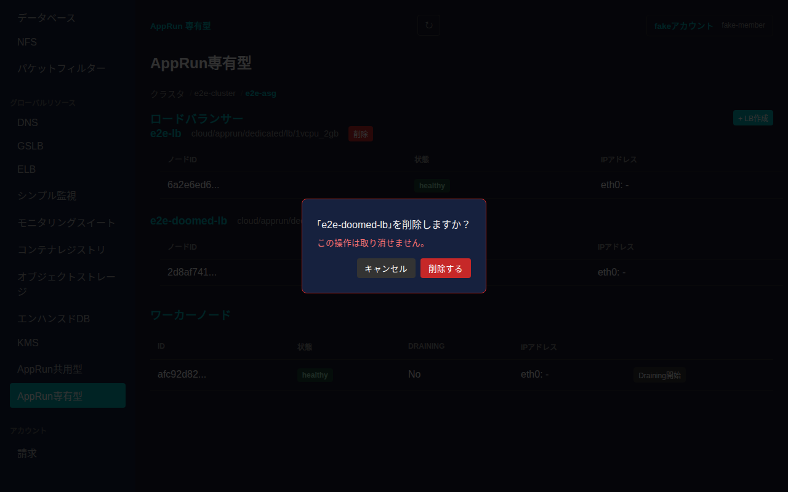

## 削除

ASG・アプリケーション・クラスタは、それぞれの一覧の「削除」ボタンから削除できます。いずれも確認ダイアログが表示されます。

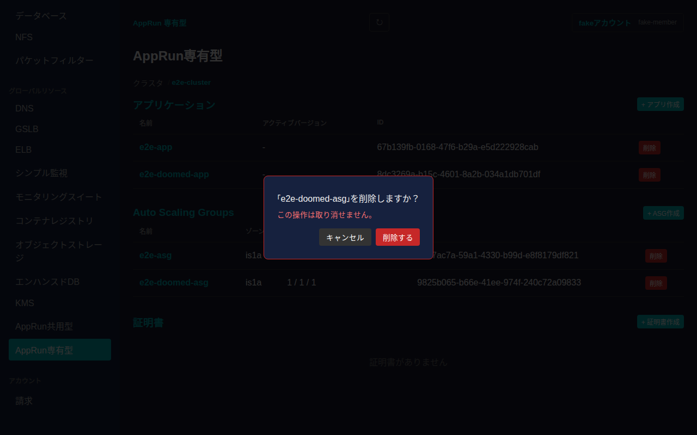

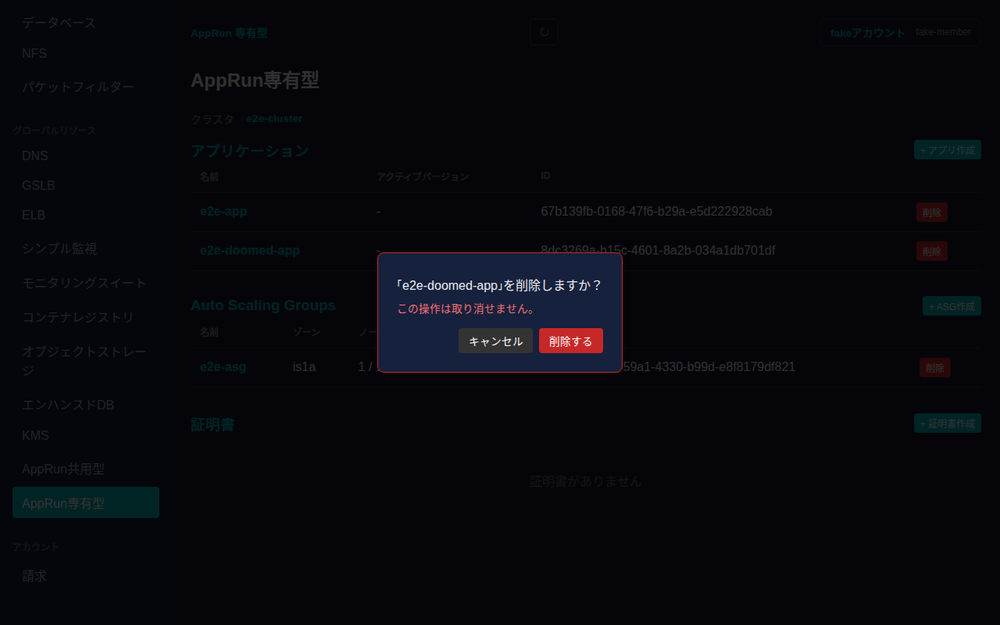

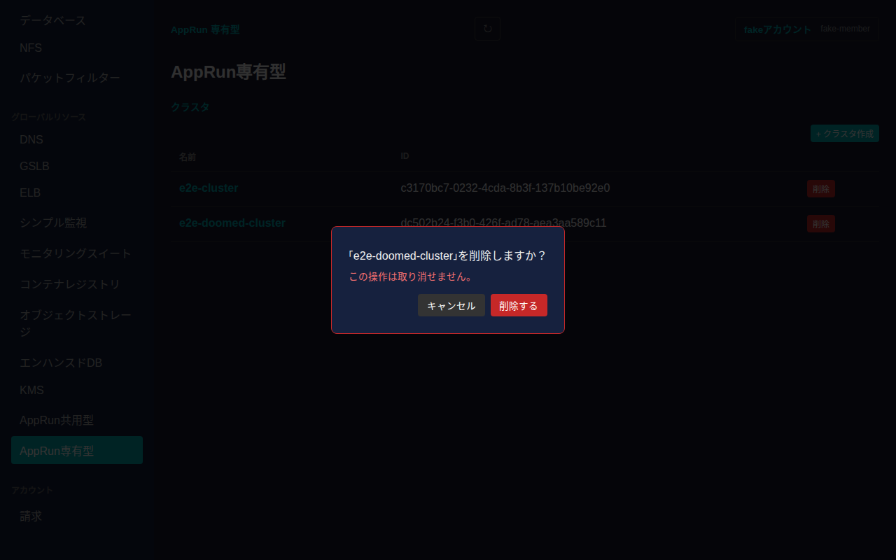

「削除する」を押すと対象が削除され、一覧から消えます。
