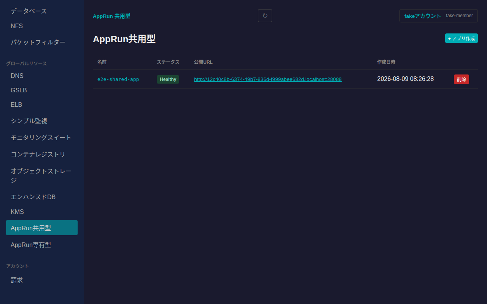
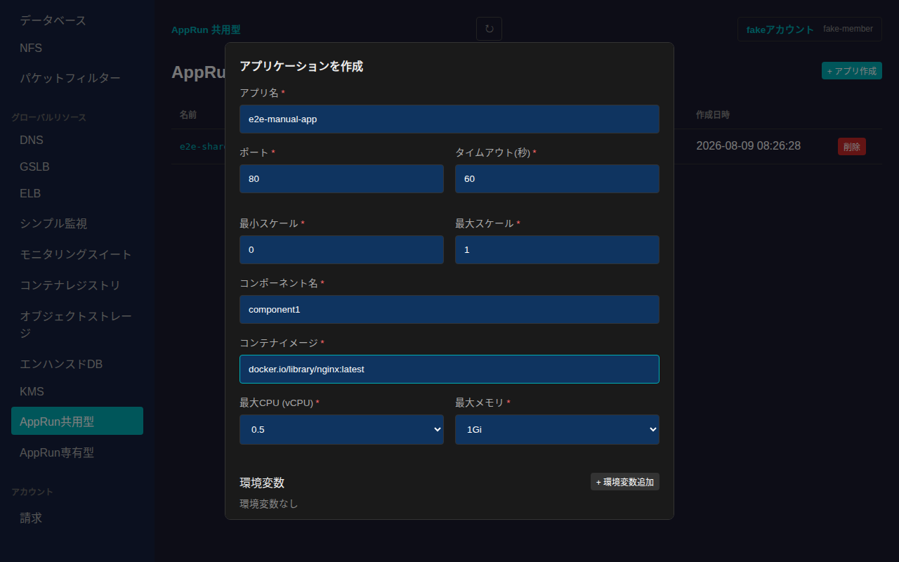
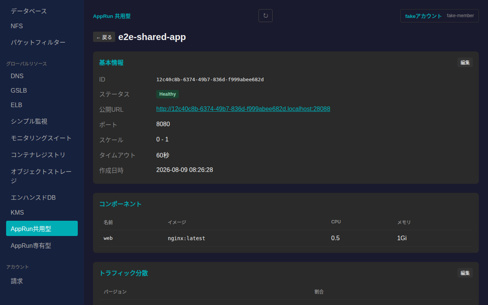
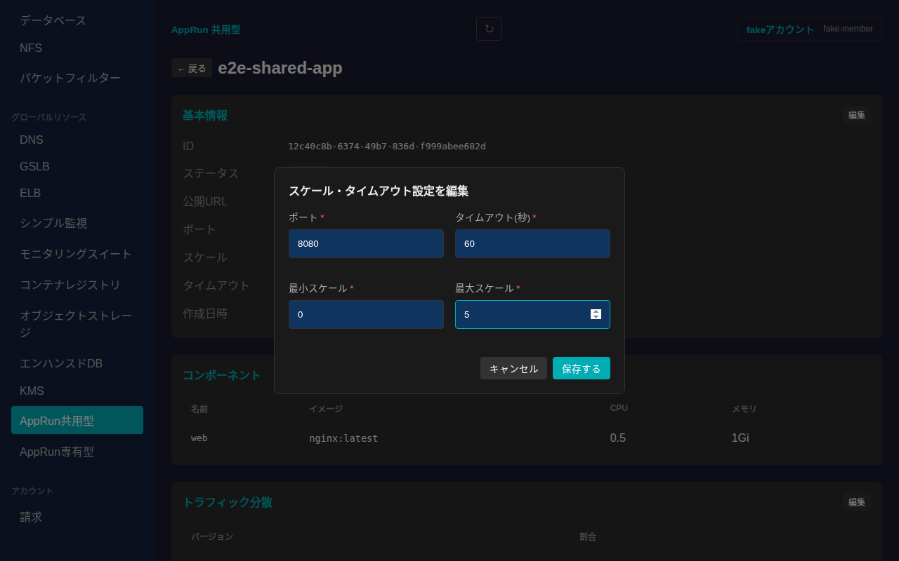
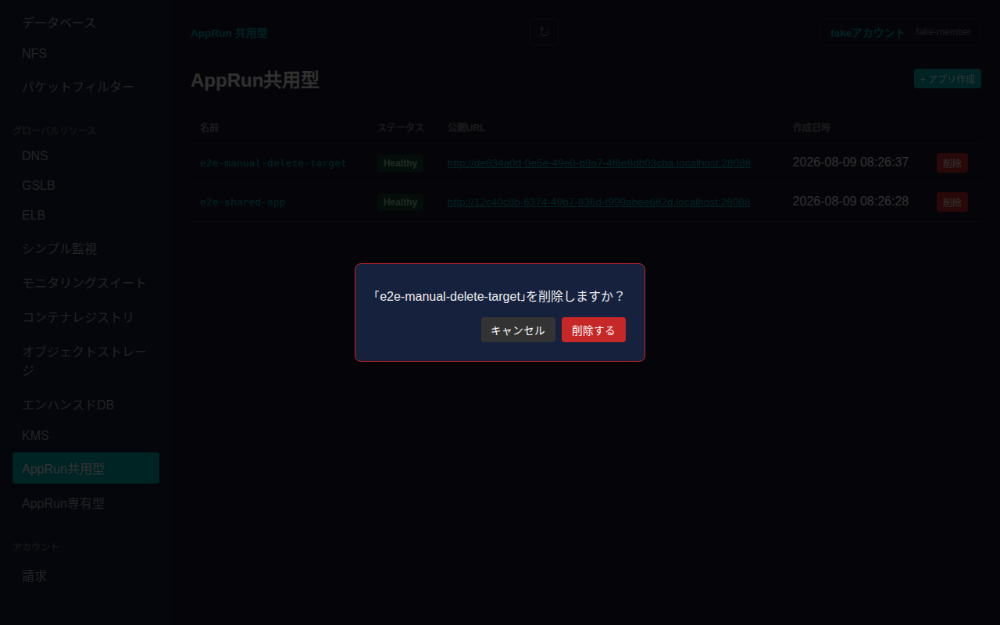

# AppRun共用型

さくらのクラウドのAppRun共用型を一覧・作成・削除し、詳細画面から基本情報の編集(スケール・タイムアウト等)、コンポーネント・トラフィック分散・バージョン履歴の確認ができます。

## 一覧画面

サイドバーの「グローバルリソース」内「AppRun共用型」から一覧に入ります。AppRun共用型はゾーンに依存しないグローバルリソースです。一覧には名前・ステータス・公開URL・作成日時が表示されます。

## 作成

一覧右上の「+ アプリ作成」からアプリケーションを新規作成できます。アプリ名・ポート・タイムアウト・最小/最大スケールに加え、最初のコンポーネント(コンポーネント名・コンテナイメージ・最大CPU/メモリ・環境変数)を指定します。アプリ名・ポート・タイムアウト・スケール・コンポーネント名・コンテナイメージ・CPU/メモリは必須項目です。

「作成する」を押すと一覧に反映されます。

## 詳細画面

一覧で名前をクリックすると詳細画面に遷移します。基本情報(ID・ステータス・公開URL・ポート・スケール・タイムアウト・作成日時)、コンポーネント一覧、トラフィック分散、バージョン履歴が表示されます。

### 基本情報の編集

「基本情報」カードの「編集」から、ポート・タイムアウト・最小/最大スケールを編集できます。

値を入力してから「保存する」を押すと反映されます。

### トラフィック分散・バージョン履歴

複数バージョンが存在する場合、「トラフィック分散」カードの「編集」からバージョンごとの振り分け割合を編集できます。「バージョン履歴」カードの各行の「削除」から、最新バージョン以外のバージョンを削除できます(最新かつ唯一のバージョンは削除できません)。

## 削除

一覧の各行にある「削除」ボタンを押すと、確認ダイアログが表示されます。

「削除する」を押すとアプリケーションが削除され、一覧から消えます。
