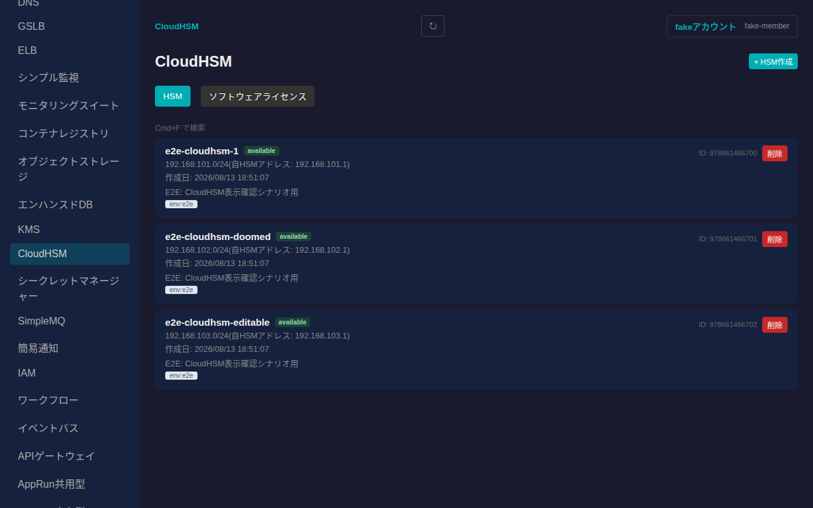
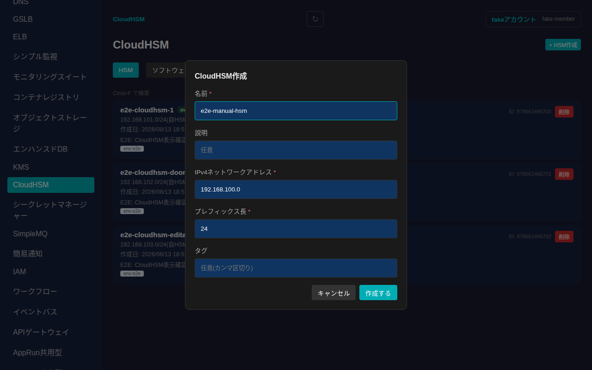
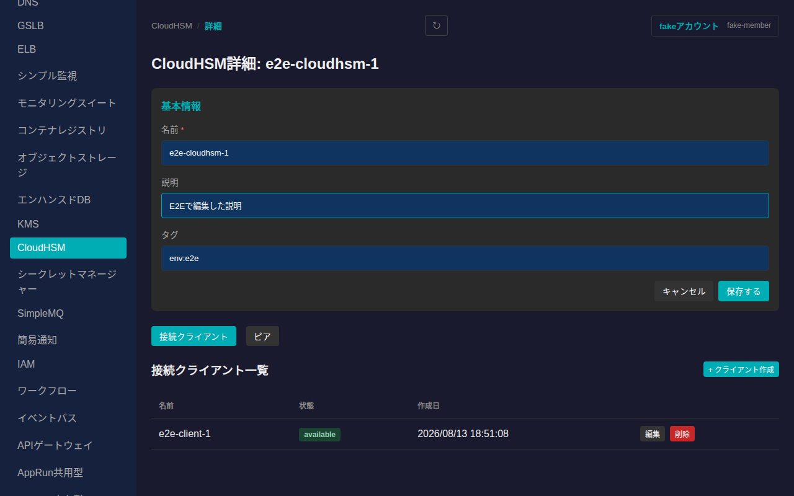
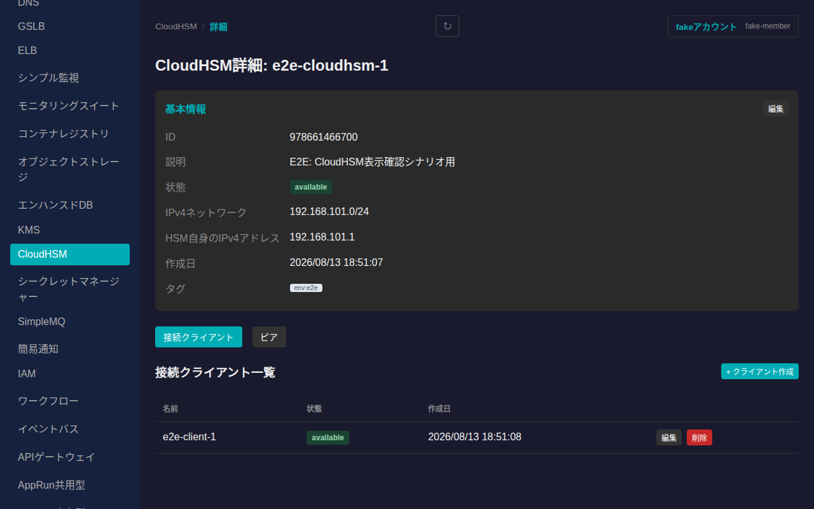
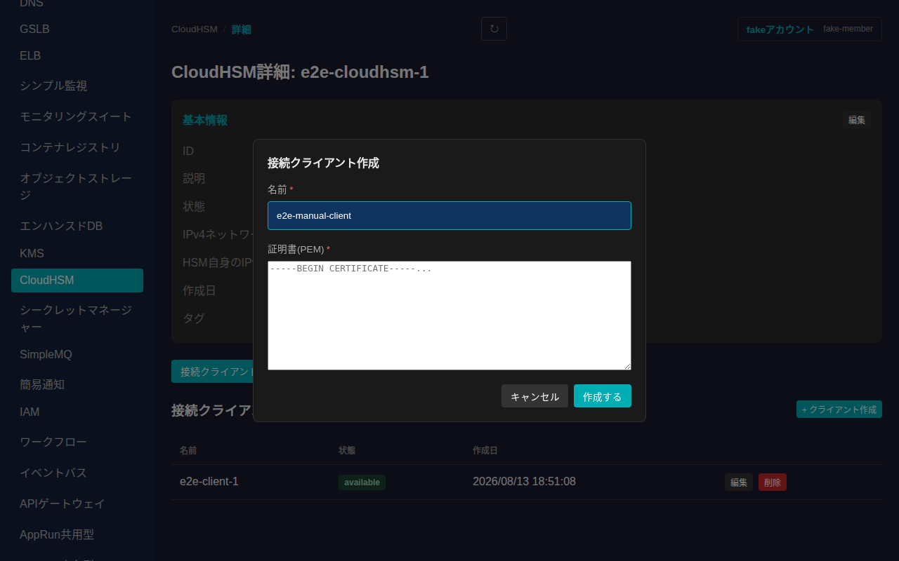
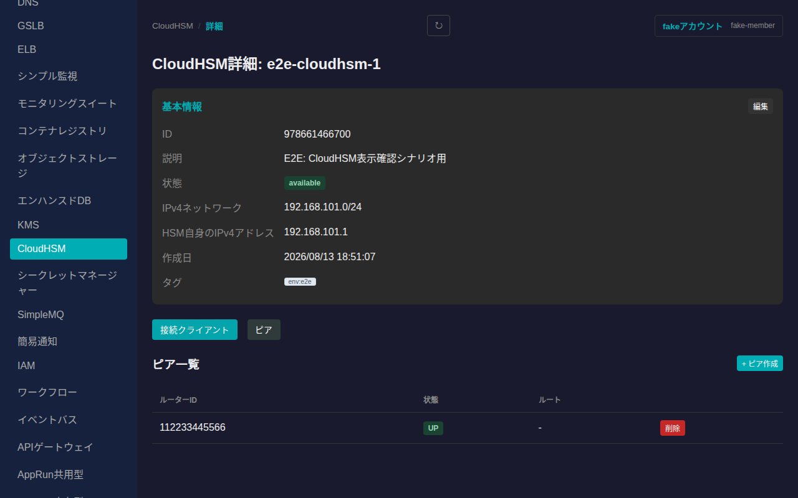
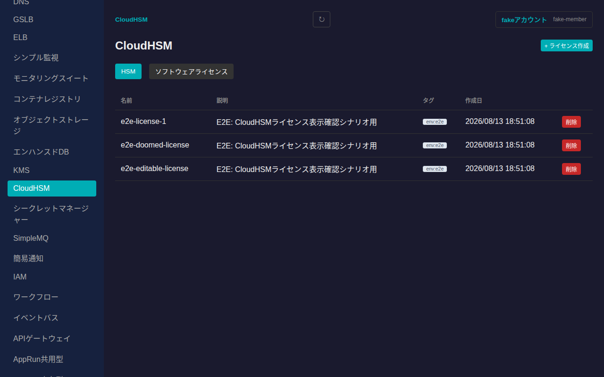
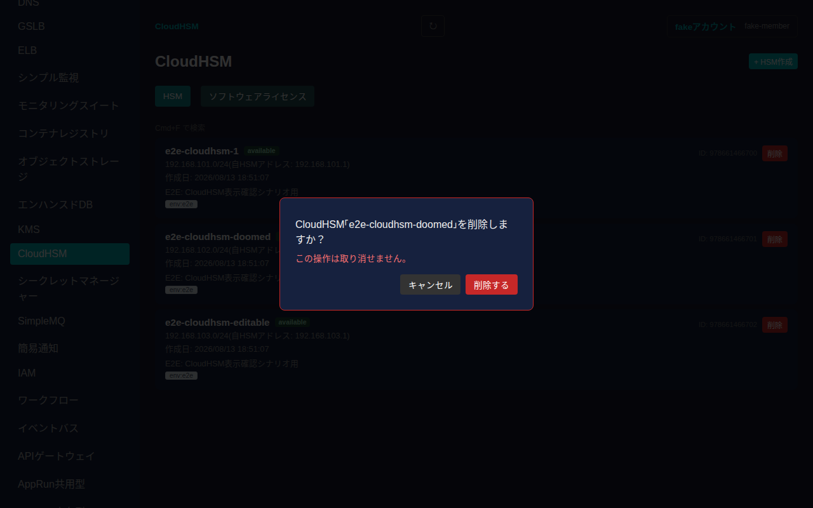

# CloudHSM

さくらのクラウドのCloudHSM(専有型のハードウェアセキュリティモジュール)のHSMパーティション・接続クライアント(証明書)・ピア(VPN対向ルーター)・ソフトウェアライセンスを管理できます。CloudHSMは物理的にis1bゾーンにのみ設置されるため、ゾーン非依存のグローバルリソースとして扱われます。

## 一覧画面

サイドバーの「グローバルリソース」内「CloudHSM」から一覧に入ります。「HSM」タブと「ソフトウェアライセンス」タブがあり、HSMタブではHSMパーティションのカード一覧(名前・状態・IPv4ネットワーク・HSM自身のIPv4アドレス・作成日・説明・タグ)が表示されます。

## HSMの作成

一覧右上の「+ HSM作成」からHSMパーティションを新規作成できます。名前・IPv4ネットワークアドレス・プレフィックス長が必須項目です。説明・タグは任意で指定できます。

「作成する」を押すと一覧に反映されます。sakumockのモック環境では作成直後に状態が「available」になりますが、実クラウド環境ではプロビジョニングに時間がかかる場合があります。

## 詳細画面

一覧でHSMのカードをクリックすると詳細画面に遷移します。基本情報(ID・説明・状態・IPv4ネットワーク・HSM自身のIPv4アドレス・作成日・タグ)が表示され、「編集」から名前・説明・タグを変更できます(IPv4ネットワークアドレス・プレフィックス長はサブネット定義のため変更できません)。

### 接続クライアント

「接続クライアント」タブでは、このHSMに対して証明書ベースで接続するクライアント(名前・状態・作成日)を確認できます。「+ クライアント作成」から名前とクライアント証明書(PEM形式)を指定して新規作成できます。「編集」では名前のみ変更できます(証明書は不変)。「削除」でクライアントを削除できます。

### ピア

「ピア」タブでは、HSM間VPN接続の対向ルーター(ルーターID・状態・ルート)を確認できます。「+ ピア作成」からルーターIDとシークレットキーを指定して新規作成できます。ピアは作成・削除のみ可能で、内容の編集はできません。

## ソフトウェアライセンス

「ソフトウェアライセンス」タブでは、HSM本体とは独立して契約するソフトウェアライセンス(名前・説明・タグ・作成日)を一覧・作成・削除できます。

## 削除

一覧の各HSMカードにある「削除」ボタンを押すと確認ダイアログが表示されます。

「削除する」を押すとHSMが削除され、一覧から消えます。

## 未対応の機能

- HSM/接続クライアント/ソフトウェアライセンスの一部フィールドはCloudHSM APIの内部的な固定値(`ServiceClass`等)であり、SakPilot側では常に固定値を送るため、フォームには含めていません。
