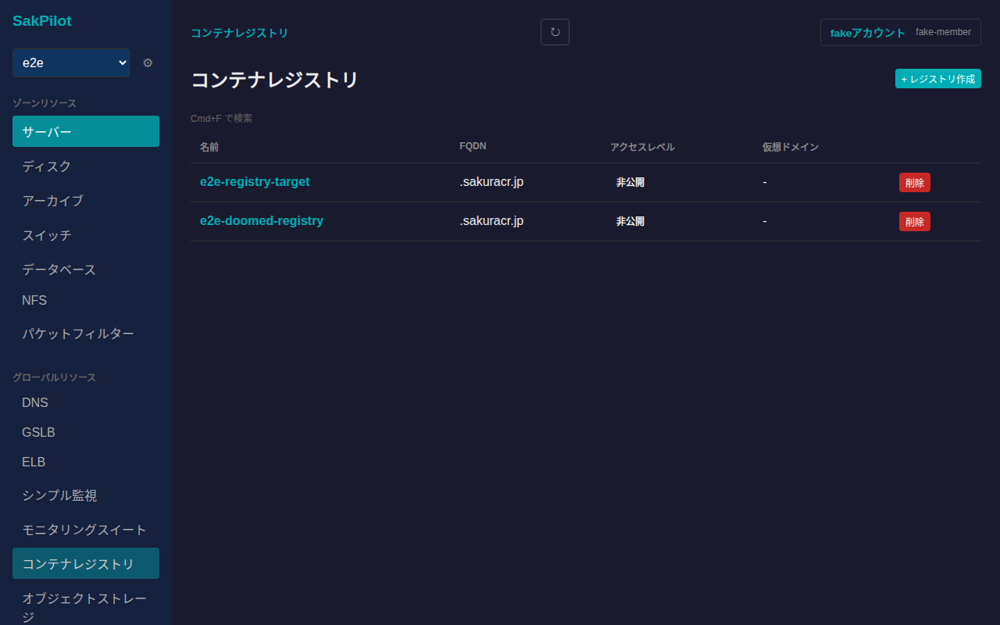
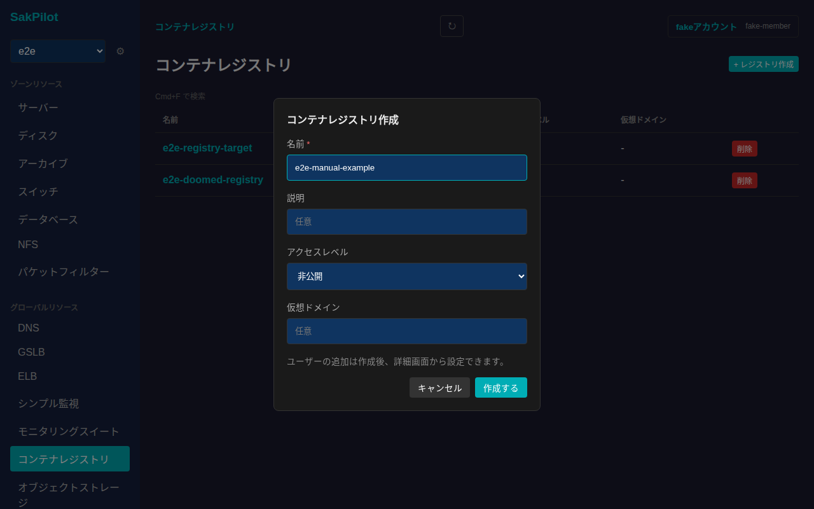
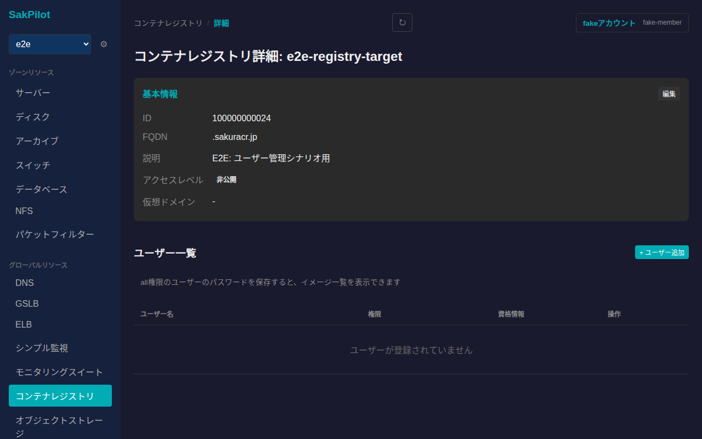
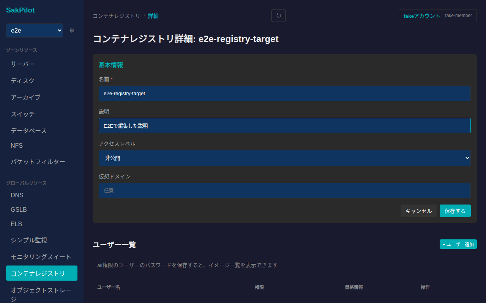
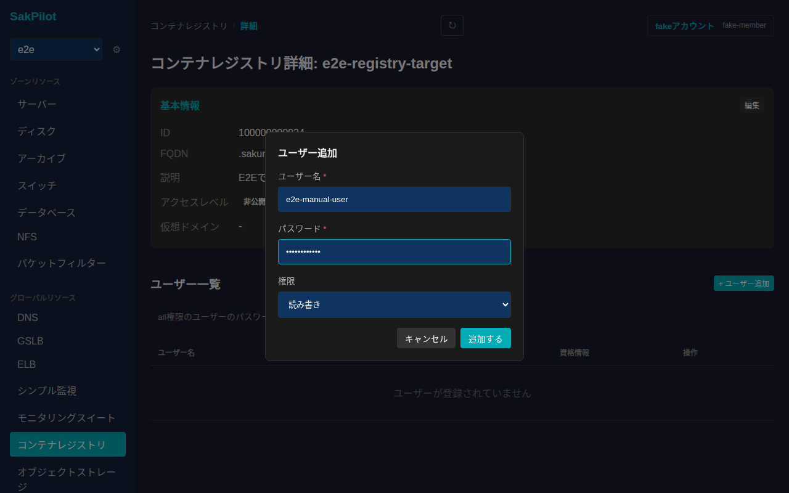
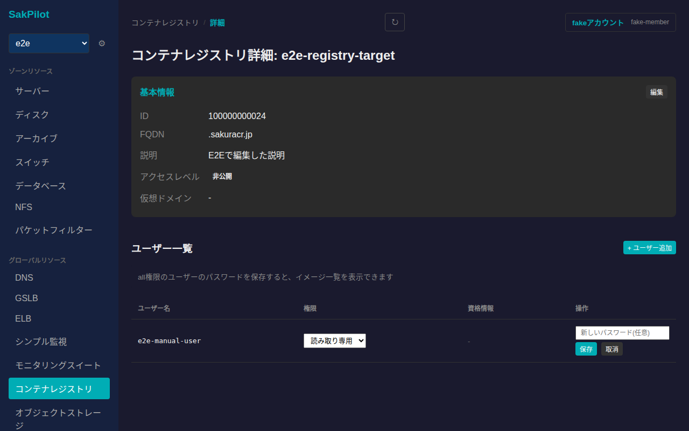
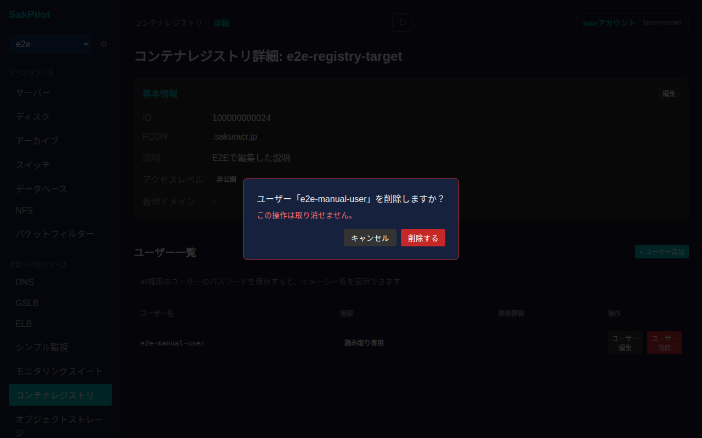
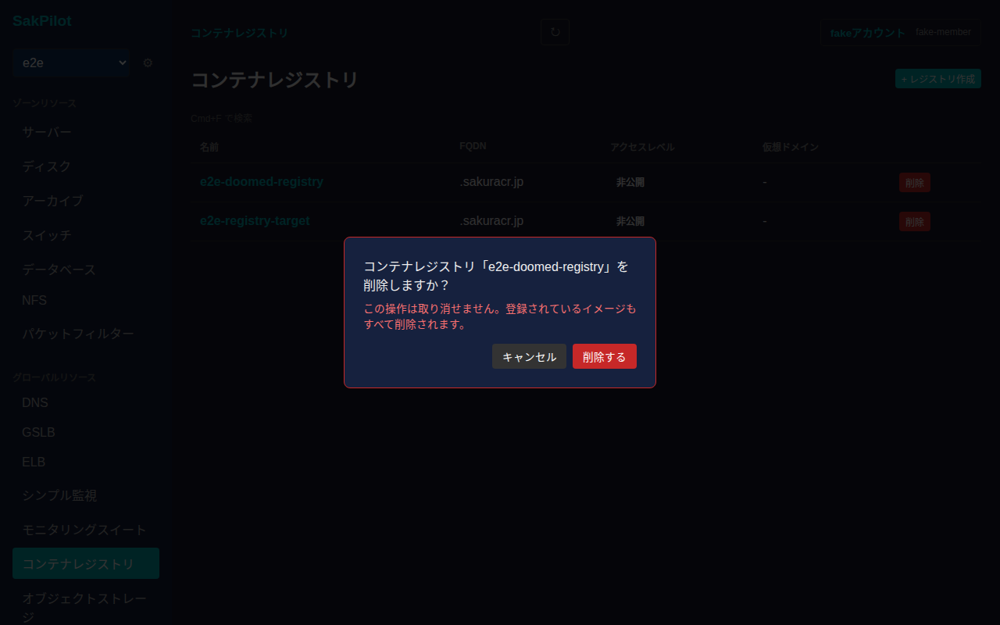

# コンテナレジストリ

さくらのクラウドのコンテナレジストリを一覧・作成・削除し、詳細画面から基本情報の編集、ユーザー(認証情報)の追加・編集・削除ができます。

## 一覧画面

サイドバーの「グローバルリソース」内「コンテナレジストリ」から一覧に入ります。コンテナレジストリはゾーンに依存しないグローバルリソースです。一覧には名前・FQDN・アクセスレベル・仮想ドメインが表示されます。

## 作成

一覧右上の「+ レジストリ作成」からコンテナレジストリを新規作成できます。名前は必須項目です。説明・アクセスレベル(非公開/読み取り専用で公開)・仮想ドメインは任意で指定できます。

ユーザーの追加は作成後、詳細画面から設定します。「作成する」を押すと一覧に反映されます。

## 詳細画面

一覧で名前をクリックすると詳細画面に遷移します。基本情報(ID・FQDN・説明・アクセスレベル・仮想ドメイン)とユーザー一覧が表示されます。

イメージ一覧は、all権限のユーザーのパスワードを保存すると表示できるようになります(実際のレジストリAPIへの接続が必要です)。

### 基本情報の編集

「基本情報」カードの「編集」から名前・説明・アクセスレベル・仮想ドメインを編集できます。

値を入力してから「保存する」を押すと反映されます。

### ユーザーの追加

「ユーザー一覧」の「+ ユーザー追加」から、ユーザー名・パスワード・権限(全権限/読み書き/読み取り専用)を指定してユーザーを追加できます。ユーザー名・パスワードは必須項目です。

「追加する」を押すと一覧に反映されます。

### ユーザーの編集

各ユーザー行の「ユーザー編集」から権限の変更や、パスワードの再設定ができます。

「保存」を押すと反映されます。

### ユーザーの削除

各ユーザー行の「ユーザー削除」を押すと、確認ダイアログが表示されます。

「削除する」を押すとユーザーが削除されます。

## 削除

一覧の各行にある「削除」ボタンを押すと、取り消し不可である旨(登録されているイメージも全て削除される旨)を明記した確認ダイアログが表示されます。

「削除する」を押すとコンテナレジストリが削除され、一覧から消えます。
