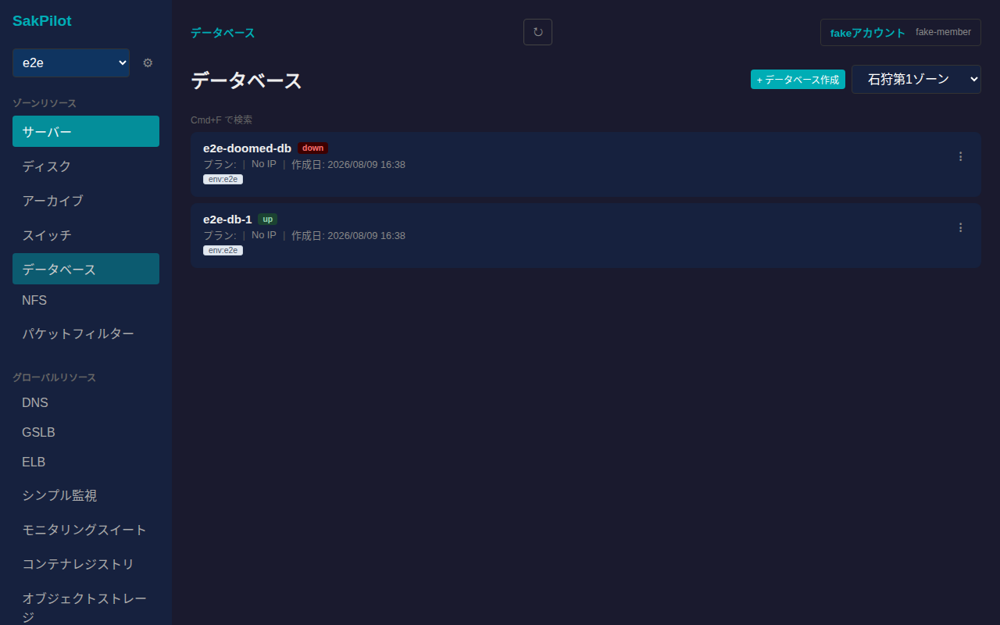
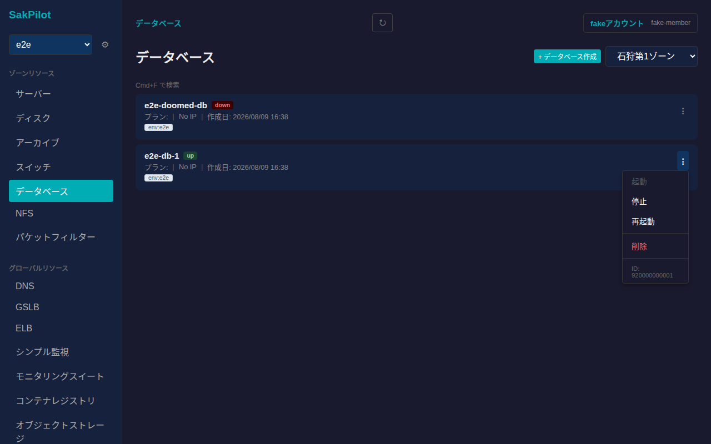
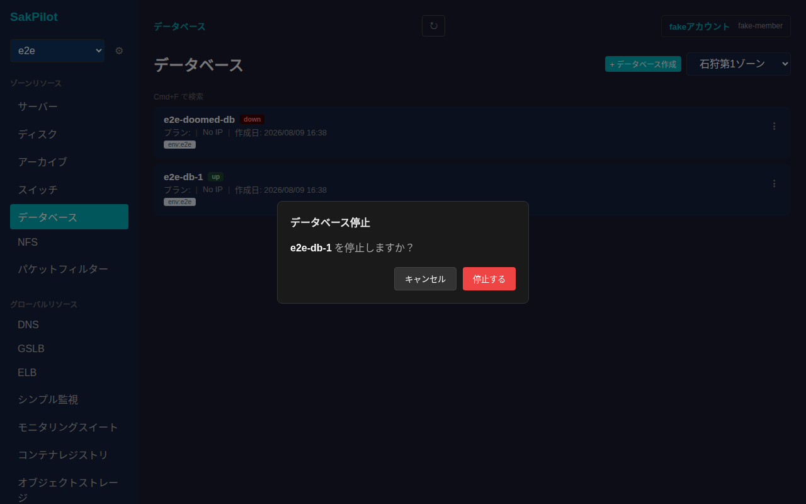
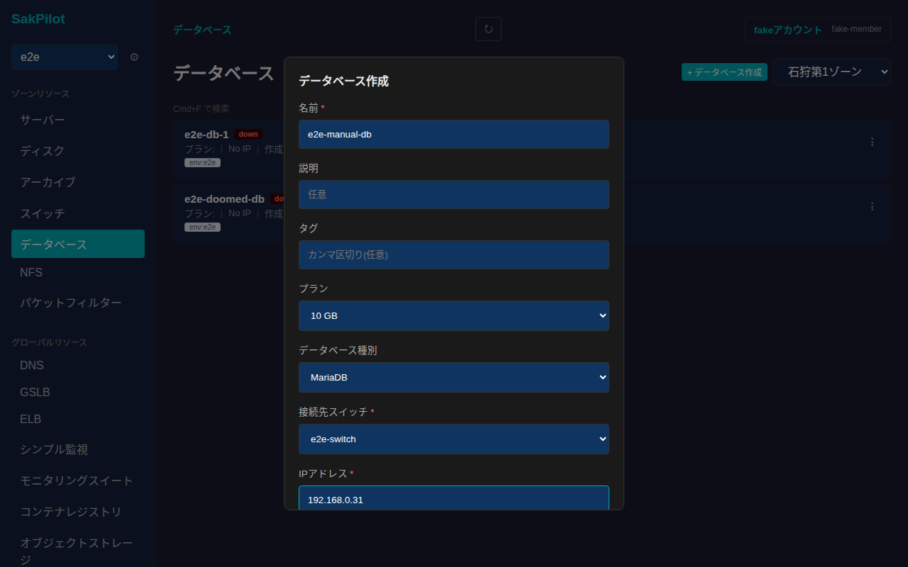
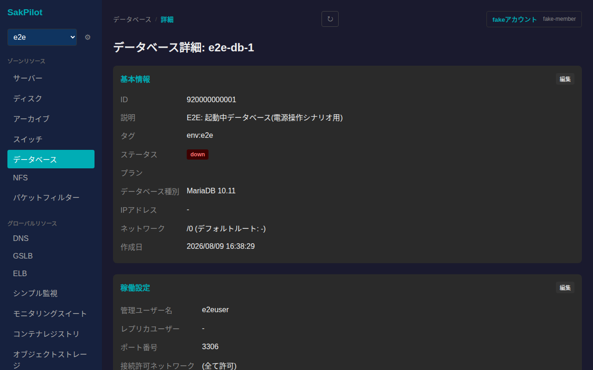
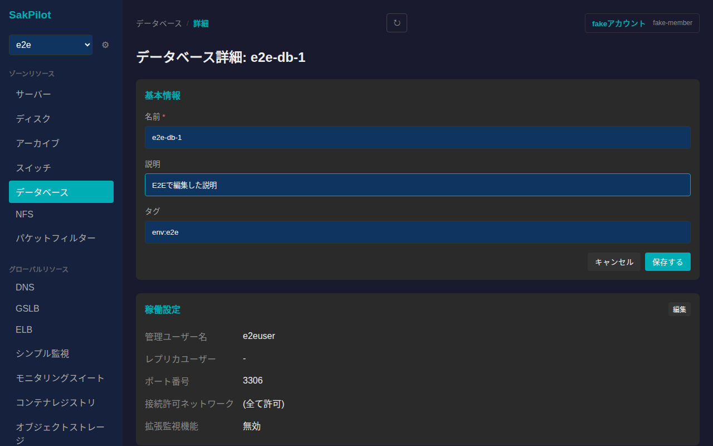
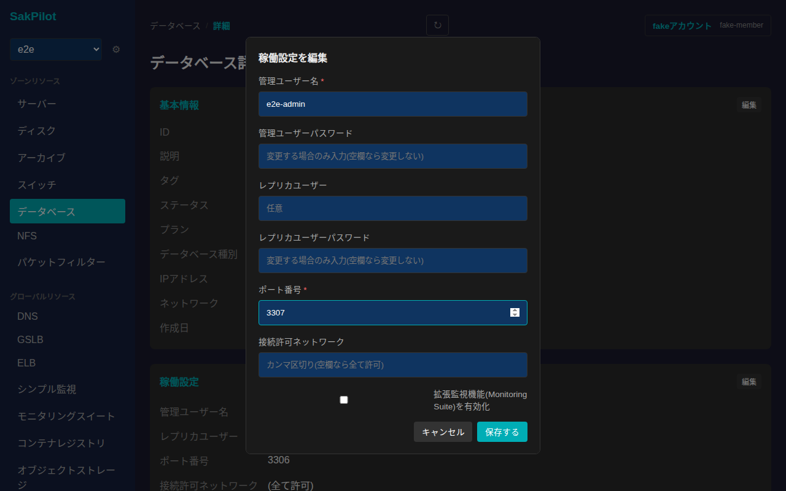
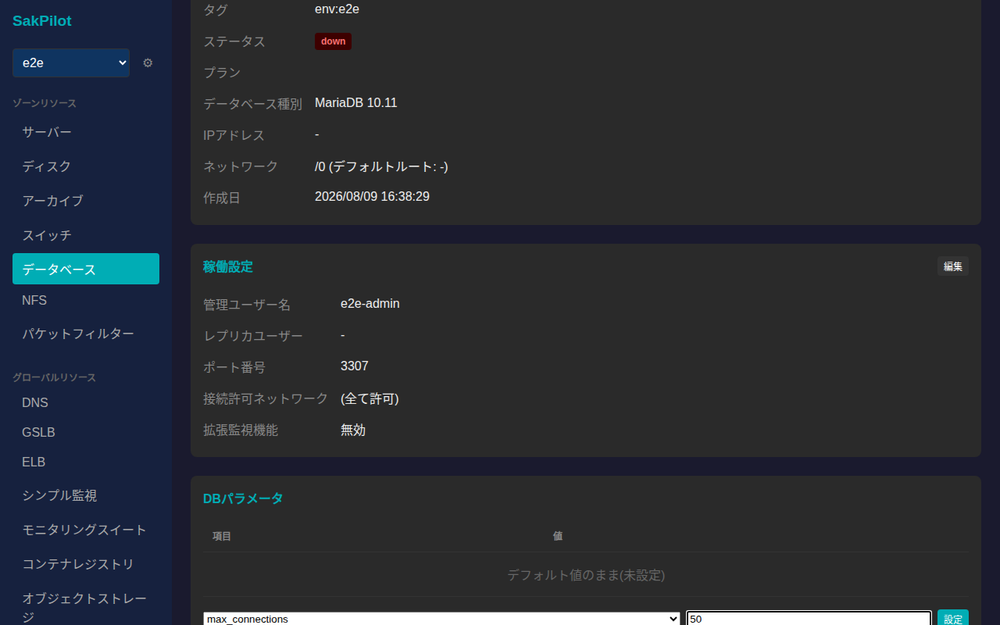
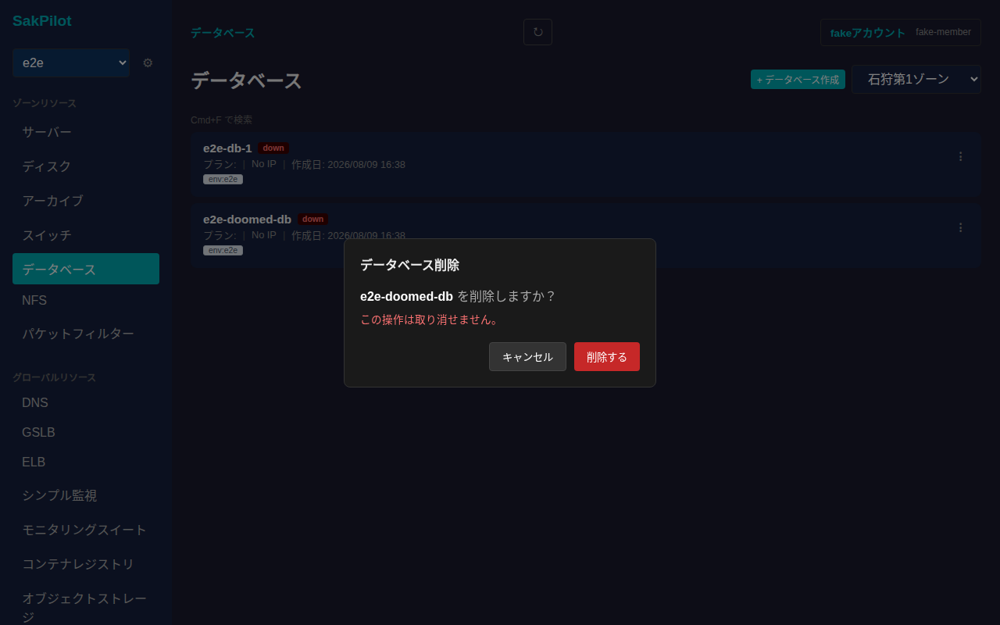

# データベース

さくらのクラウドのデータベース(MariaDB/PostgreSQLアプライアンス)を一覧・起動/停止/再起動・作成・削除し、詳細画面から基本情報・稼働設定・DBパラメータの編集ができます。データベースはゾーンに依存するリソースです。

## 一覧画面

サイドバーの「データベース」から一覧に入ります。カードには名前・ステータス(`up`/`down`)・プラン・IPアドレス・作成日・タグが表示されます。

各カード右端の「⋮」から起動・停止・再起動・削除の操作メニューが開きます。ステータスに応じて選択できない操作は無効化されます(起動中のデータベースは「起動」を選べない、など)。

## 起動・停止・再起動

操作メニューから「停止」を選ぶと確認ダイアログが表示されます。意図しない操作を防ぐため必ず確認を経由します。

「停止する」を押すと電源操作がリクエストされ、以降はポーリングでステータスが自動更新されます(`down`になるまで数秒かかることがあります)。起動・再起動も同様の確認ダイアログ経由で行います。

## 作成

一覧右上の「+ データベース作成」からデータベースを新規作成できます。名前・接続先スイッチ・IPアドレス・ネットワークマスク長・デフォルトルート・管理ユーザー名/パスワード・ポート番号は必須項目です。プラン(10GB〜1TB)・データベース種別(MariaDB/PostgreSQL)・説明・タグ・拡張監視機能(Monitoring Suite)は任意で指定できます。

必須項目を入力して「作成する」を押すと一覧に反映されます。

## 詳細画面

一覧でカードをクリックすると詳細画面に遷移します。基本情報(ID・説明・タグ・ステータス・プラン・データベース種別・IPアドレス・ネットワーク・作成日)に加えて、稼働設定・DBパラメータの各カードが並びます。

### 基本情報の編集

「基本情報」カードの「編集」から名前・説明・タグを編集できます。

値を入力してから「保存する」を押すと反映されます。

### 稼働設定の編集

「稼働設定」カードの「編集」から、管理ユーザー名/パスワード・レプリカユーザー名/パスワード・ポート番号・接続許可ネットワーク・拡張監視機能をまとめて編集できます。パスワード欄は空欄のままにすると変更されません。

値を入力してから「保存する」を押すと反映されます。

### DBパラメータの設定・リセット

「DBパラメータ」カードでは、データベースエンジン固有のパラメータ(例: `max_connections`)を項目選択+値入力で追加設定できます。

「設定」を押すと反映され、設定済みの項目は表の各行の「リセット」からデフォルト値に戻せます。

## 削除

一覧の操作メニューから「削除」を選ぶと、取り消し不可である旨を明記した確認ダイアログが表示されます。

「削除する」を押すとデータベースが削除され、一覧から消えます。
