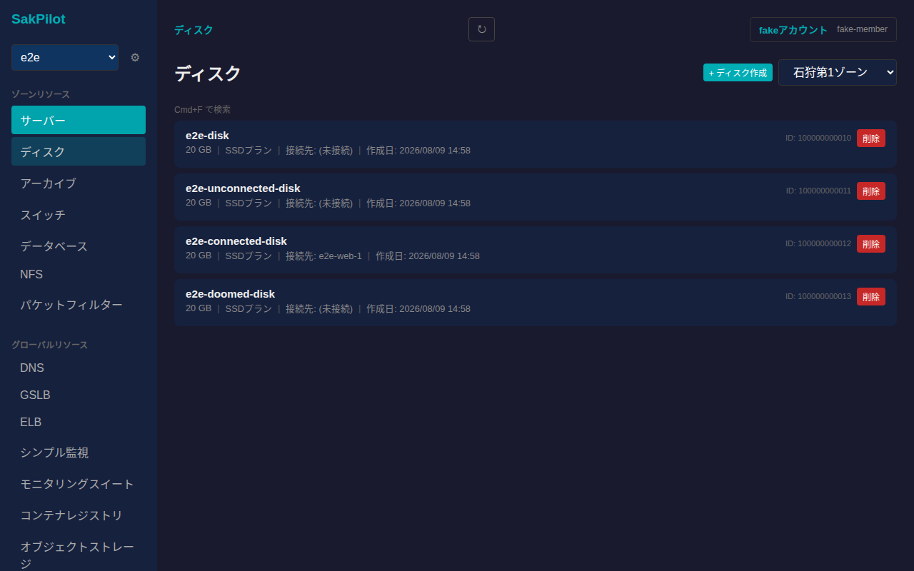
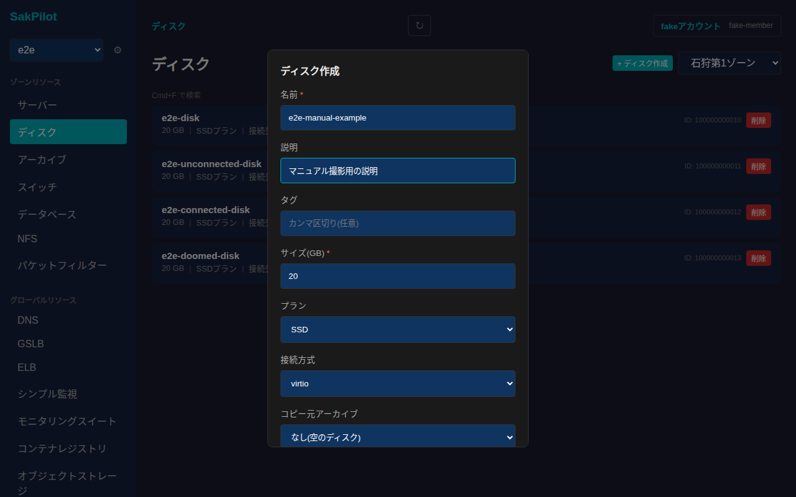
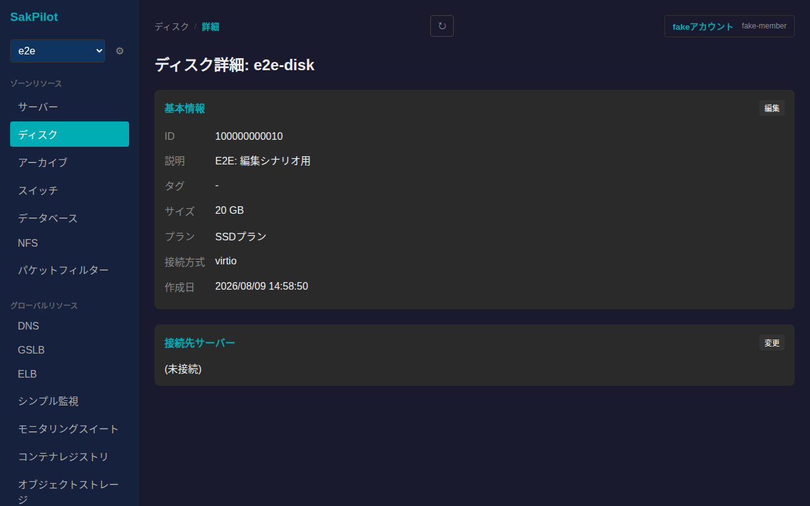
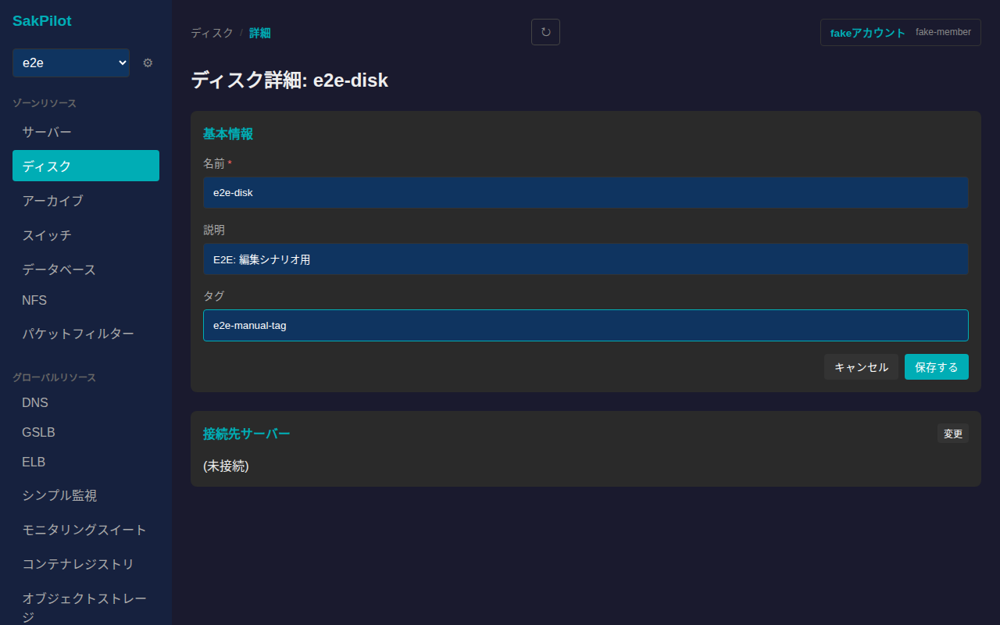
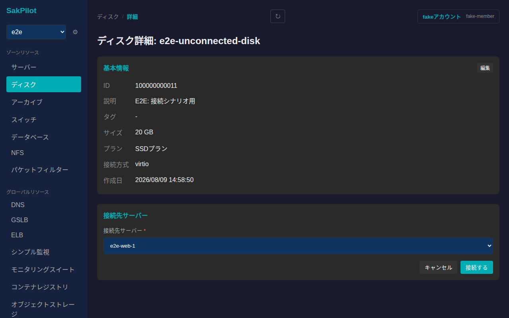
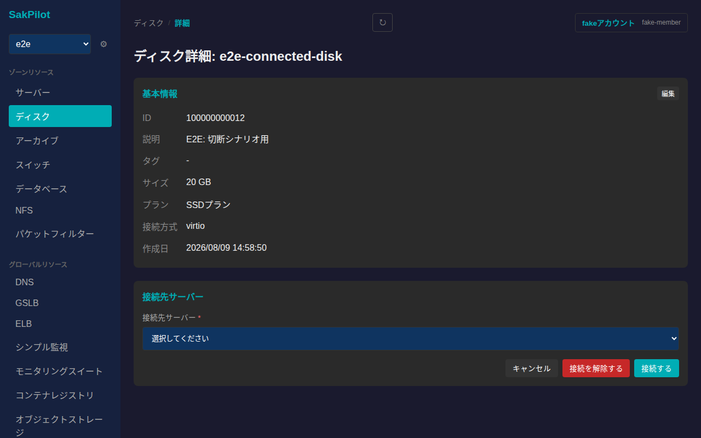
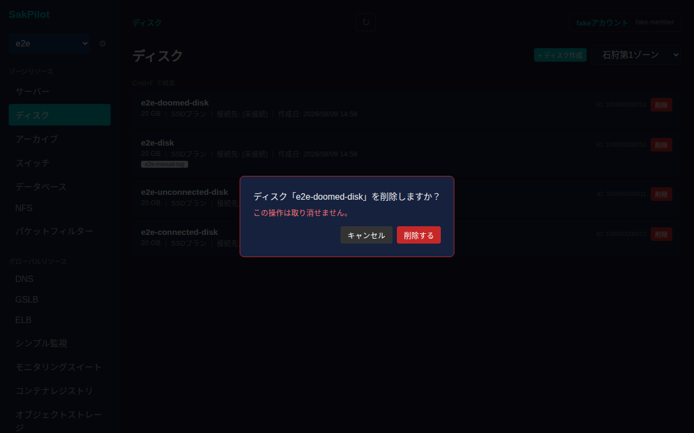

# ディスク

さくらのクラウドのディスクを一覧・作成・削除し、詳細画面から名前/説明/タグの編集、接続先サーバーの変更(接続・切断)ができます。

## 一覧画面

サイドバーの「ディスク」から一覧に入ります。ゾーンごとにディスクが表示され、右上のゾーン切り替えで対象ゾーンを変更できます。カードにはディスク名・サイズ・プラン(SSD/HDD)・接続先サーバー(未接続の場合は「(未接続)」)・作成日が表示されます。

## 作成

一覧右上の「+ ディスク作成」からディスクを新規作成できます。名前・サイズ(GB)は必須項目です。説明・タグは任意で、プラン(SSD/HDD)・接続方式(virtio/ide)・コピー元アーカイブ・接続先サーバーも作成時に指定できます。コピー元アーカイブを指定しない場合は空のディスクが作成されます。

必要な項目を入力し「作成する」を押すと一覧に反映されます。

## 詳細画面

一覧でカードをクリックすると詳細画面に遷移します。基本情報(ID・説明・タグ・サイズ・プラン・接続方式・作成日)に加えて、接続先サーバーのカードが並びます。

### 名前・説明・タグの編集

「基本情報」カードの「編集」から名前・説明・タグを編集できます。

値を入力してから「保存する」を押すと反映されます。

### 接続先サーバーの変更

「接続先サーバー」カードの「変更」から接続先を変更できます。未接続のディスクの場合はサーバーを選択して「接続する」を押すと接続されます。

既にサーバーに接続されているディスクの場合は、同じフォームに「接続を解除する」ボタンが表示され、これを押すとサーバーから切断されます(接続先を切り替えたい場合は、先に切断してから改めて別のサーバーへ接続します)。

## 削除

一覧の各カードにある「削除」ボタンを押すと、取り消し不可である旨を明記した確認ダイアログが表示されます。

「削除する」を押すとディスクが削除され、一覧から消えます。サーバーに接続中のディスクを削除した場合の挙動等、詳細な削除条件はさくらのクラウドAPI側の仕様に従います。
