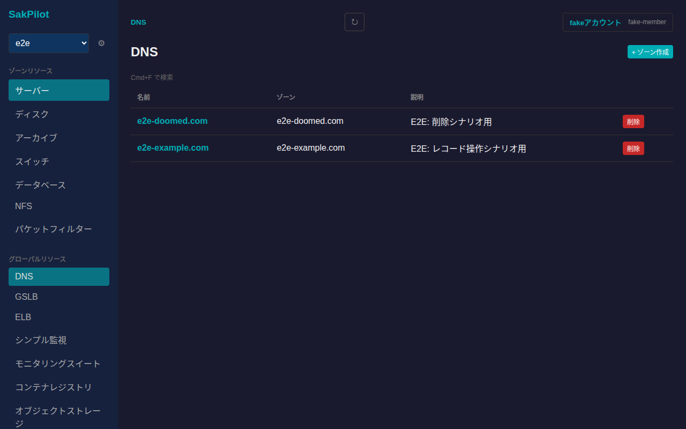
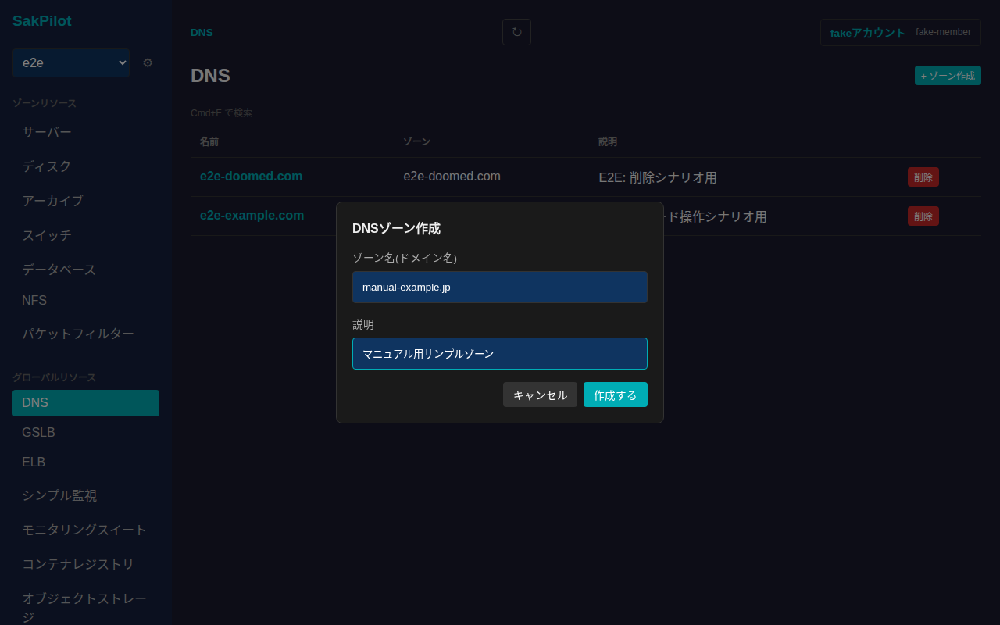
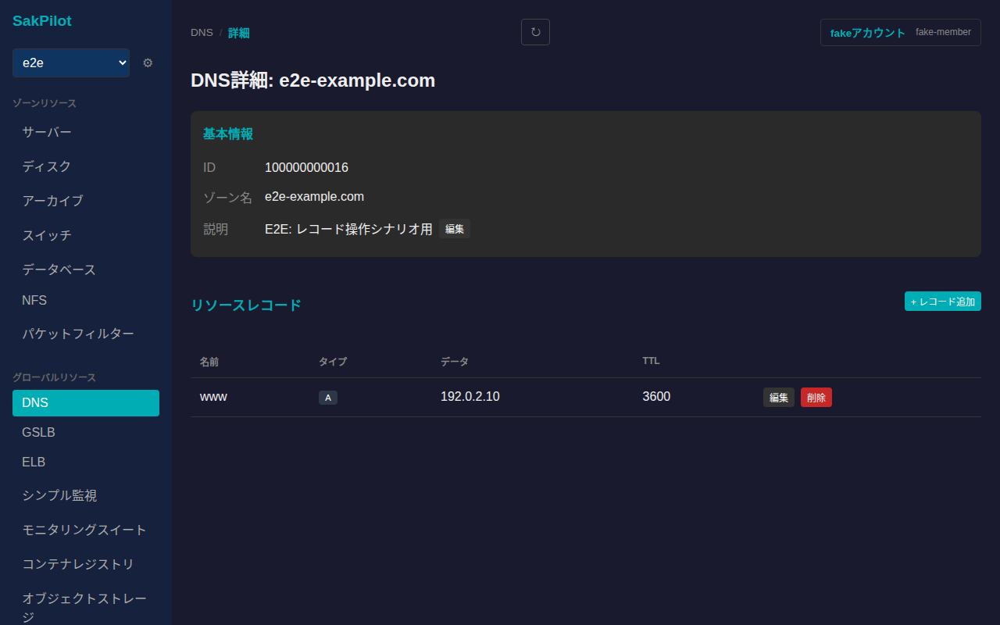
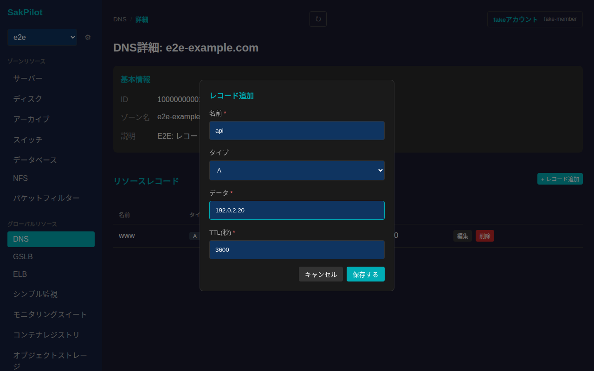
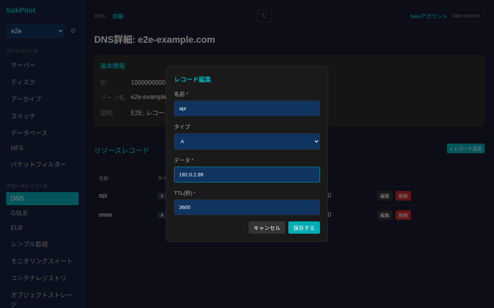
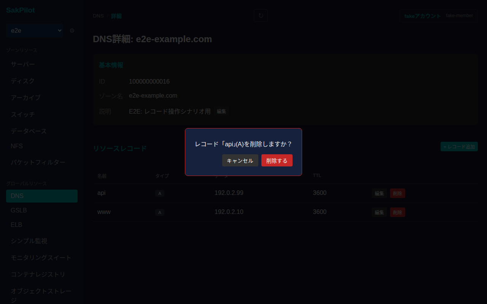

# DNS

さくらのクラウドのDNSゾーンを一覧・作成・削除し、詳細画面からゾーンの説明編集、リソースレコードの追加・編集・削除ができます。

## 一覧画面

サイドバーの「DNS」から一覧に入ります。DNSはゾーン非依存(グローバル)リソースのため、ゾーン切り替えは不要です。テーブルには各ゾーンの名前・ゾーン名・説明が表示されます。

右上の「+ ゾーン作成」からゾーン作成モーダルが開きます。ゾーン名(ドメイン名)と任意の説明を入力できます。

「作成する」を押すとゾーンが作成され、一覧に追加されます。

一覧の各行右端の「削除」からゾーンを削除できます。削除は取り消し不可であり、登録されているレコードもすべて削除される旨が確認ダイアログに表示されます。

## 詳細画面

一覧で行をクリックするとゾーン詳細画面に遷移します。基本情報(ID・ゾーン名・説明)と、登録されているリソースレコードの一覧が表示されます。

「説明」の右にある「編集」から、ゾーンの説明をインライン編集できます。

### レコードの追加

「リソースレコード」セクション右上の「+ レコード追加」からレコード追加フォームが開きます。名前・タイプ(A/AAAA/CNAME/ALIAS/MX/NS/TXT/SRV/CAA/PTR)・データ・TTLを入力します。データの入力例(プレースホルダー)はタイプに応じて切り替わり、タイプがAの場合はIPv4アドレスの形式チェックが入ります。

「保存する」を押すとレコードが追加され、一覧に反映されます。

### レコードの編集

各レコード行の「編集」から、同じフォームで既存の値を編集できます。

「保存する」を押すと変更が反映されます。

### レコードの削除

各レコード行の「削除」を押すと、削除対象のレコード名・タイプを明記した確認ダイアログが表示されます。

「削除する」を押すとレコードが削除され、一覧から消えます。
