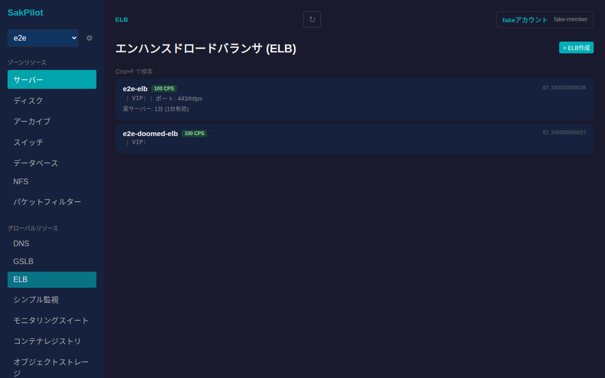
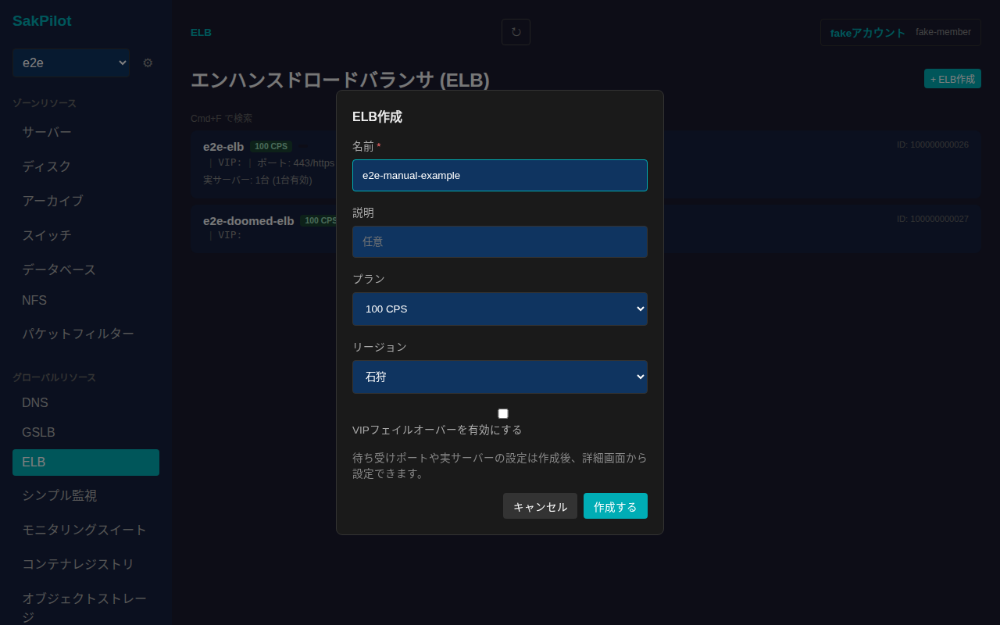
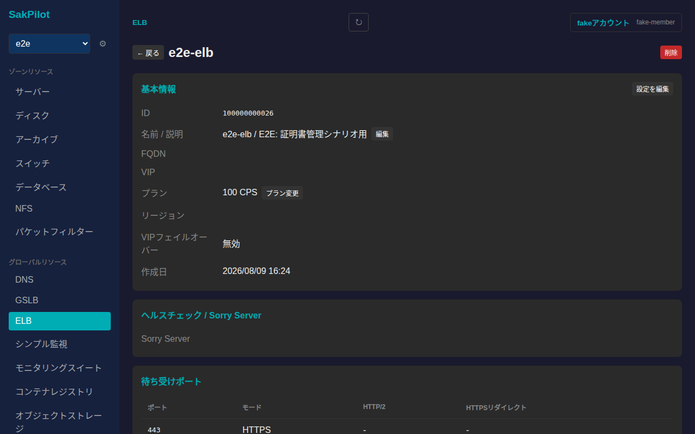
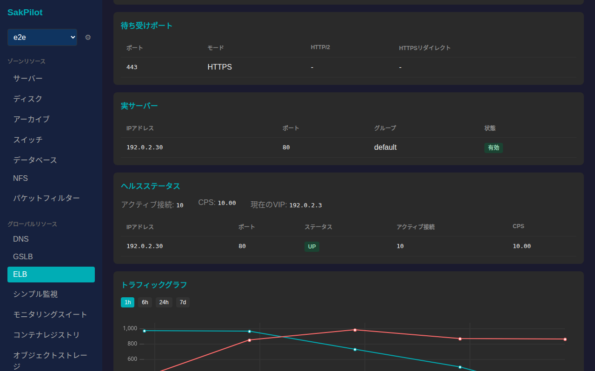
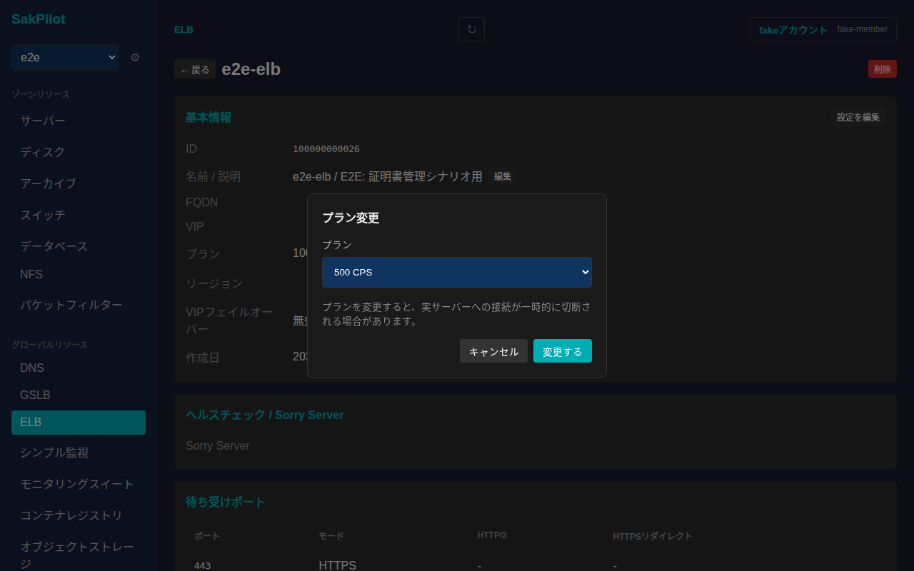
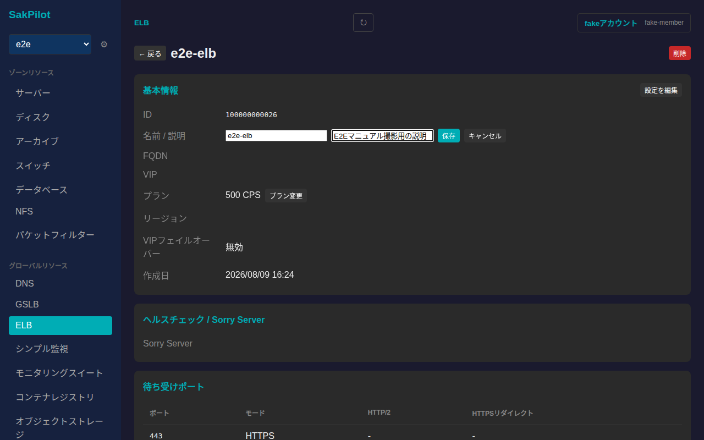
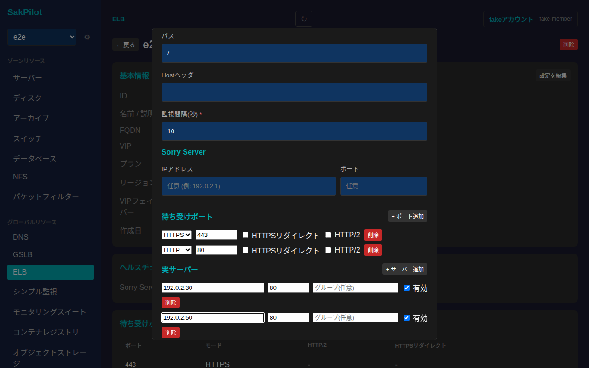
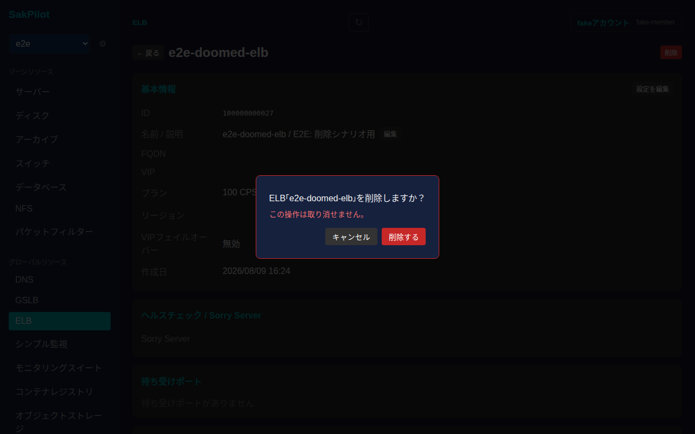

# ELB(エンハンスドロードバランサ / ProxyLB)

さくらのクラウドのELB(エンハンスドロードバランサ、API上はProxyLB)を一覧・作成・削除し、詳細画面から名前/説明の編集、プラン変更、待ち受けポート・実サーバーの編集、ヘルスステータス・トラフィックグラフの確認ができます。ELBはゾーンに依存しないグローバルリソースです。

## 一覧画面

サイドバーの「グローバルリソース」内「ELB」から一覧に入ります。カードには名前・プラン(CPS)・VIP・待ち受けポート・実サーバー数(うち有効な数)が表示されます。

## 作成

一覧右上の「+ ELB作成」からELBを新規作成できます。名前は必須項目です。説明・プラン・リージョン・VIPフェイルオーバーの有効化は任意で指定できます。

待ち受けポートや実サーバーの設定は作成後、詳細画面から設定します。「作成する」を押すと一覧に反映されます。

## 詳細画面

一覧でカードをクリックすると詳細画面に遷移します。基本情報(ID・名前/説明・FQDN・VIP・プラン・リージョン・VIPフェイルオーバー・作成日)、ヘルスチェック/Sorry Server、待ち受けポート、実サーバーが表示されます。

画面をスクロールすると、ヘルスステータス(アクティブ接続数・CPS・現在のVIP・実サーバーごとの状態)とトラフィックグラフ(1h/6h/24h/7dの期間切り替え)が確認できます。

### プランの変更

「基本情報」カードの「プラン変更」からCPSプランを変更できます。

プランを変更すると、実サーバーへの接続が一時的に切断される場合がある旨が表示されます。「変更する」を押すと反映されます。

### 名前・説明の編集

「名前 / 説明」の横にある「編集」から名前・説明を編集できます。

値を入力してから「保存」を押すと反映されます。

### 待ち受けポート・実サーバーの編集

「基本情報」カードの「設定を編集」から、ヘルスチェック(パス/Hostヘッダー/監視間隔)・Sorry Server・待ち受けポート・実サーバーをまとめて編集できます。

「+ ポート追加」「+ サーバー追加」でそれぞれ行を追加でき、各行の「削除」で行を取り除けます。値を入力してから「保存する」を押すと反映されます。

なお、SSL証明書の設定・更新・削除もこの詳細画面から行えますが、E2Eテスト環境(fakeドライバ)側の制約によりこの手順のスクリーンショットは撮影対象外としています。

## 削除

詳細画面右上の「削除」ボタンを押すと、取り消し不可である旨を明記した確認ダイアログが表示されます。

「削除する」を押すとELBが削除され、一覧から消えます。
