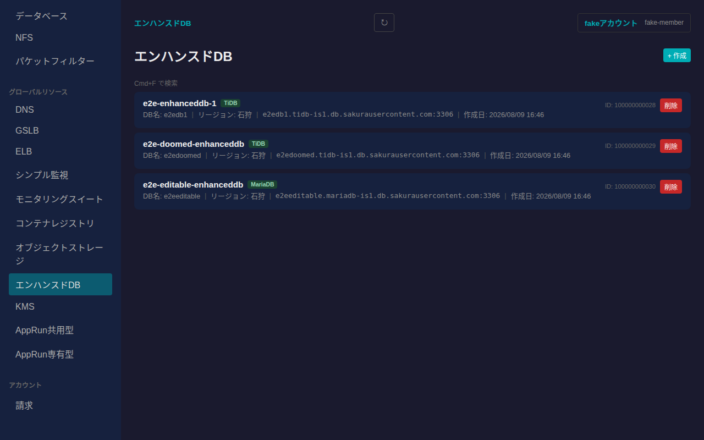
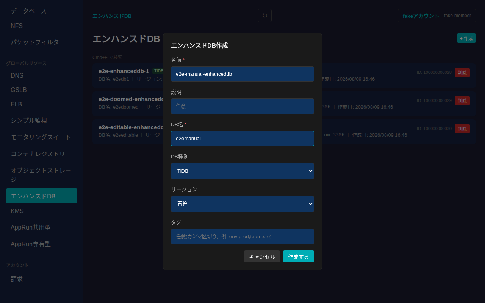
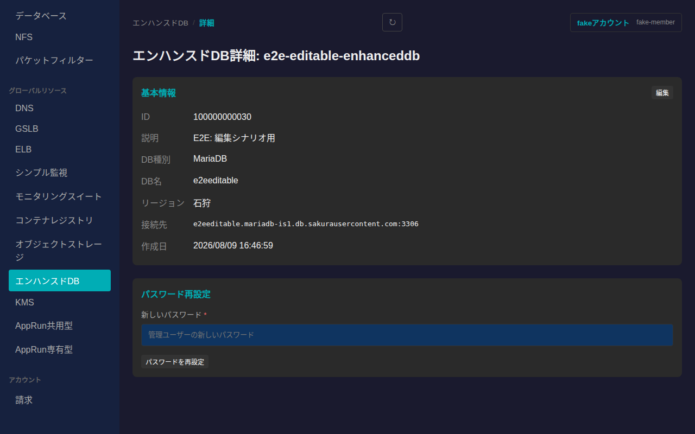
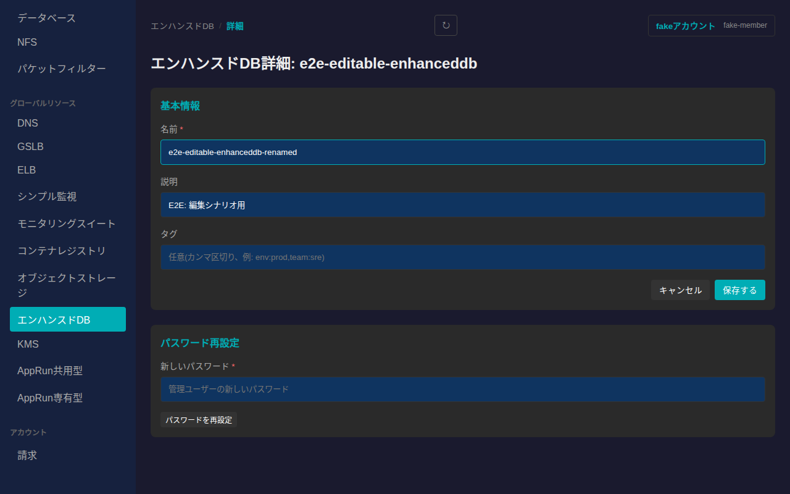
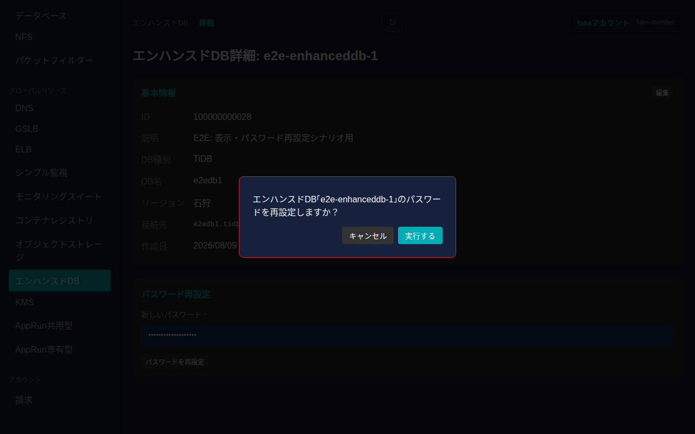
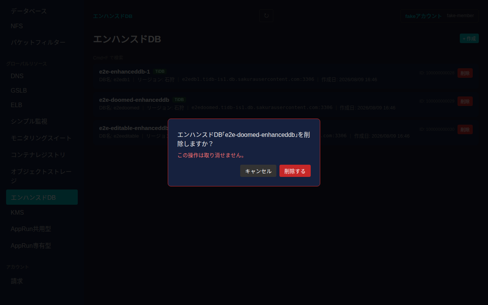

# エンハンスドDB

さくらのクラウドのエンハンスドDB(TiDB/MariaDBベースのマネージドデータベース)を一覧・作成・削除し、詳細画面から基本情報の編集・管理パスワードの再設定ができます。エンハンスドDBはゾーンに依存しないグローバルリソースです。

## 一覧画面

サイドバーの「エンハンスドDB」から一覧に入ります。カードには名前・DB種別(`TiDB`/`MariaDB`)・DB名・リージョン(石狩/東京)・接続先ホスト名とポート・作成日・タグが表示されます。

各カード右端の「削除」ボタンから削除できます。データベースアプライアンスと異なり起動・停止の概念はなく、常時稼働するリソースです。

## 作成

一覧右上の「+ 作成」からエンハンスドDBを新規作成できます。名前・DB名は必須項目です。DB種別(TiDB/MariaDB)・リージョン(石狩/東京)・説明・タグは任意で指定できます。

必須項目を入力して「作成する」を押すと一覧に反映されます。

## 詳細画面

一覧でカードをクリックすると詳細画面に遷移します。基本情報(ID・説明・DB種別・DB名・リージョン・接続先・作成日・タグ)に加えて、パスワード再設定のカードが並びます。

### 基本情報の編集

「基本情報」カードの「編集」から名前・説明・タグを編集できます。

値を入力してから「保存する」を押すと反映されます。

### パスワードの再設定

「パスワード再設定」カードで新しいパスワードを入力し「パスワードを再設定」を押すと、確認ダイアログが表示されます。意図しない操作を防ぐため必ず確認を経由します。

「実行する」を押すと管理ユーザーのパスワードが再設定されます。

## 削除

一覧のカードにある「削除」ボタンを押すと、取り消し不可である旨を明記した確認ダイアログが表示されます。

「削除する」を押すとエンハンスドDBが削除され、一覧から消えます。
