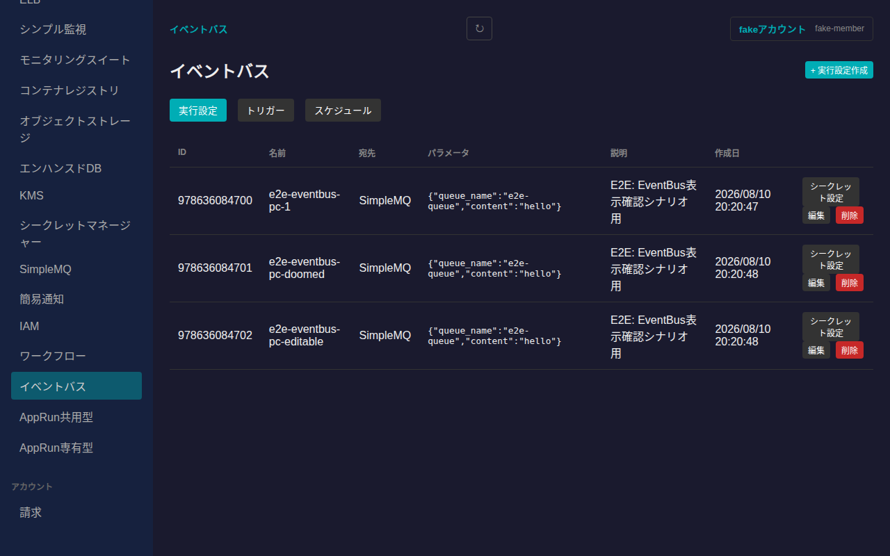
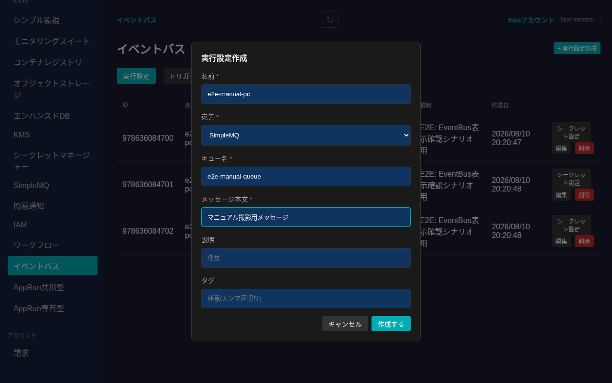
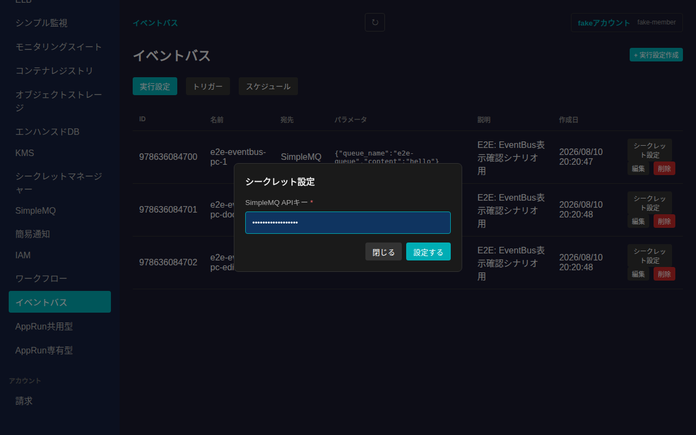
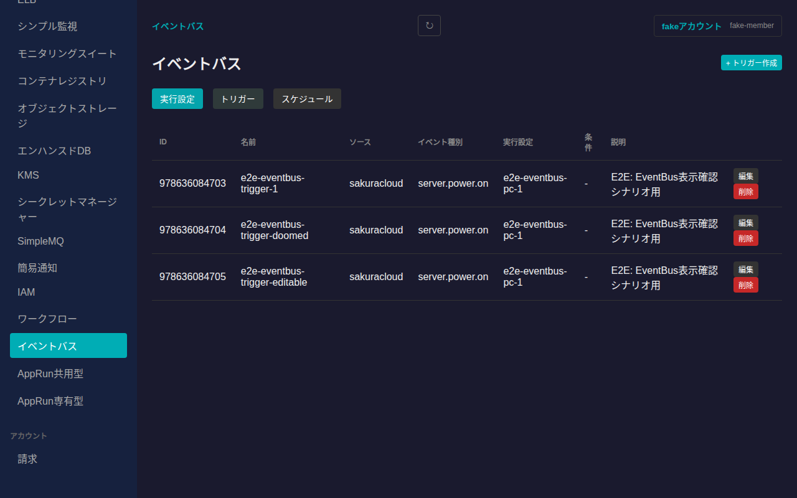
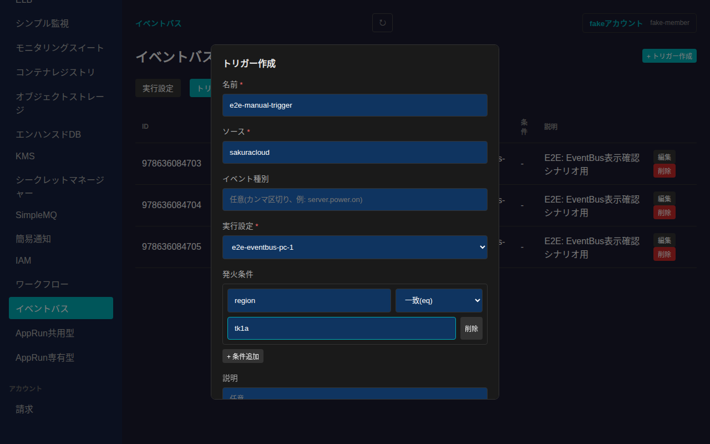
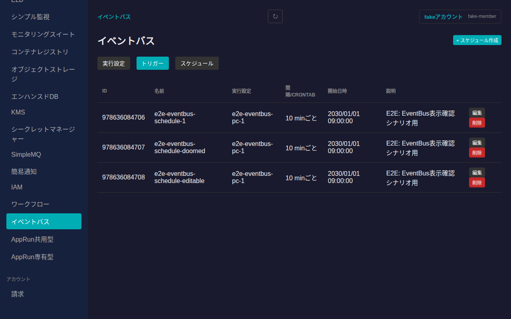
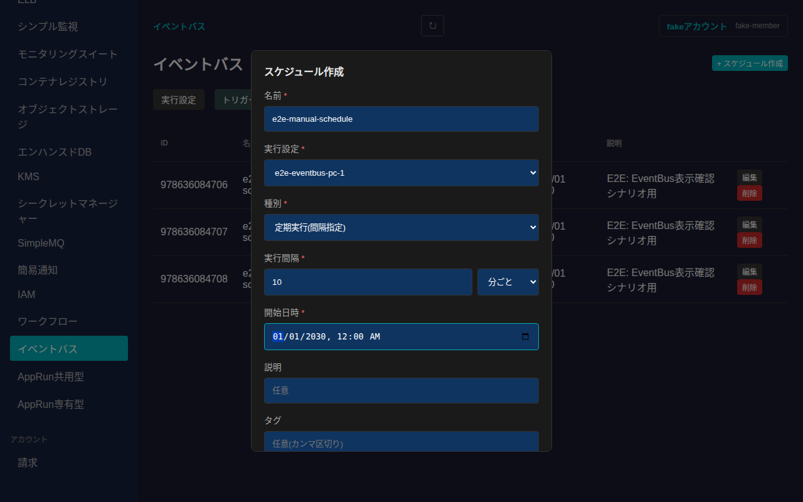
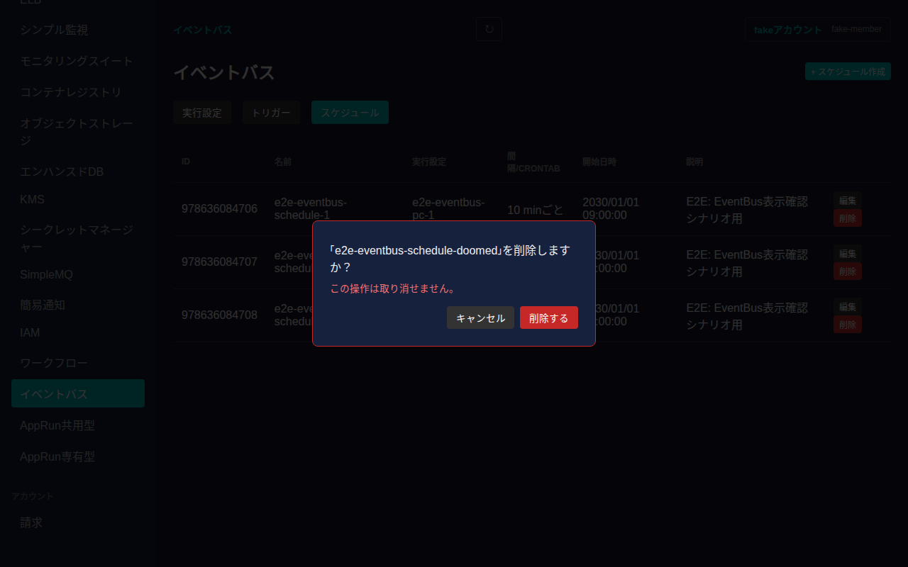

# イベントバス(EventBus)

さくらのクラウドのイベントバス(EventBus)サービスの実行設定(ProcessConfiguration)・トリガー(Trigger)・スケジュール(Schedule)を管理できます。さくらのクラウド上のリソースで発生したイベント、または定期的なスケジュールをきっかけに、簡易通知への転送やSimpleMQへのメッセージ送信、オートスケールの実行などを自動化する仕組みです。

## 全体像

- **実行設定(ProcessConfiguration)**: トリガーやスケジュールが発火したときに実際に行う処理内容。宛先(Destination)は「簡易通知」「SimpleMQ」「オートスケール」のいずれか
- **トリガー(Trigger)**: さくらのクラウド上のイベント(例: サーバーの電源ON)を監視し、条件に一致したら実行設定を実行する
- **スケジュール(Schedule)**: 定期的な間隔(分/時間/日ごと)またはCrontab形式の指定時刻に、実行設定を実行する

いずれもゾーンに依存しないグローバルリソースで、サイドバーの「グローバルリソース」内「イベントバス」から一覧に入り、タブで切り替えます。トリガー・スケジュールはいずれかの実行設定を参照するため、先に実行設定を作成しておく必要があります。

## 実行設定(ProcessConfiguration)

一覧には各実行設定の名前・宛先・パラメータ(JSON)・説明・作成日が表示されます。

「+ 実行設定作成」から新規作成できます。宛先ごとに入力項目が切り替わります(SimpleMQ: キュー名・メッセージ本文、簡易通知: 通知グループID・メッセージ、オートスケール: アクション・対象リソースID)。作成後は宛先を変更できません。

### シークレット設定

宛先がSimpleMQまたはオートスケールの実行設定は、実際にジョブを実行するための認証情報(SimpleMQのAPIキー、またはさくらのクラウドのアクセストークン/シークレット)を別途設定する必要があります。各行の「シークレット設定」から設定できます。一度設定した値は再表示できません。

## トリガー(Trigger)

一覧には各トリガーのソース・イベント種別・実行設定・発火条件・説明が表示されます。

「+ トリガー作成」から、ソース・実行設定に加えて、任意でイベント種別(カンマ区切り)や発火条件を指定できます。発火条件のキーは「小文字英数字1〜20文字(`data`は不可)」という制約があり、演算子は「一致(eq)」(値を1つ指定)または「いずれかに一致(in)」(値をカンマ区切りで複数指定)から選べます。

## スケジュール(Schedule)

一覧には各スケジュールの実行設定・実行間隔(またはCrontab)・開始日時・説明が表示されます。

「+ スケジュール作成」から、実行設定・種別(定期実行またはCrontab形式)・開始日時を指定して作成できます。定期実行の場合は間隔(数値)と単位(分/時間/日)を、Crontab形式の場合はcrontab式を指定します。開始日時より前は発火しません。

## 削除

実行設定・トリガー・スケジュールいずれも、各行の「削除」ボタンから削除できます。取り消し不可である旨を明記した確認ダイアログが表示されます。

「削除する」を押すと削除され、一覧から消えます。実行設定を削除する前に、参照しているトリガー・スケジュールが無いことを確認してください。
