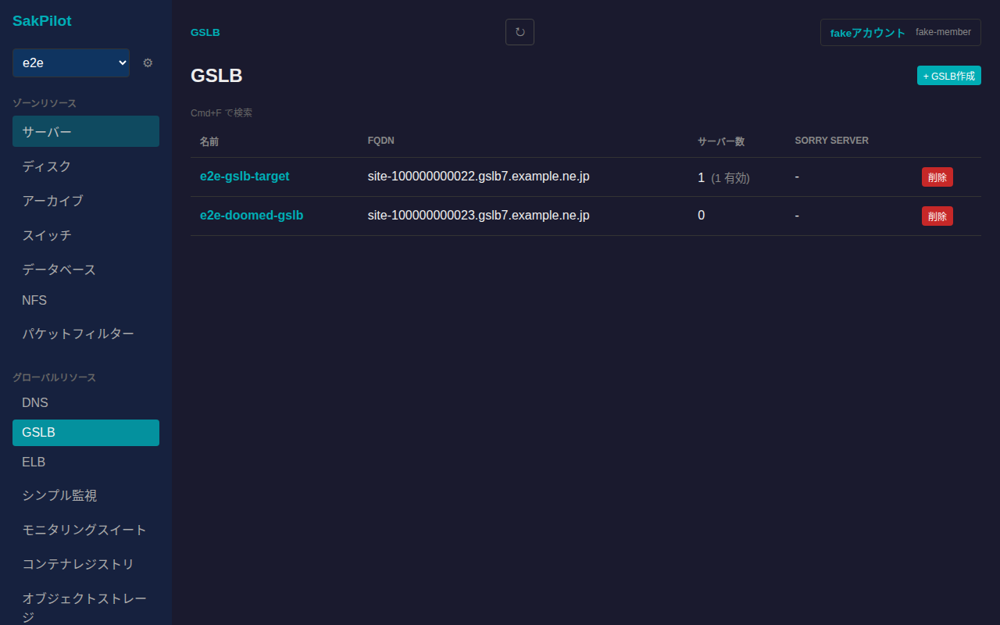
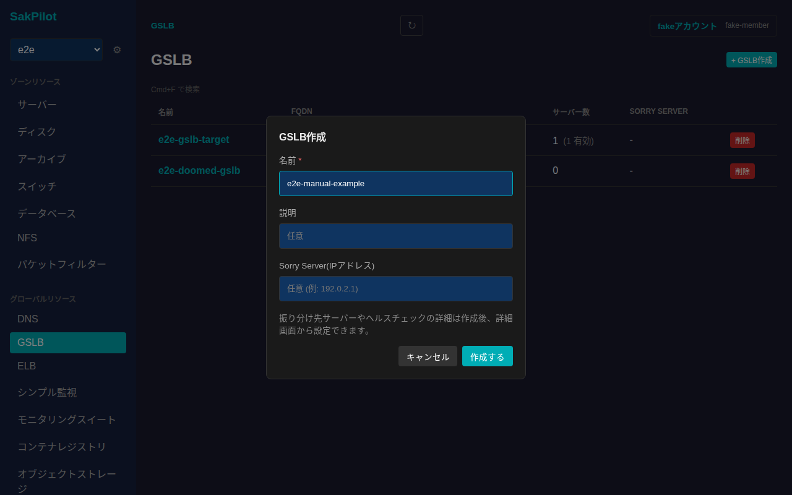
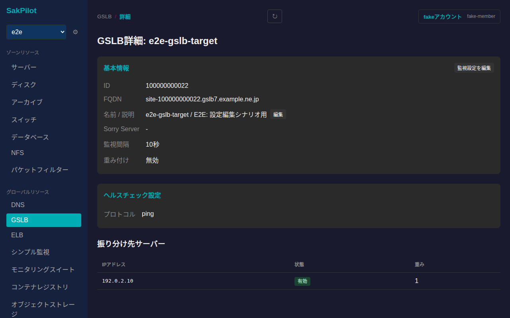
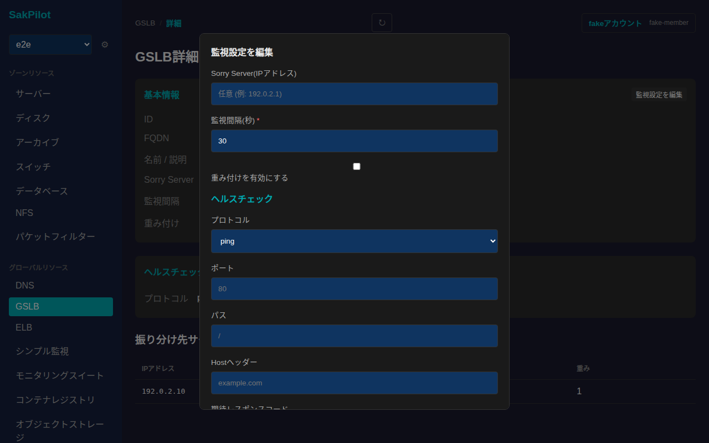
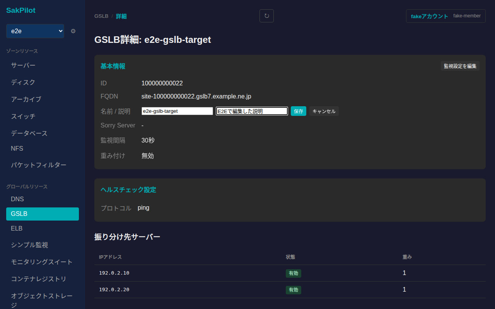
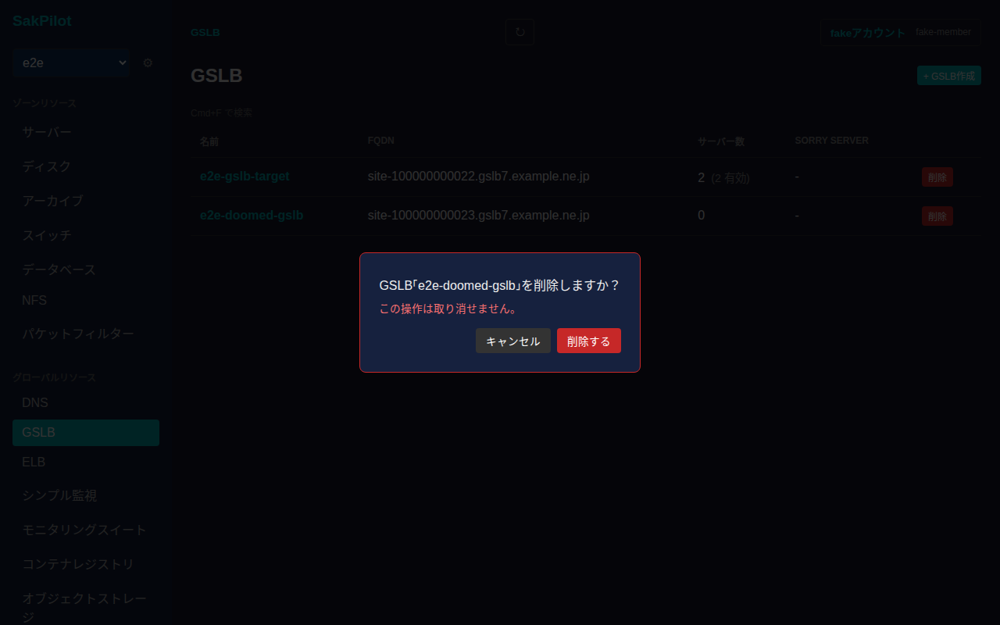

# GSLB

さくらのクラウドのGSLB(グローバルサーバーロードバランサ)を一覧・作成・削除し、詳細画面から名前/説明の編集、監視設定(ヘルスチェック・振り分け先サーバー)の編集ができます。

## 一覧画面

サイドバーの「グローバルリソース」内「GSLB」から一覧に入ります。GSLBはゾーンに依存しないグローバルリソースです。一覧には名前・FQDN・振り分け先サーバー数(うち有効な数)・Sorry Serverが表示されます。

## 作成

一覧右上の「+ GSLB作成」からGSLBを新規作成できます。名前は必須項目です。説明・Sorry Server(IPアドレス)は任意で指定できます。

振り分け先サーバーやヘルスチェックの詳細は作成後、詳細画面から設定します。「作成する」を押すと一覧に反映されます。

## 詳細画面

一覧で名前をクリックすると詳細画面に遷移します。基本情報(ID・FQDN・名前/説明・Sorry Server・監視間隔・重み付け)、ヘルスチェック設定、振り分け先サーバー一覧(IPアドレス・状態・重み)が表示されます。

### 監視設定の編集

「基本情報」カードの「監視設定を編集」から、Sorry Server・監視間隔・重み付けの有効化・ヘルスチェック(プロトコル/ポート/パス/Hostヘッダー/期待レスポンスコード)・振り分け先サーバーの追加/削除をまとめて編集できます。

「+ サーバー追加」で振り分け先サーバーの行を追加でき、各行の「削除」で行を取り除けます。値を入力してから「保存する」を押すと反映されます。

### 名前・説明の編集

「名前 / 説明」の横にある「編集」から名前・説明を編集できます。

値を入力してから「保存」を押すと反映されます。

## 削除

一覧の各行にある「削除」ボタンを押すと、取り消し不可である旨を明記した確認ダイアログが表示されます。

「削除する」を押すとGSLBが削除され、一覧から消えます。
