# IAM

さくらのクラウドのIAM(ユーザー・グループ・ロール・サービスプリンシパル・プロジェクト/フォルダ・組織管理・ポリシーバインディング・SSO・SCIM・サービスポリシー)を利用できます。ユーザー・グループ・IAMロール・IDロールは読み取り専用の一覧表示、サービスプリンシパル・プロジェクト/フォルダ・SSO・SCIMは作成・編集・削除、組織は名前の編集、ポリシーはバインディングの追加・編集・削除、サービスポリシーは有効/無効の切り替えが行えます。

## 一覧画面

サイドバーの「グローバルリソース」内「IAM」から一覧に入ります。IAMは組織横断的な機能のため、他のリソースのようなゾーン/グローバルの区分ではなく単一の画面で完結します。上部のタブでユーザー・グループ・IAMロール・IDロール・サービスプリンシパル・プロジェクト/フォルダ・組織・ポリシー・SSO・SCIM・サービスポリシーを切り替えます。

### ユーザー

ID・名前・ユーザーコード・メールアドレス・ステータス・説明・作成日が確認できます。

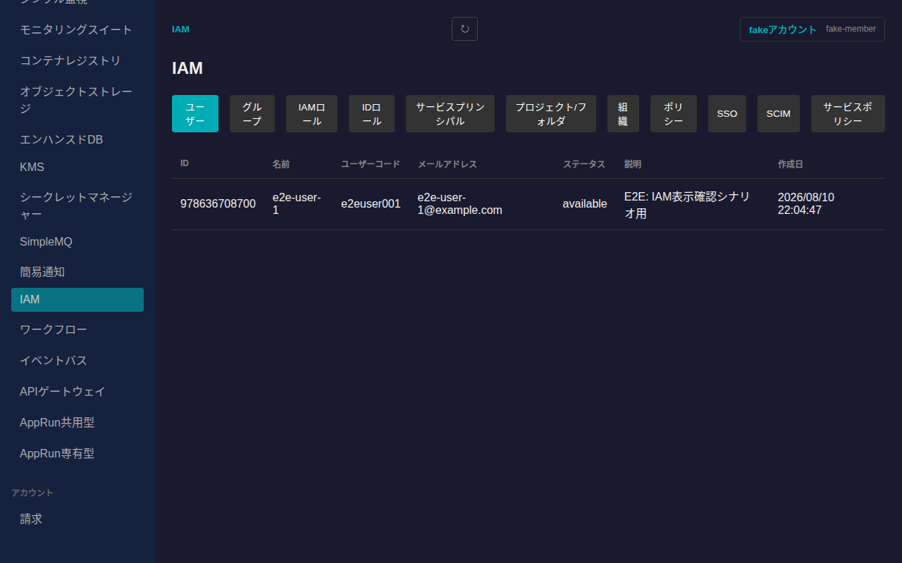

### グループ

ID・名前・説明・作成日が確認できます。

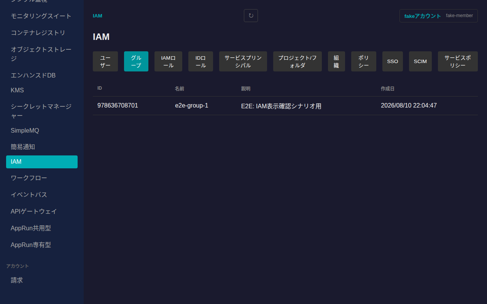

### IAMロール

さくらのクラウドが提供するIAMロール定義の一覧です(オーナー・編集者・閲覧者など)。ID・名前・カテゴリ・付与可能な最低階層・説明が確認できます。ロール定義自体は固定のため作成・編集はできません。

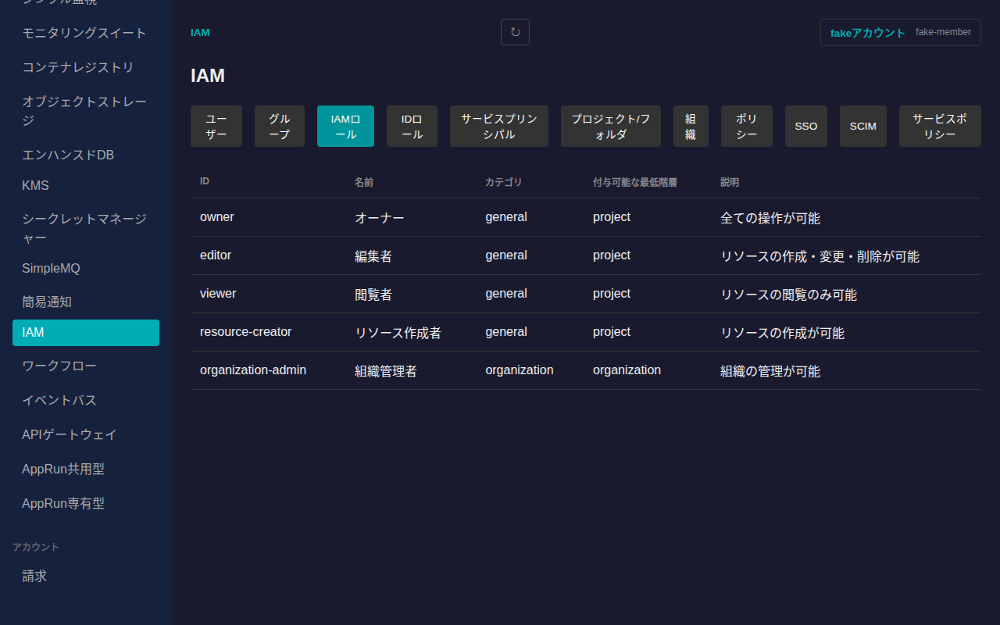

### IDロール

IAMロール導入以前からの旧ロール体系(管理者・メンバーなど)の一覧です。ID・名前・説明が確認できます。

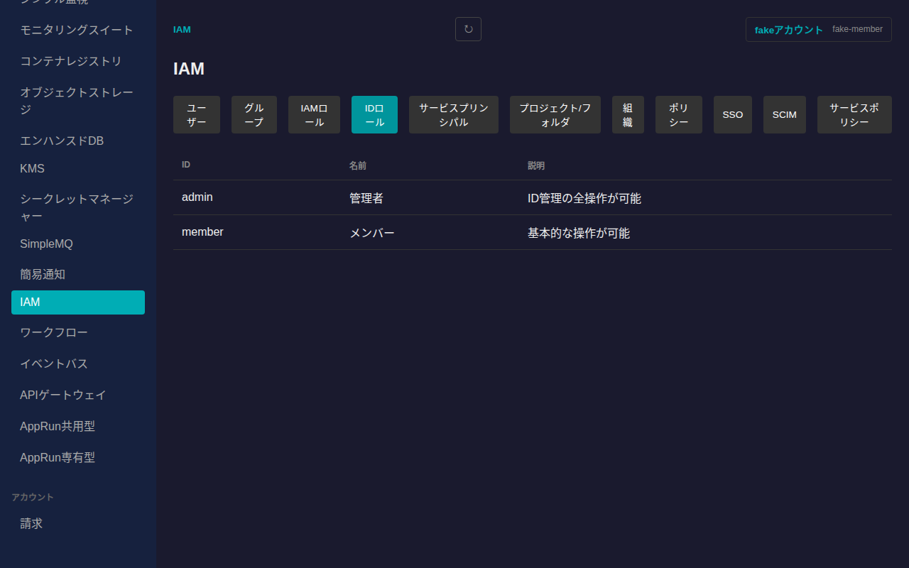

### サービスプリンシパル

サービスプリンシパルは、プログラムやCI/CDなどから鍵ペア認証でさくらのクラウドAPIを利用するための機能です。ID・名前・プロジェクトID・説明・作成日が確認できます。

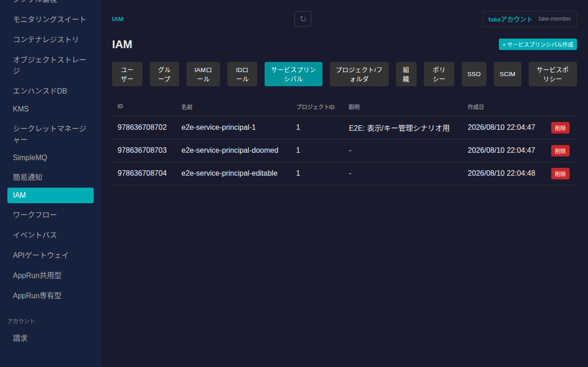

一覧右上の「+ サービスプリンシパル作成」から、プロジェクトID・名前・説明を指定して新規作成できます。行右端の「削除」ボタンで削除できます(確認ダイアログが表示され、関連するキーもすべて削除されます)。

行をクリックすると詳細画面に遷移します。「基本情報」カードでは名前・説明を編集できます。「キー」カードでは、そのサービスプリンシパルに登録された公開鍵の一覧・状態(有効/無効)・鍵の生成元・作成日・有効期限を確認できるほか、以下の操作が行えます。

- **キー登録**: 公開鍵(PEM形式)を登録します
- **有効化/無効化**: キーの状態を切り替えます(無効化するとそのキーでの認証ができなくなります)
- **削除**: キーを削除します(このキーで発行されたトークンは無効になります)

いずれの操作も確認ダイアログを経由します。

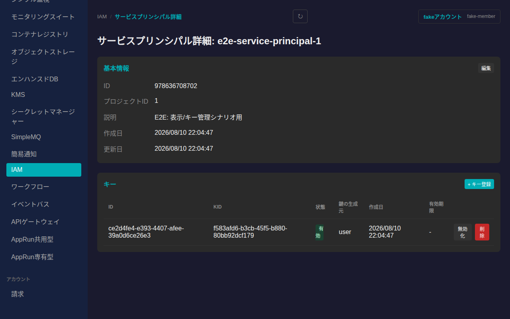

### プロジェクト/フォルダ

プロジェクトはさくらのクラウドの権限管理単位、フォルダはプロジェクトをグルーピングする階層構造です。フォルダは入れ子にできる箱、プロジェクトはその中に置く葉(常に末端)という関係になります。フォルダ・プロジェクトともに親を持たない場合は組織のルート直下に表示されます。

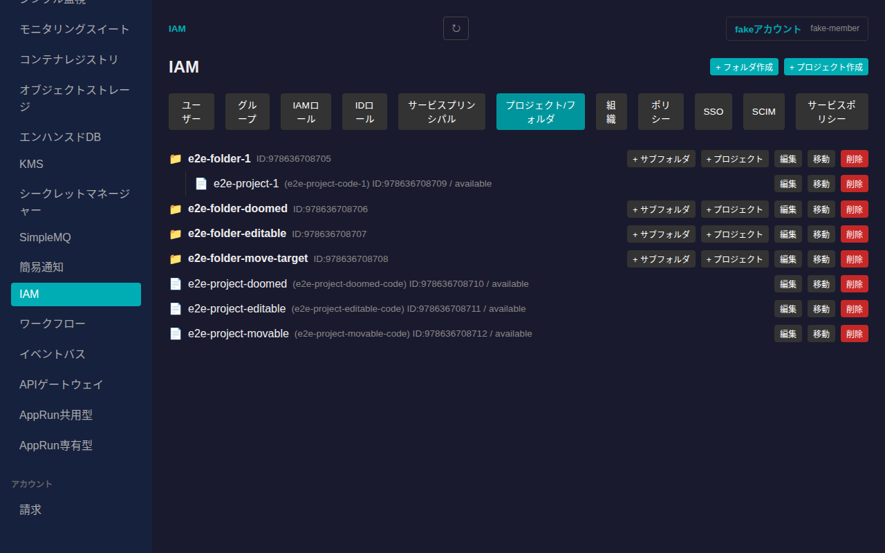

一覧右上の「+ フォルダ作成」「+ プロジェクト作成」から、組織ルート直下にフォルダ・プロジェクトを新規作成できます。各フォルダの行にある「+ サブフォルダ」「+ プロジェクト」からは、そのフォルダの子として作成できます(プロジェクト作成にはプロジェクトコードの指定が必要です)。

各行の操作ボタンでは以下が行えます。

- **編集**: フォルダ・プロジェクトの名前・説明を変更します(プロジェクトコードは変更できません)
- **移動**: 移動先のフォルダ(または組織ルート)を選んで、フォルダ・プロジェクトを別の場所へ移動します
- **削除**: フォルダ・プロジェクトを削除します(確認ダイアログを経由します)

### 組織

組織ID・組織名を確認できます。「組織名を編集」から組織名を変更できます。

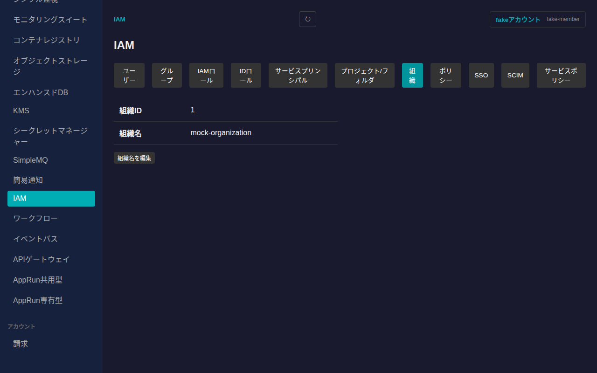

### ポリシー

IAMロール(またはIDロール)をユーザー・グループ・サービスプリンシパルなどのプリンシパルに割り当てるポリシーバインディングを管理します。「スコープ」で組織/プロジェクト/フォルダを切り替え(プロジェクト・フォルダを選ぶ場合は対象を選択するセレクトボックスが追加で表示されます)、組織スコープのみ「ロール体系」でIAMロール/IDロール(旧ロール体系)を切り替えられます。IDロールは組織スコープのみに割り当て可能なため、プロジェクト・フォルダスコープでは常にIAMロールを使用します。

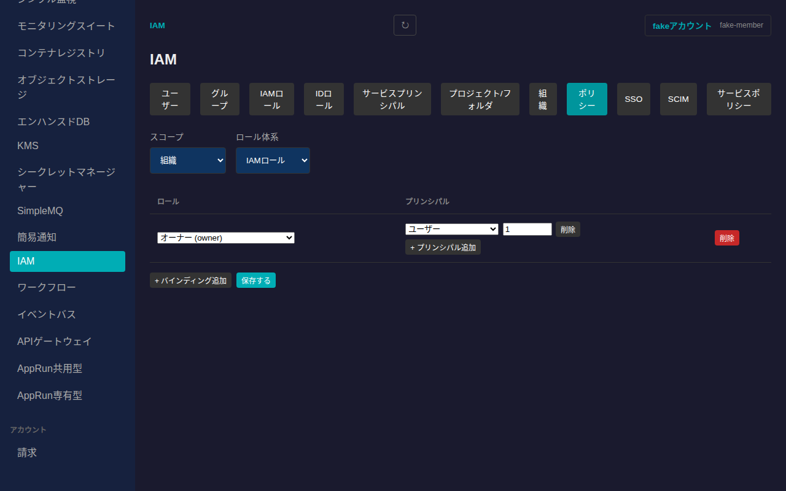

「+ バインディング追加」で新しいロールへの割り当てを追加し、ロールをセレクトボックスから選択、「+ プリンシパル追加」でユーザー・グループ・サービスプリンシパルの種別とIDを指定します。編集後は「保存する」で確定します。保存はそのスコープのバインディング一覧全体を置き換える形で行われるため、既存のバインディングを消さずに追加したい場合は残したままにしてください。行右端の「削除」でバインディング自体を、プリンシパル行の「削除」でそのプリンシパルのみを取り除けます。

### SSO

SAML方式のシングルサインオン(SSO)プロファイルを管理します。ID・名前・説明・組織への割り当て状態・作成日が確認できます。

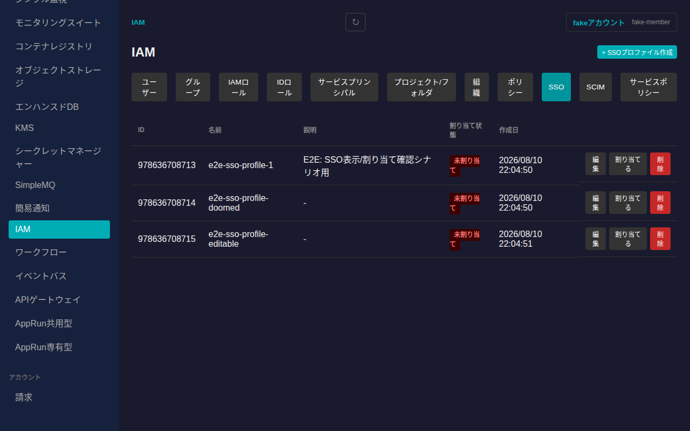

一覧右上の「+ SSOプロファイル作成」から、名前・説明・IdPエンティティID・IdPログインURL・IdPログアウトURL・IdP証明書(PEM形式)を指定して新規作成できます(SPエンティティID・SP Assertion Consumer Service URLはさくらのクラウド側が自動生成するため入力不要です)。行の「編集」から各項目を変更できます。

組織への割り当て状態に応じて「割り当てる」「割り当て解除」ボタンが切り替わります。割り当てるとそのプロファイルでのSSOログインが組織で有効になり、解除すると無効になります。「削除」でプロファイル自体を削除できます(確認ダイアログを経由します)。

### SCIM

SCIM(System for Cross-domain Identity Management)によるユーザープロビジョニング連携の設定を管理します。ID・名前・ベースURL・作成日が確認できます。

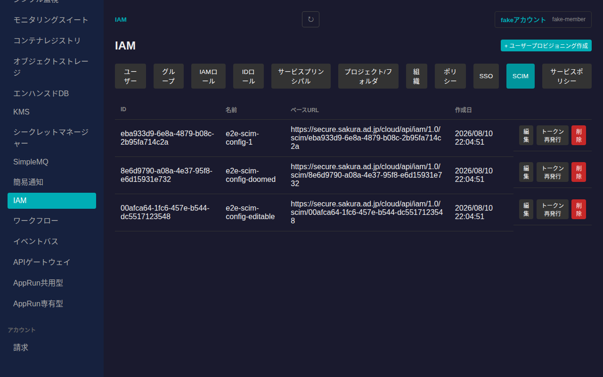

一覧右上の「+ ユーザープロビジョニング作成」から名前を指定して新規作成できます。作成直後のみ、外部IDプロバイダとの連携に必要なシークレットトークンがダイアログに表示されます。**このトークンは一度しか表示されないため、必ずこの場でコピーして安全な場所に保管してください**。閉じた後は同じ値を再確認する手段がなく、必要な場合は「トークン再発行」で新しいトークンを発行し直すことになります(旧トークンは無効になります)。

行の「編集」で名前を変更、「トークン再発行」でシークレットトークンを再発行(同じく一度きり表示)、「削除」で設定自体を削除できます(確認ダイアログを経由します)。

### サービスポリシー

組織全体に適用するガードレール的なルール(サービスポリシー)の有効/無効を切り替えます。状態が「有効」「無効」で表示され、ボタンでトグルできます。

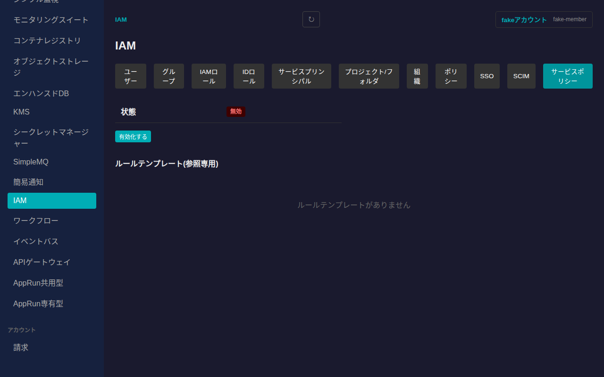

「ルールテンプレート(参照専用)」には、コード・名前・タイプ・ドライラン対応可否・説明・プレフィックスといったルールテンプレートの一覧が表示されます(作成・編集はできません)。

## 今後の対応予定

2要素認証(user2fa)の管理機能は、対応するモックAPIが未整備のため今後のアップデートで対応予定です。
