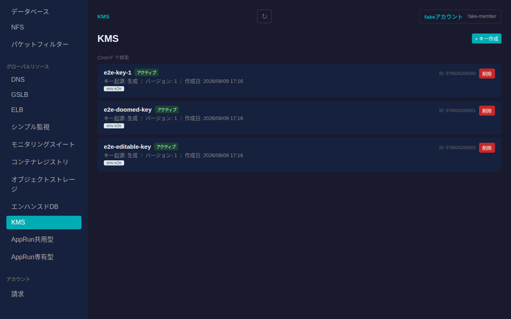
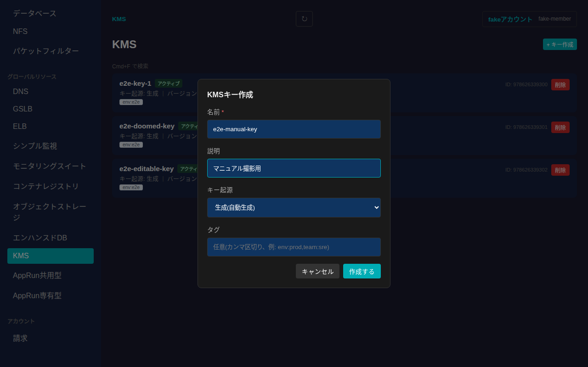
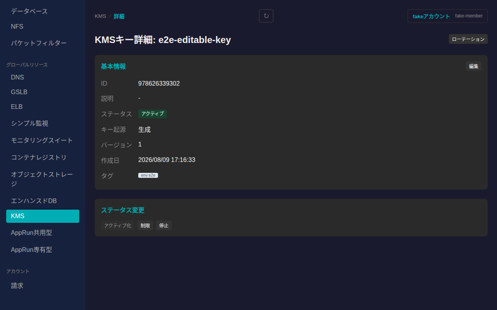
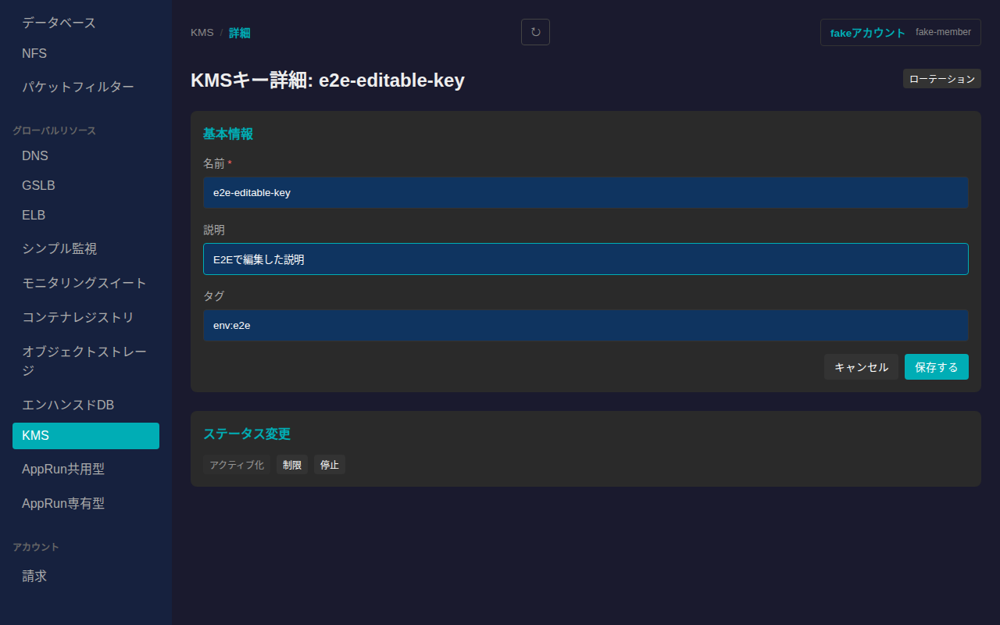
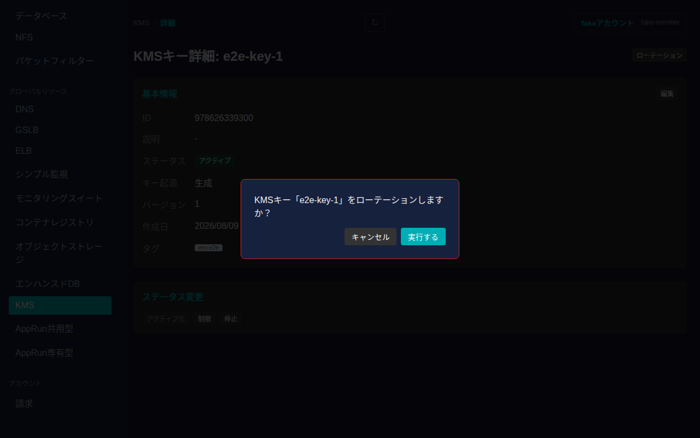
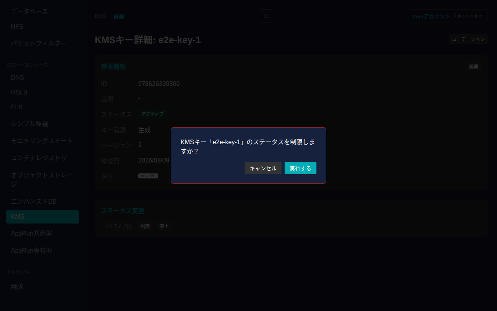
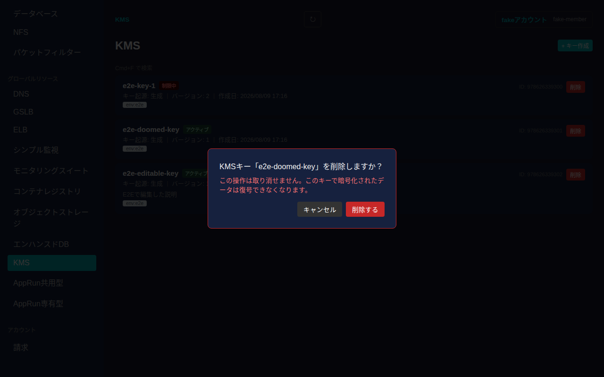

# KMS

さくらのクラウドのKMS(鍵管理サービス)を一覧・作成・削除し、詳細画面から基本情報の編集、ローテーション、ステータス変更ができます。

## 一覧画面

サイドバーの「グローバルリソース」内「KMS」から一覧に入ります。KMSキーはゾーンに依存しないグローバルリソースです。一覧には各キーのカードが表示され、名前・ステータス・キー起源・バージョン・作成日・説明・タグが確認できます。

## 作成

一覧右上の「+ キー作成」からKMSキーを新規作成できます。名前は必須項目です。説明・キー起源(生成/インポート)・タグは任意で指定できます。キー起源に「インポート」を選ぶと、Base64エンコードされたキー素材の入力欄が表示されます。

「作成する」を押すと一覧に反映されます。

## 詳細画面

一覧でカードをクリックすると詳細画面に遷移します。基本情報(ID・説明・ステータス・キー起源・バージョン・作成日・タグ)が表示されます。

### 基本情報の編集

「基本情報」カードの「編集」から名前・説明・タグを編集できます。

値を入力してから「保存する」を押すと反映されます。

### ローテーション

詳細画面右上の「ローテーション」から、キーの新しいバージョンを生成できます。確認ダイアログが表示されます。

「実行する」を押すとローテーションが実行され、バージョンが増加します。

### ステータス変更

「ステータス変更」カードから、アクティブ化・制限・停止のいずれかにステータスを変更できます。現在のステータスに対応するボタンは無効化されます。変更前に確認ダイアログが表示されます。

「実行する」を押すと反映されます。

## 削除

一覧の各カードにある「削除」ボタンを押すと、取り消し不可である旨(このキーで暗号化されたデータが復号できなくなる旨)を明記した確認ダイアログが表示されます。

「削除する」を押すとKMSキーが削除され、一覧から消えます。
