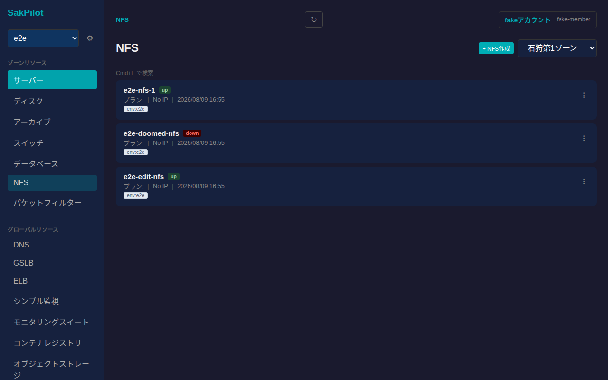
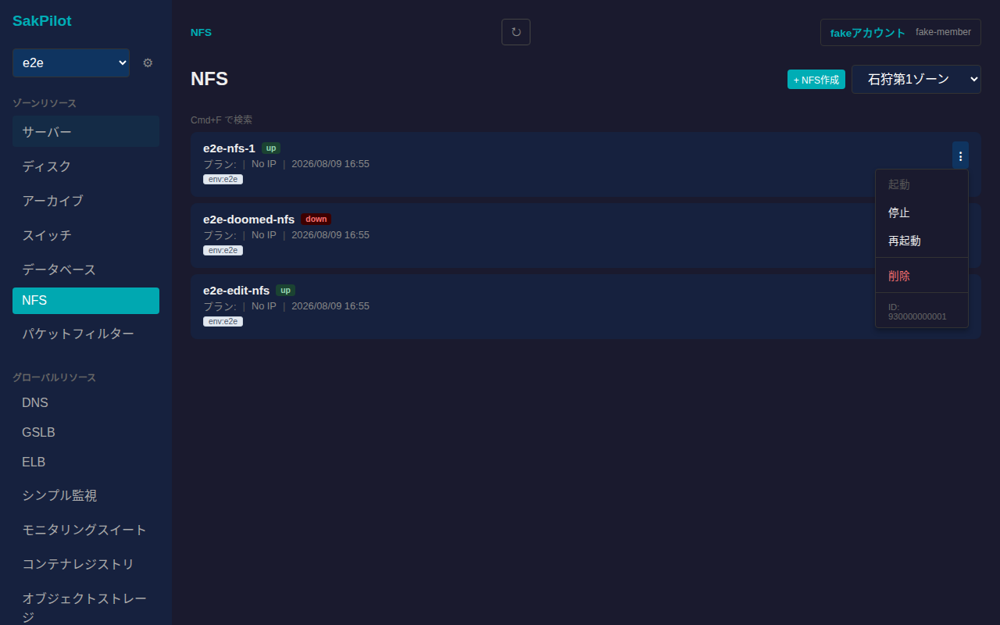
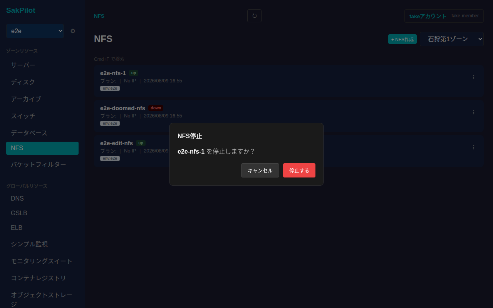
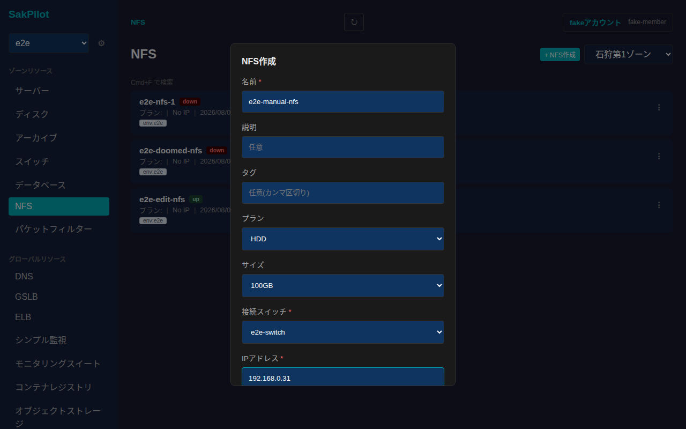
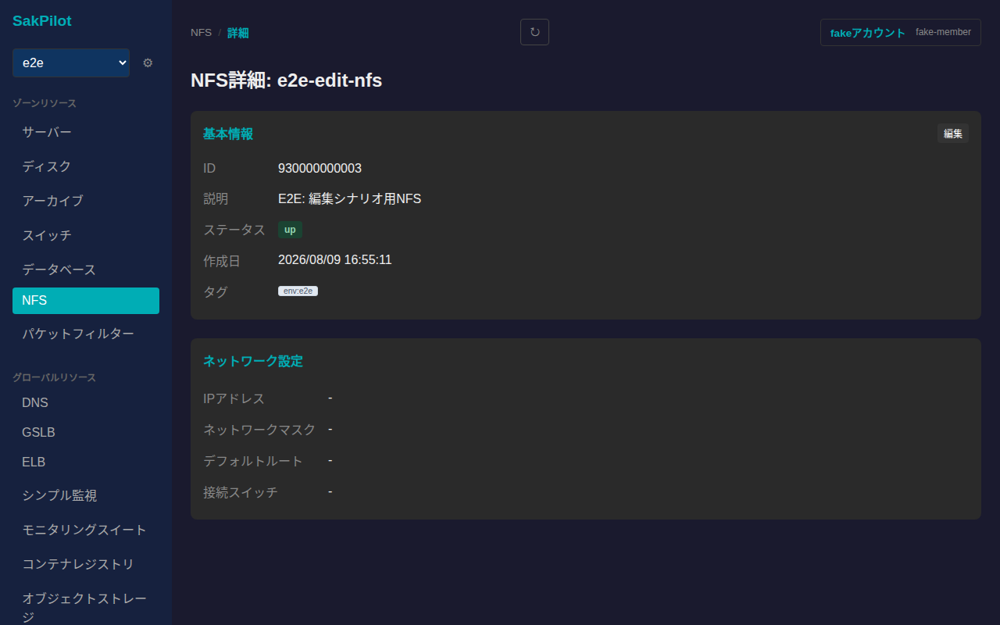
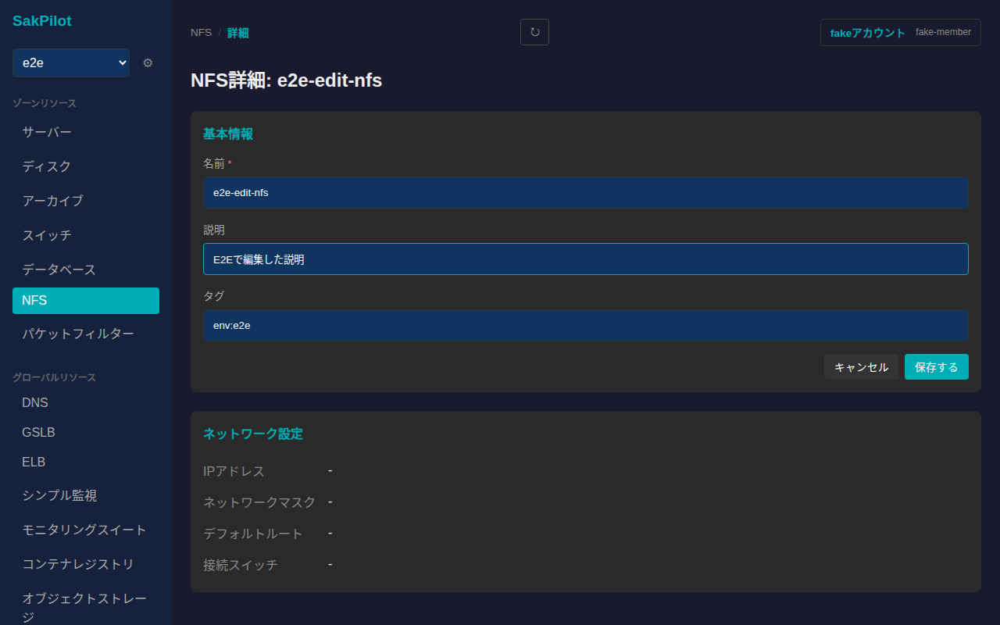
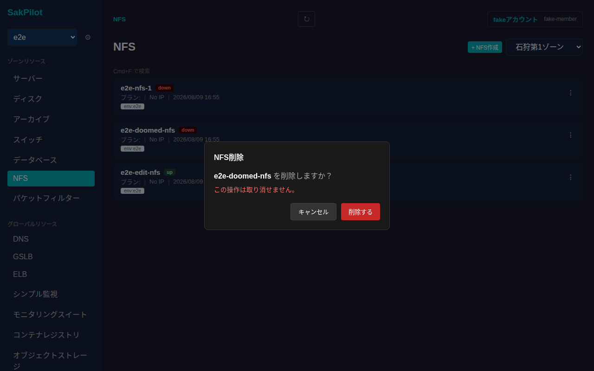

# NFS

さくらのクラウドのNFSアプライアンスを一覧・起動/停止/削除し、詳細画面から基本情報の編集ができます。NFSはゾーンに依存するリソースです。

## 一覧画面

サイドバーの「NFS」から一覧に入ります。カードには名前・ステータス(`up`/`down`)・プラン・IPアドレス・接続スイッチ・作成日・タグが表示されます。

各カード右端の「⋮」から起動・停止・削除の操作メニューが開きます。ステータスに応じて選択できない操作は無効化されます(起動中のNFSは「起動」を選べない、など)。

## 起動・停止

操作メニューから「停止」を選ぶと確認ダイアログが表示されます。意図しない操作を防ぐため必ず確認を経由します。

「停止する」を押すと電源操作がリクエストされ、以降はポーリングでステータスが自動更新されます(`down`になるまで数秒かかることがあります)。起動も同様の確認ダイアログ経由で行います。

## 作成

一覧右上の「+ NFS作成」からNFSを新規作成できます。名前・接続スイッチ・IPアドレス・ネットワークマスク長は必須項目です。プラン(HDD/SSD)・サイズ・デフォルトルート・説明・タグは任意で指定できます。

必須項目を入力して「作成する」を押すと一覧に反映されます。

## 詳細画面

一覧でカードをクリックすると詳細画面に遷移します。基本情報(ID・説明・ステータス・作成日・タグ)に加えて、ネットワーク設定(IPアドレス・ネットワークマスク・デフォルトルート・接続スイッチ)のカードが並びます。

### 基本情報の編集

「基本情報」カードの「編集」から名前・説明・タグを編集できます。

値を入力してから「保存する」を押すと反映されます。

## 削除

一覧の操作メニューから「削除」を選ぶと、取り消し不可である旨を明記した確認ダイアログが表示されます。

「削除する」を押すとNFSが削除され、一覧から消えます。
