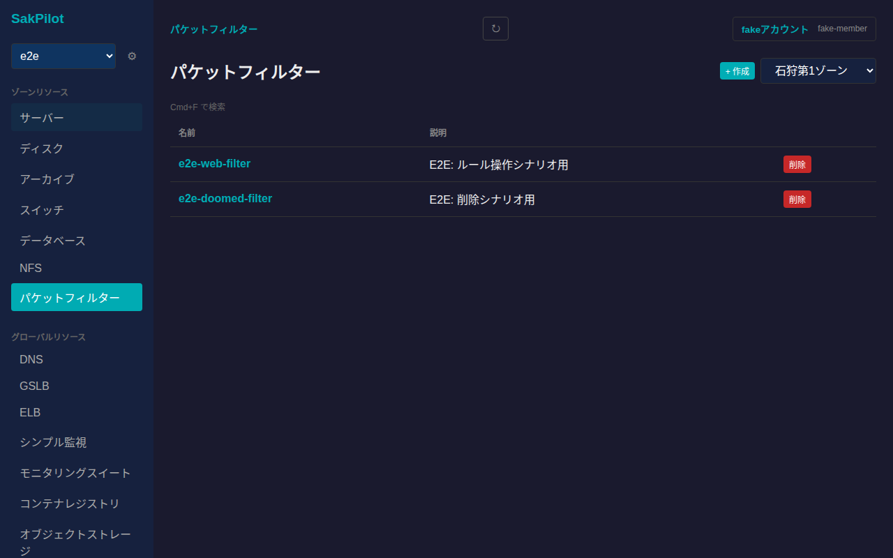
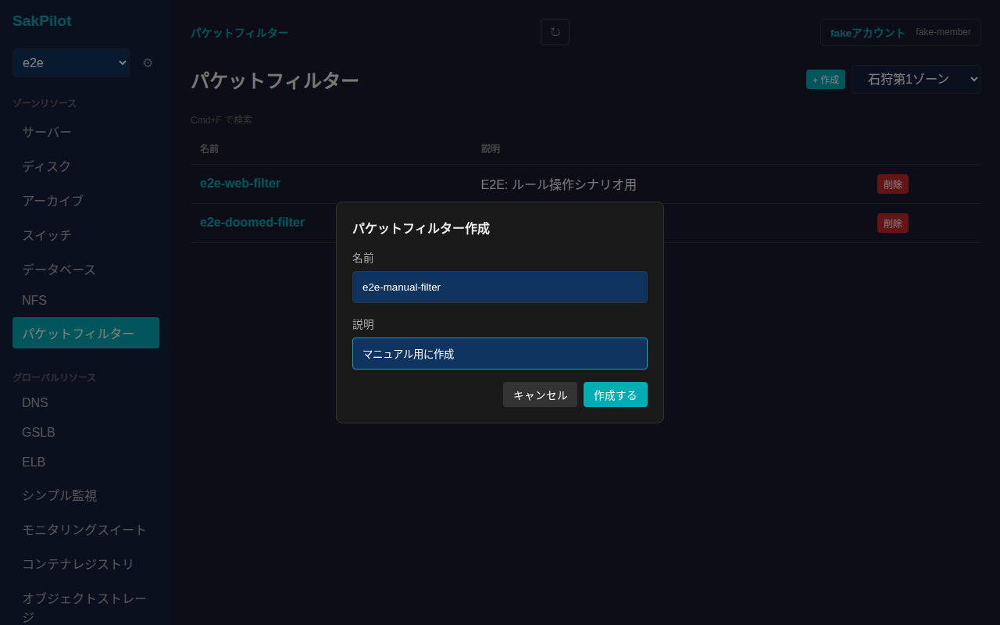
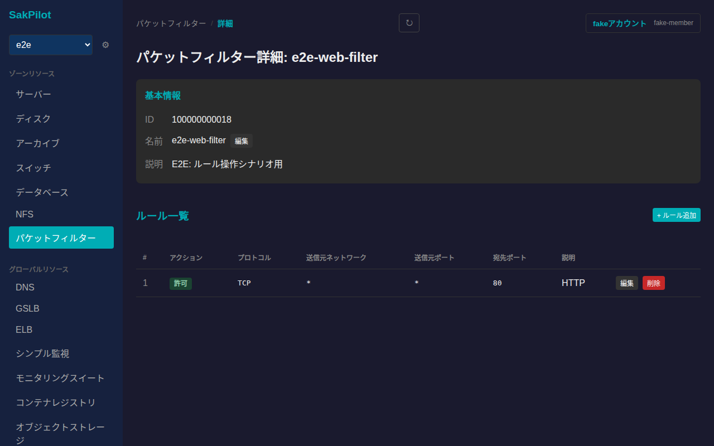
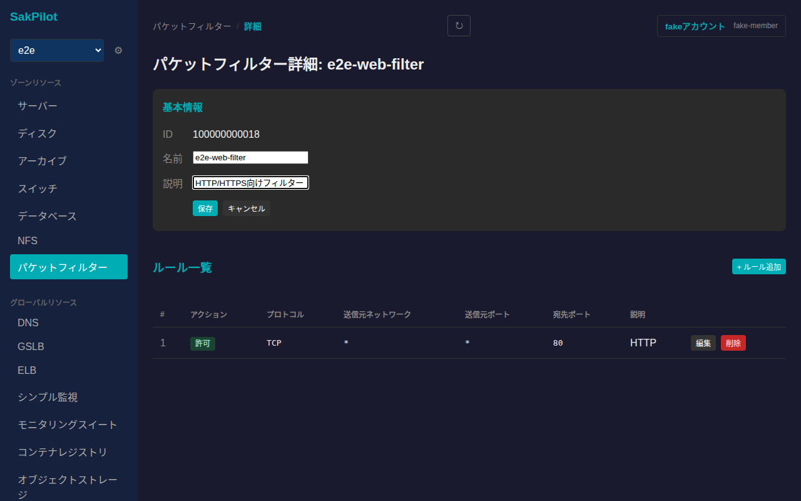
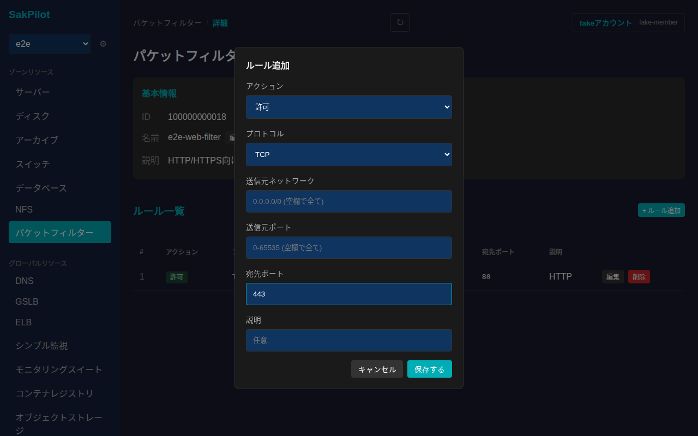
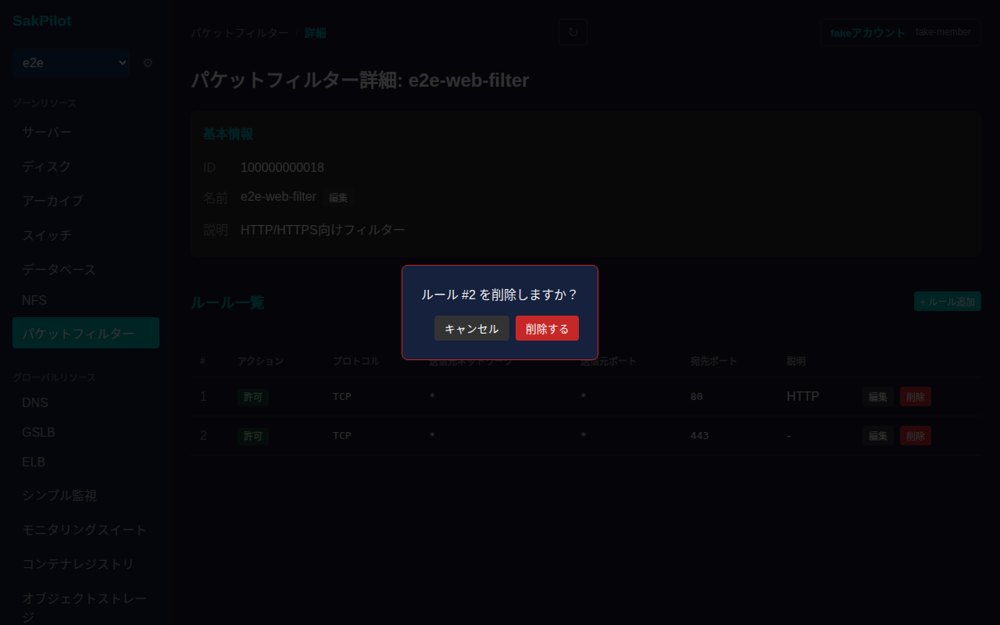
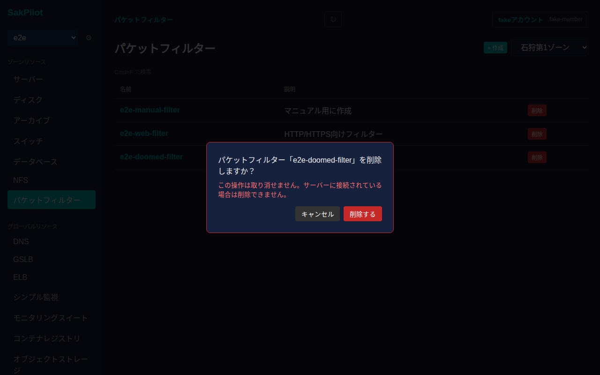

# パケットフィルター

さくらのクラウドのパケットフィルターを一覧・作成し、フィルタリングルール(送信元ネットワーク・ポート・プロトコル・アクション)を管理できます。

## 一覧画面

サイドバーの「パケットフィルター」から一覧に入ります。ゾーンごとにパケットフィルターが表示され、右上のゾーン切り替えで対象ゾーンを変更できます。テーブルには名前・説明が表示されます。

## 作成

一覧右上の「+ 作成」からモーダルを開きます。名前は必須、説明は任意です。作成直後はルールが1件もない状態になります。

入力後「作成する」を押すと一覧に反映されます。

## 詳細画面

一覧で行をクリックすると詳細画面に遷移します。基本情報(ID・名前・説明)に加えて、設定済みのルールがテーブルで表示されます。各ルールにはアクション(許可/拒否)・プロトコル(TCP/UDP/ICMP/IP)・送信元ネットワーク・送信元ポート・宛先ポート・説明が並びます。

### 名前・説明の編集

「基本情報」カードの「編集」から、名前・説明を編集できます。

値を入力してから「保存」を押すと反映されます。

### ルールの追加・編集・削除

「ルール一覧」右上の「+ ルール追加」から、アクション・プロトコル・送信元ネットワーク・送信元ポート・宛先ポート・説明を指定してルールを追加できます。各項目を空欄にすると「全て」を意味します。

既存ルールの「編集」ボタンからも同じフォームで内容を変更できます。「保存する」を押すとルール一覧に反映されます。

ルールの「削除」ボタンを押すと削除確認ダイアログが表示されます。

「削除する」を押すとそのルールのみが削除され、他のルールは残ります。

## 削除

一覧の「削除」ボタンからパケットフィルター自体の削除確認ダイアログが表示されます。取り消し不可であることと、サーバーに接続されている場合は削除できないことが明記されています。

「削除する」を押すとパケットフィルターが削除され、一覧から消えます。
