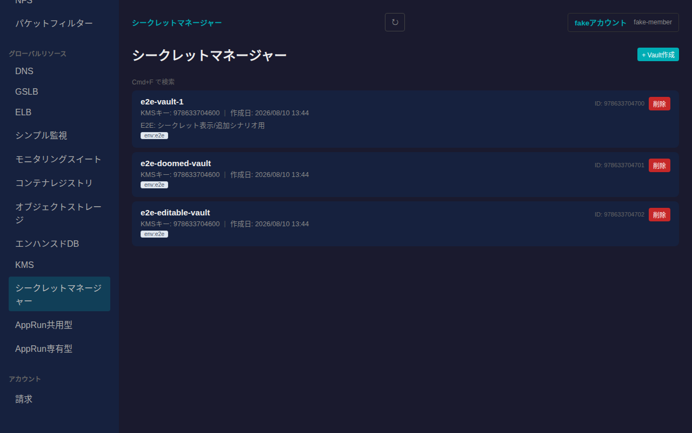
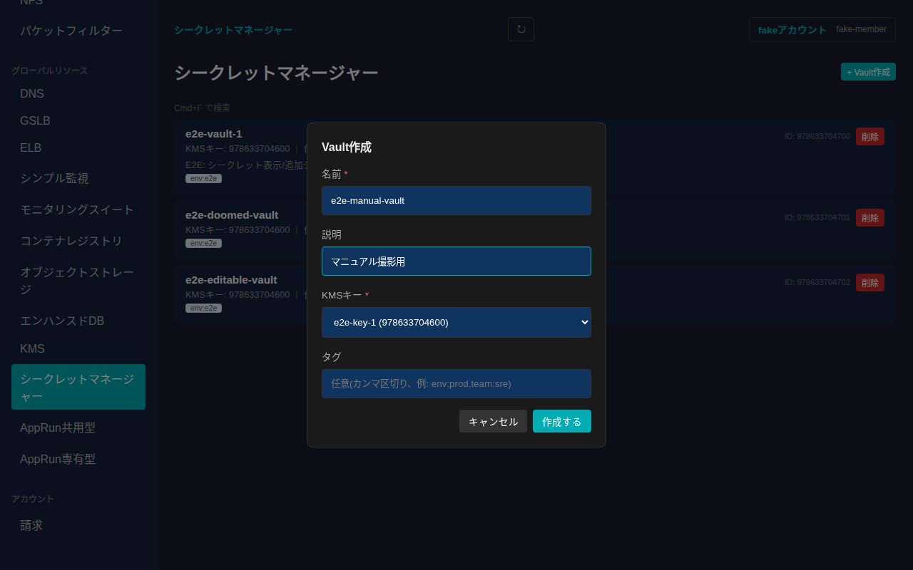
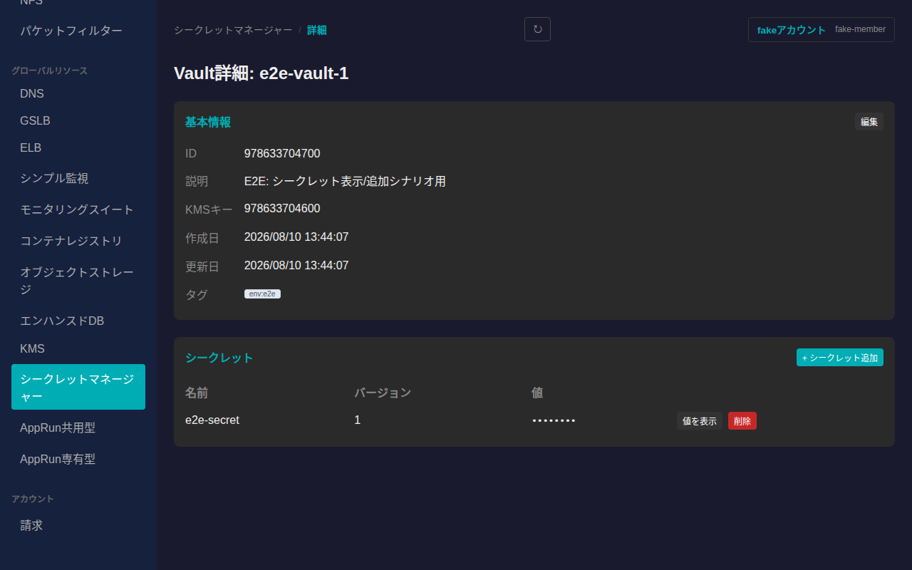
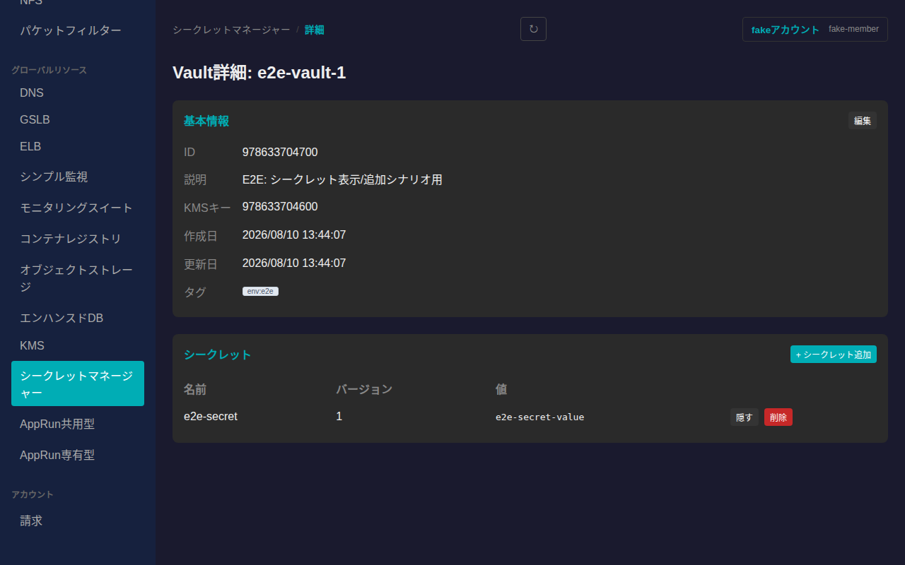
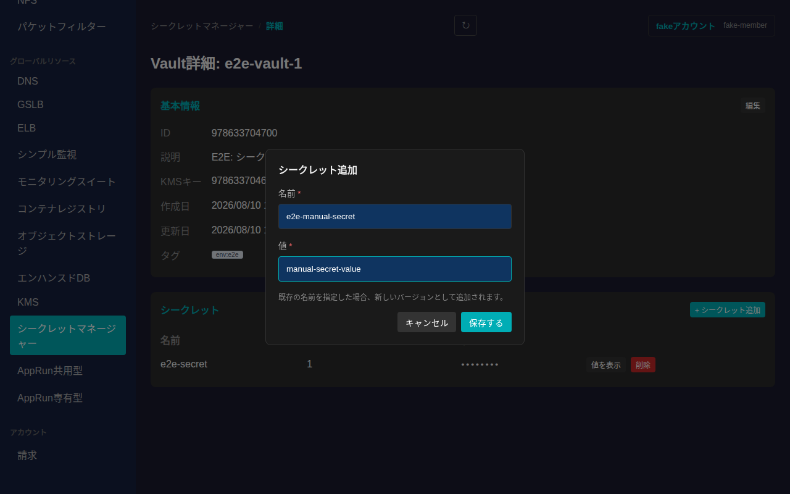
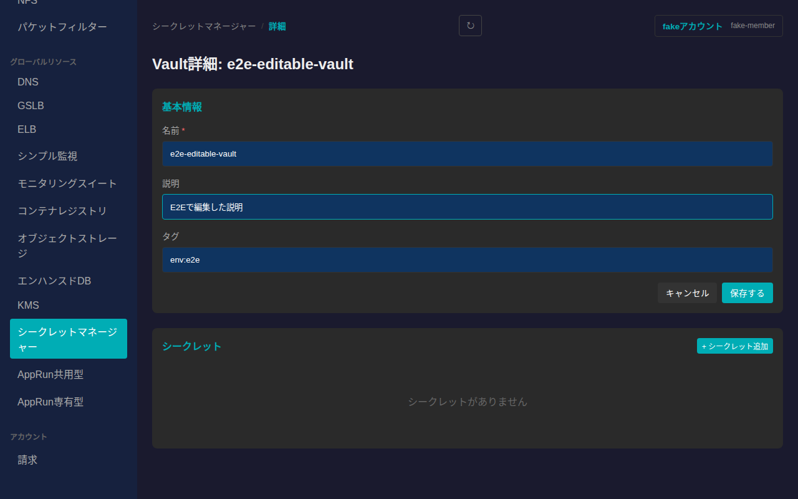
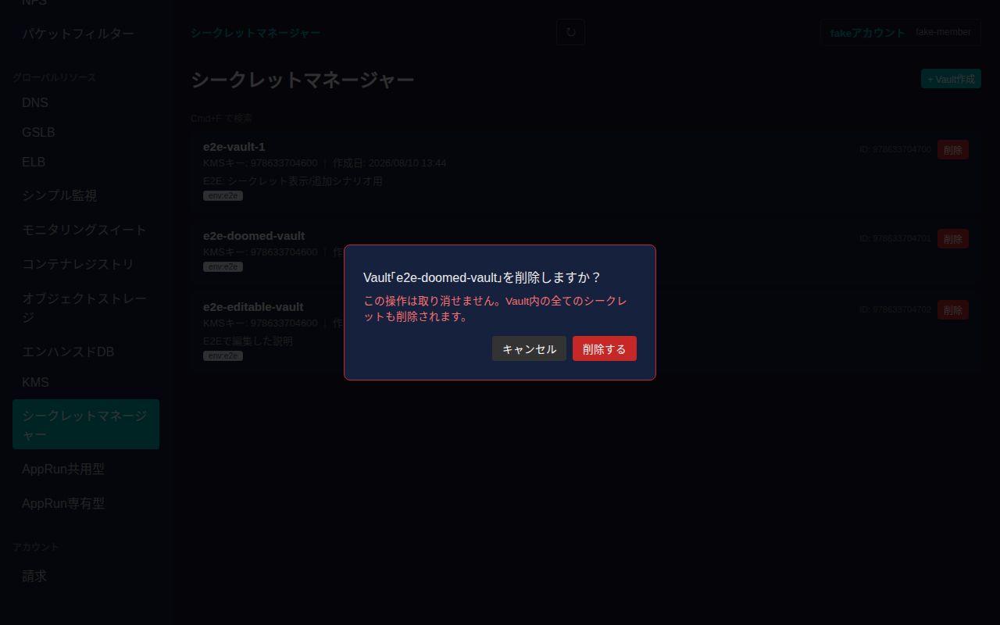

# シークレットマネージャー

さくらのクラウドのシークレットマネージャー(Vault/Secret)を一覧・作成・削除し、詳細画面から基本情報の編集、シークレットの追加・表示・削除ができます。

## 一覧画面

サイドバーの「グローバルリソース」内「シークレットマネージャー」から一覧に入ります。Vaultはゾーンに依存しないグローバルリソースです。一覧には各Vaultのカードが表示され、名前・暗号化に使うKMSキー・作成日・説明・タグが確認できます。

## 作成

一覧右上の「+ Vault作成」からVaultを新規作成できます。名前とKMSキーは必須項目です。KMSキーはすでに作成済みのKMSキーから選択します(KMSキーが1件も無い場合は先にKMSキーを作成する必要があります)。説明・タグは任意で指定できます。

「作成する」を押すと一覧に反映されます。

## 詳細画面

一覧でカードをクリックすると詳細画面に遷移します。基本情報(ID・説明・KMSキー・作成日・更新日・タグ)と、Vault内のシークレット一覧(名前・バージョン)が表示されます。値は初期状態では隠されています。

### シークレットの値を表示

シークレット行の「値を表示」を押すと、その場で値を取得して表示します(最新バージョンの値)。もう一度「隠す」を押すと非表示に戻せます。

### シークレットの追加

「+ シークレット追加」から名前と値を入力してシークレットを追加できます。既存の名前を指定した場合は新しいバージョンとして追加されます。

「保存する」を押すと一覧に反映されます。シークレットの削除は各行の「削除」ボタンから、確認ダイアログを経て行えます。

### 基本情報の編集

「基本情報」カードの「編集」から名前・説明・タグを編集できます(暗号化に使うKMSキーは作成後変更できません)。

値を入力してから「保存する」を押すと反映されます。

## 削除

一覧の各カードにある「削除」ボタンを押すと、取り消し不可である旨(Vault内の全てのシークレットも削除される旨)を明記した確認ダイアログが表示されます。

「削除する」を押すとVaultが削除され、一覧から消えます。
