# サーバー

さくらのクラウドの仮想サーバーを一覧・起動/停止・削除し、詳細画面からプラン変更・CD-ROM挿入・コンソール操作・VNC接続情報の取得ができます。

## 一覧画面

サイドバーの「サーバー」から一覧に入ります。ゾーンごとにサーバーが表示され、右上のゾーン切り替えで対象ゾーンを変更できます。カードには名前・ステータス(`up`/`down`)・スペック・IPアドレス・タグが表示されます。

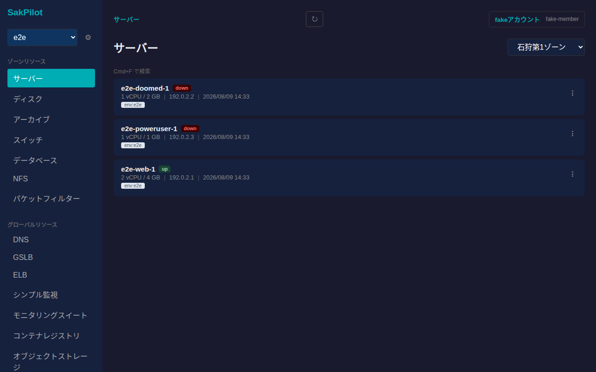

各カード右端の「⋮」から起動・停止・再起動・削除の操作メニューが開きます。ステータスに応じて選択できない操作は無効化されます(起動中のサーバーは「起動」を選べない、など)。

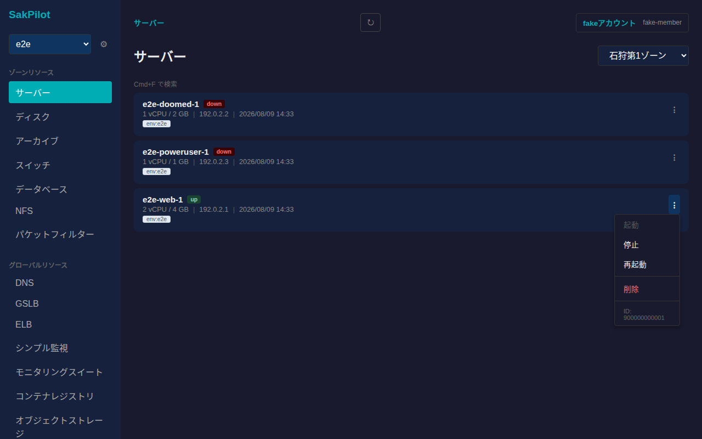

## 起動・停止・再起動

操作メニューから「停止」を選ぶと確認ダイアログが表示されます。破壊的ではない操作ですが、意図しない停止を防ぐため必ず確認を経由します。

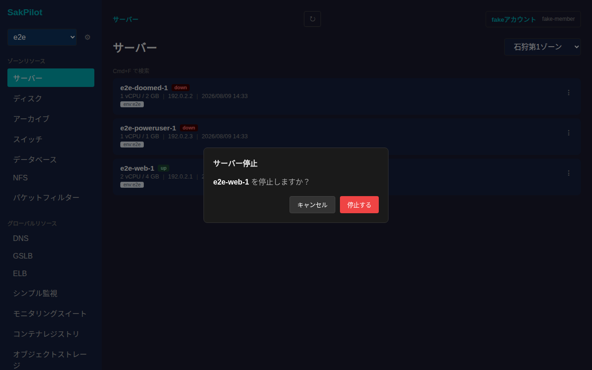

「停止する」を押すと電源操作がリクエストされ、以降はポーリングでステータスが自動更新されます(`down`になるまで数秒かかることがあります)。起動・再起動も同様の確認ダイアログ経由で行います。

## 詳細画面

一覧でカードをクリックすると詳細画面に遷移します。基本情報(ID・説明・ステータス・IPアドレス・タグ・作成日)に加えて、プラン・CD-ROM・コンソール操作・VNC接続情報の各カードが並びます。

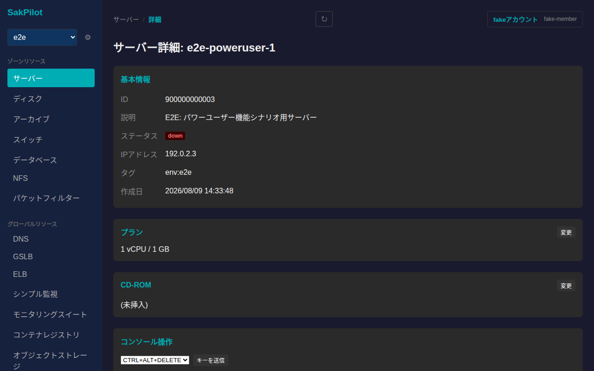

### プラン変更

「プラン」カードの「変更」からCPU/メモリを編集できます。フォームが開いたら数値を入力し、

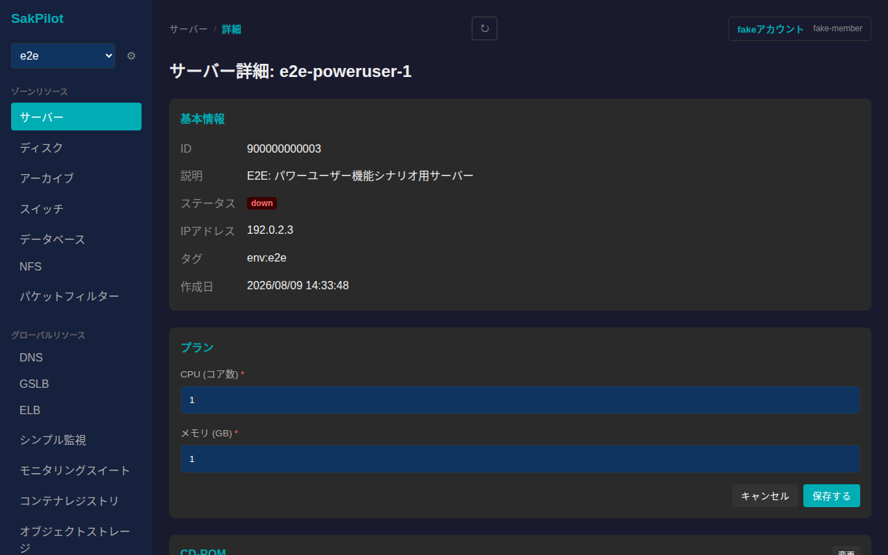

vCPU・メモリを入力してから「保存する」を押します。

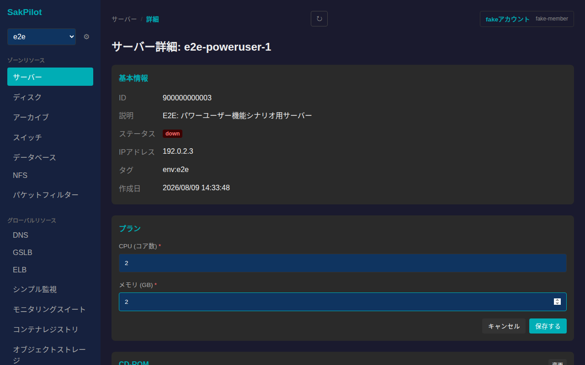

### CD-ROM挿入・排出

「CD-ROM」カードの「変更」から挿入するISOイメージを選択できます。

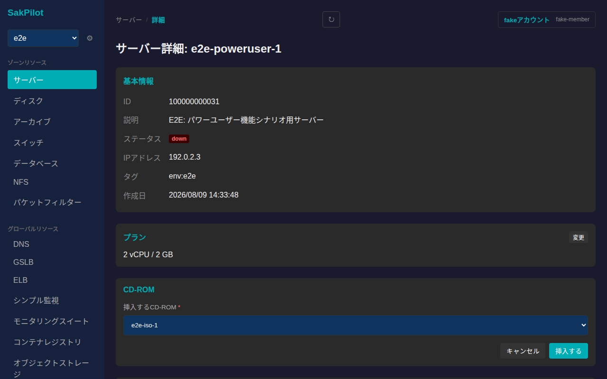

「挿入する」を押すと反映されます。挿入済みのCD-ROMは同じ「変更」ボタンから「排出する」で取り外せます。

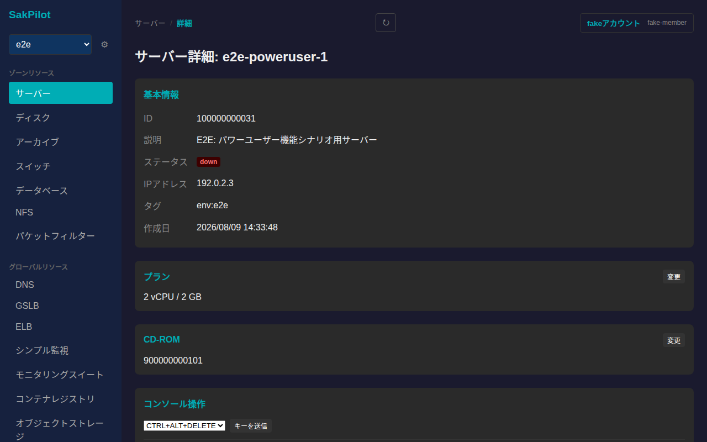

### コンソール操作(キー送信・NMI)

「コンソール操作」カードでは、CTRL+ALT+DELETE等のキーコンビネーションを送信できるほか、「NMIを送信」からNMI(ノンマスカブル割り込み)を送れます。

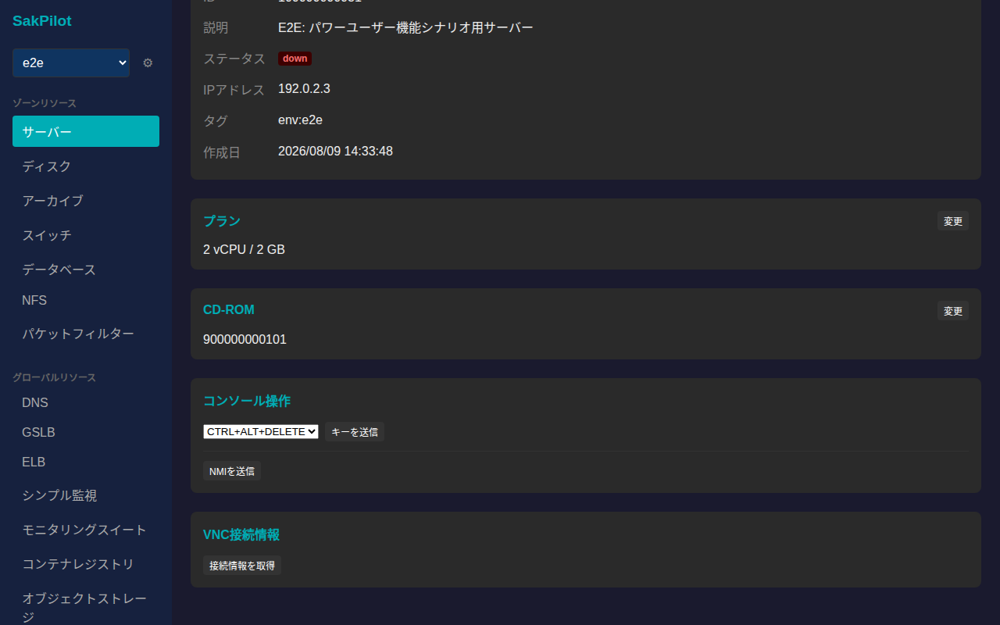

NMIはカーネルパニックを誘発する可能性がある操作のため、実行前に警告付きの確認ダイアログが挟まります。

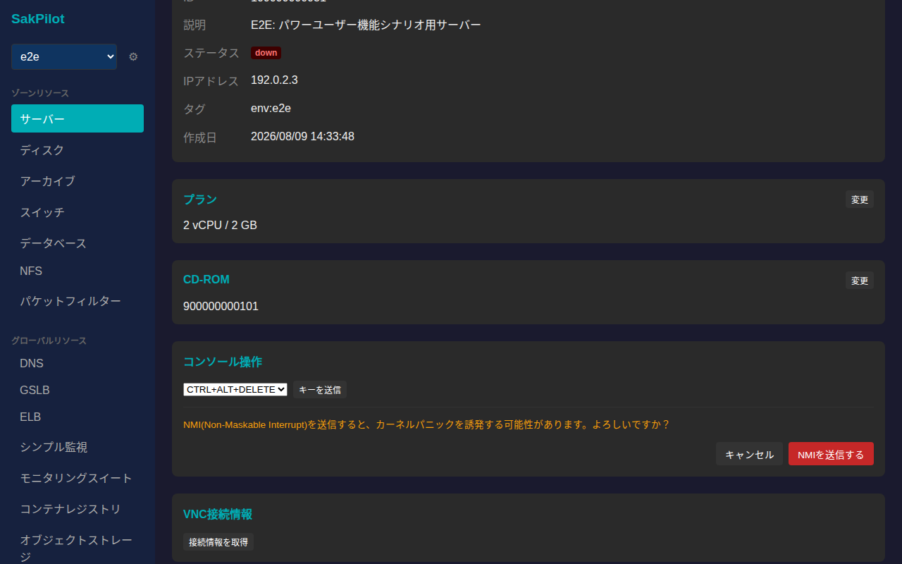

### VNC接続情報の取得

「VNC接続情報」カードの「接続情報を取得」を押すと、VNC接続先ホスト・ポート・パスワードが表示されます。

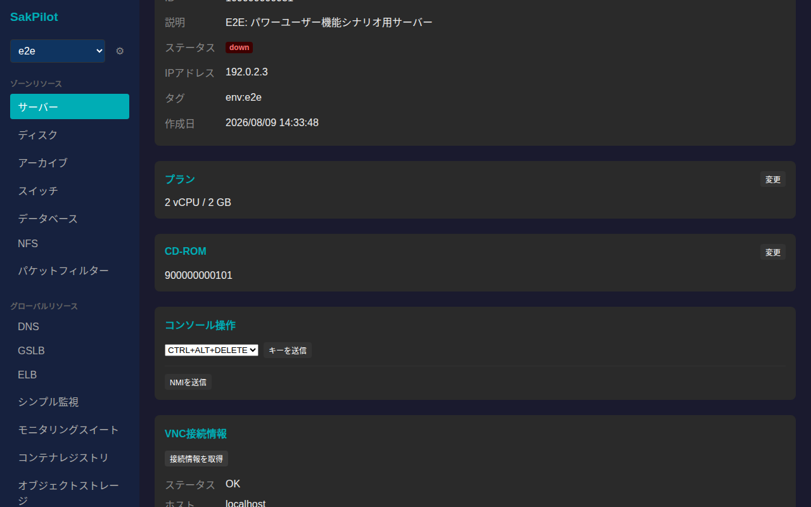

## 削除

一覧の操作メニューから「削除」を選ぶと、取り消し不可である旨を明記した確認ダイアログが表示されます。

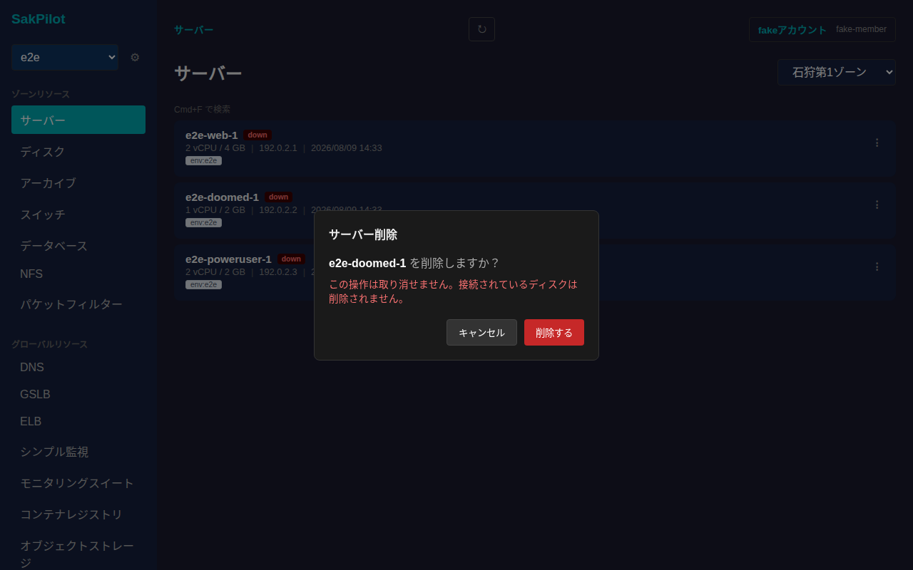

「削除する」を押すとサーバーが削除され、一覧から消えます。ディスクが接続されている場合の挙動等、詳細な削除条件はさくらのクラウドAPI側の仕様に従います。
