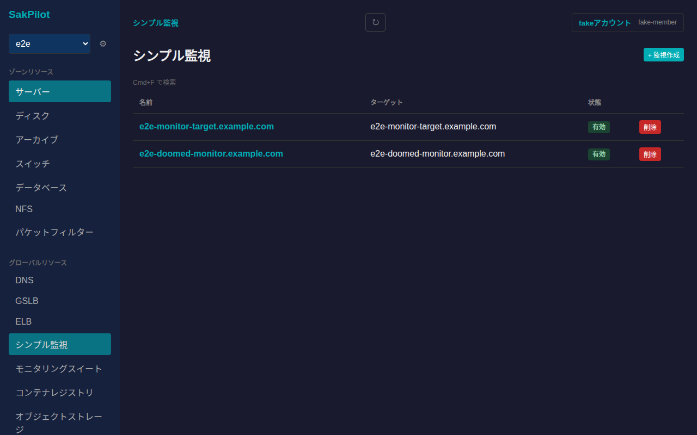
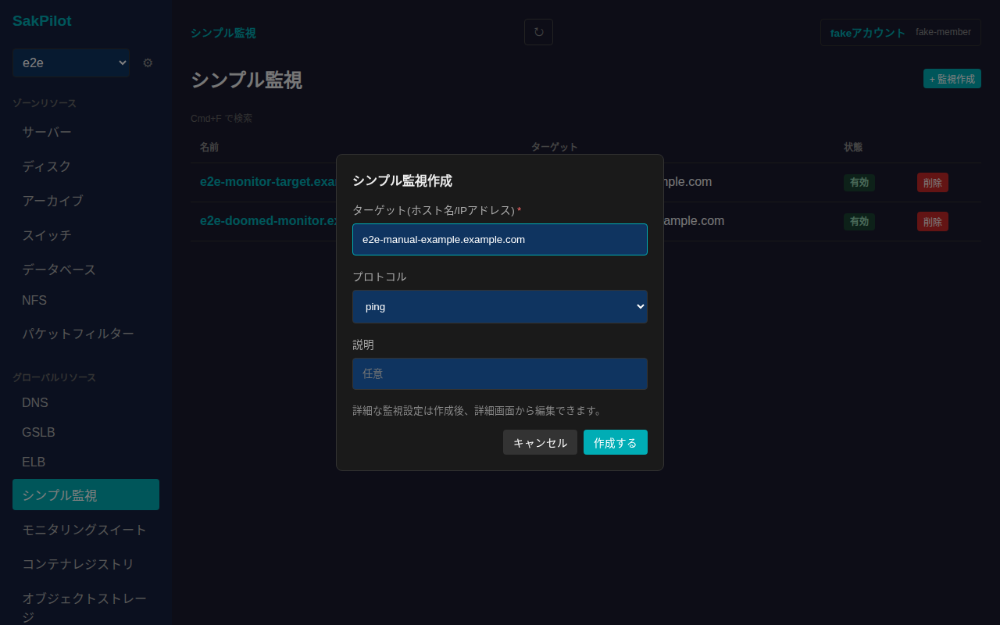
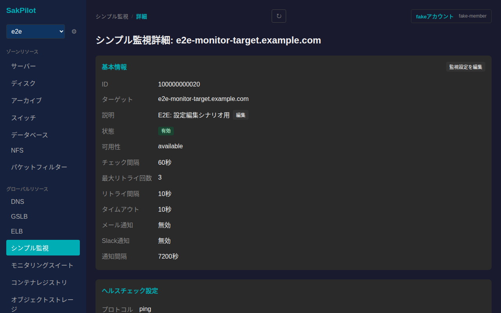
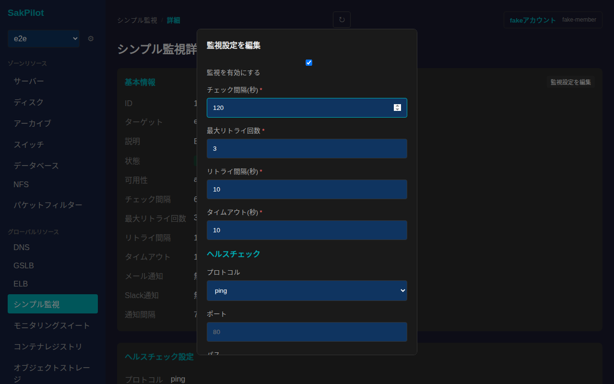
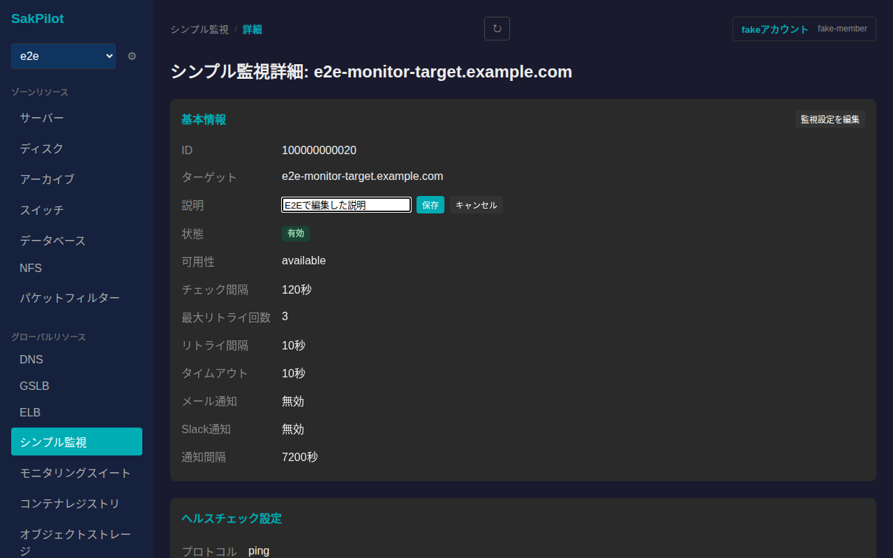
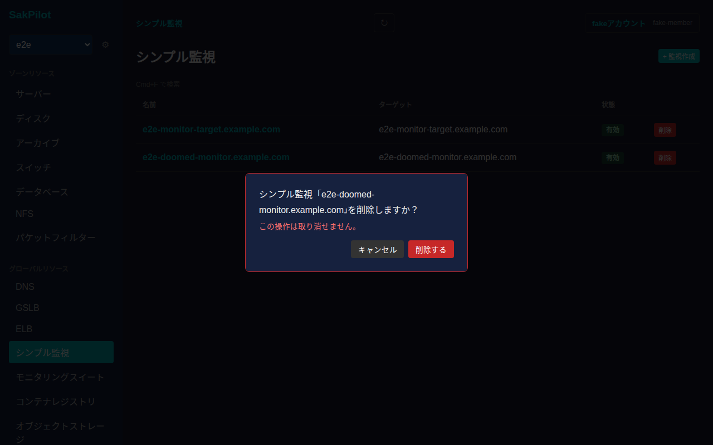

# シンプル監視

さくらのクラウドのシンプル監視を一覧・作成・削除し、詳細画面から説明の編集、監視設定(チェック間隔・リトライ・タイムアウト・通知・ヘルスチェック)の編集ができます。シンプル監視はゾーンに依存しないグローバルリソースです。

## 一覧画面

サイドバーの「グローバルリソース」内「シンプル監視」から一覧に入ります。一覧には名前(ターゲットと同じ)・ターゲット・状態(有効/無効)が表示されます。

## 作成

一覧右上の「+ 監視作成」からシンプル監視を新規作成できます。ターゲット(ホスト名/IPアドレス)は必須項目です。プロトコル・説明は任意で指定できます。

詳細な監視設定は作成後、詳細画面から編集できます。「作成する」を押すと一覧に反映されます。

## 詳細画面

一覧で名前をクリックすると詳細画面に遷移します。基本情報(ID・ターゲット・説明・状態・可用性・チェック間隔・最大リトライ回数・リトライ間隔・タイムアウト・メール通知/Slack通知・通知間隔)に加えて、ヘルスチェック設定のカードが表示されます。

### 監視設定の編集

「基本情報」カードの「監視設定を編集」から、監視の有効/無効・チェック間隔・最大リトライ回数・リトライ間隔・タイムアウト・ヘルスチェック(プロトコル/ポート等)をまとめて編集できます。

値を入力してから「保存する」を押すと反映されます。

### 説明の編集

「説明」の横にある「編集」から説明を編集できます。

値を入力してから「保存」を押すと反映されます。

## 削除

一覧の各行にある「削除」ボタンを押すと、取り消し不可である旨を明記した確認ダイアログが表示されます。

「削除する」を押すとシンプル監視が削除され、一覧から消えます。
