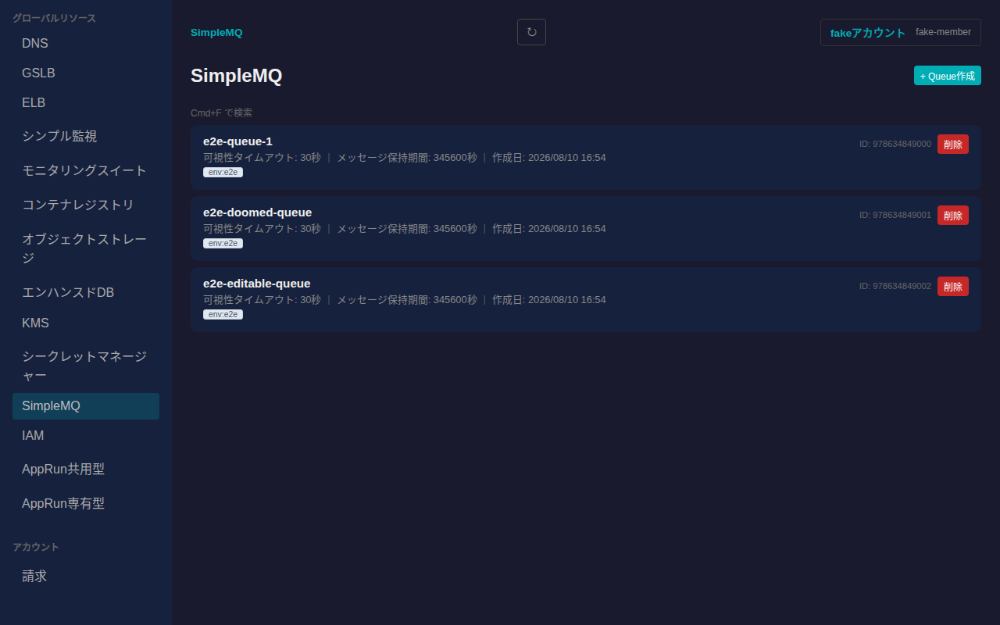
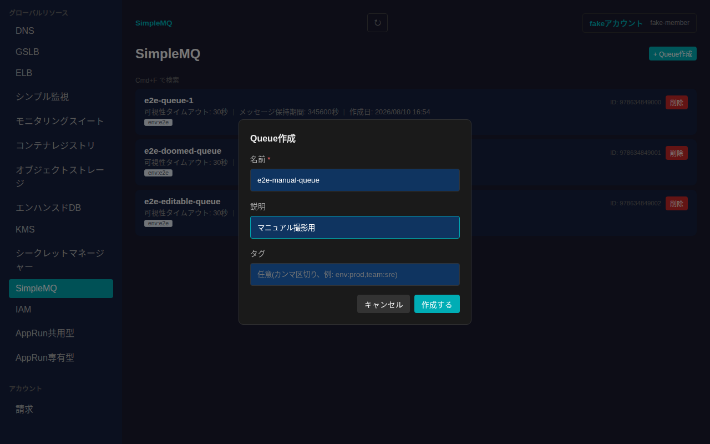
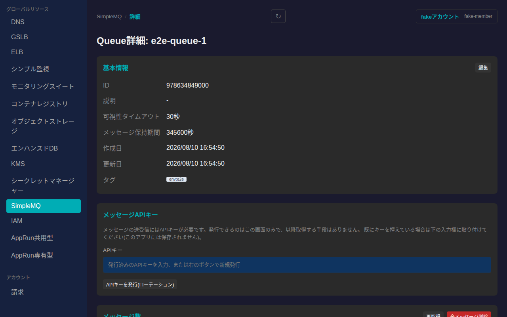
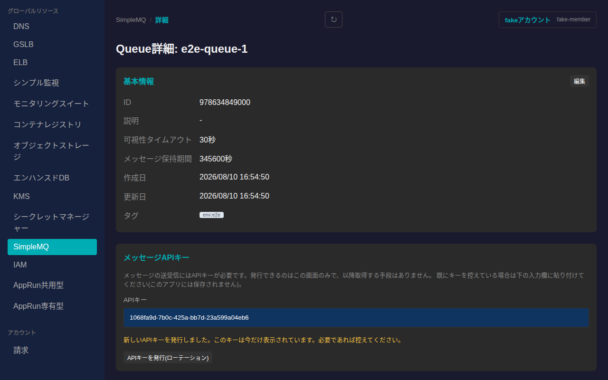
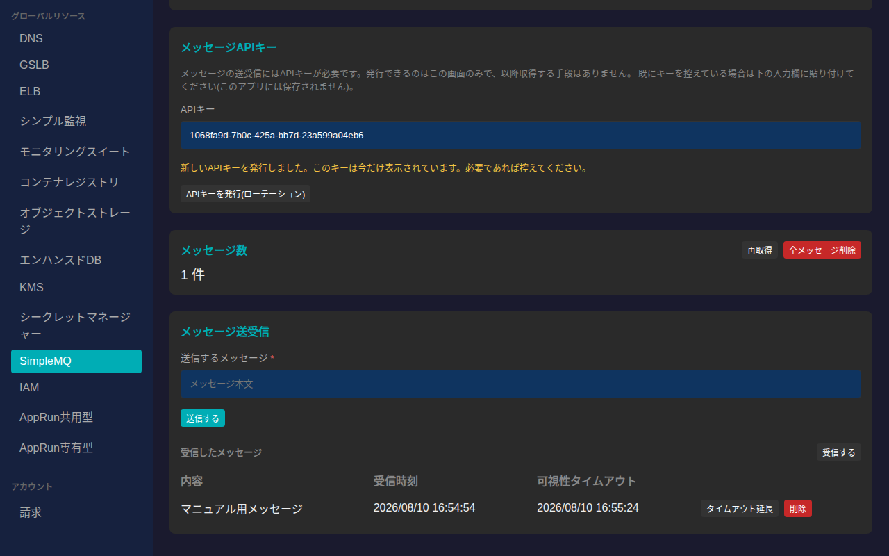
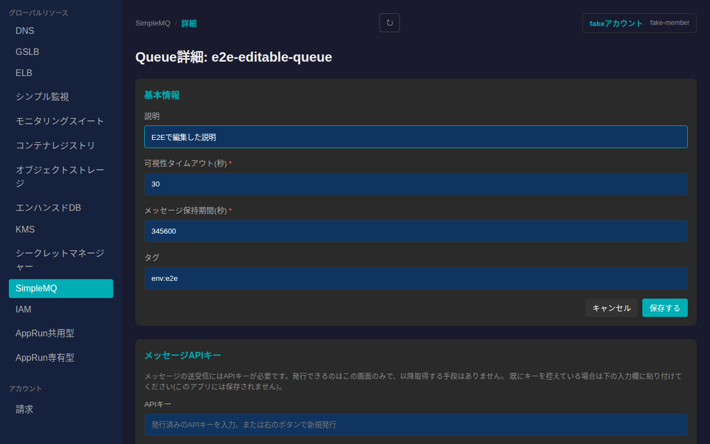
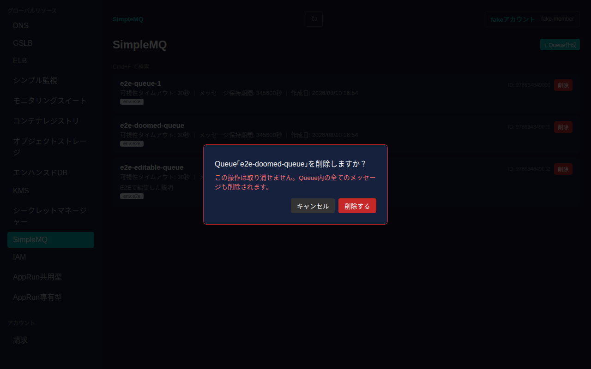

# SimpleMQ

さくらのクラウドのSimpleMQ(メッセージキューサービス)のQueueを一覧・作成・削除し、詳細画面から基本情報の編集、メッセージの送受信・全削除ができます。

## 一覧画面

サイドバーの「グローバルリソース」内「SimpleMQ」から一覧に入ります。Queueはゾーンに依存しないグローバルリソースです。一覧には各Queueのカードが表示され、名前・可視性タイムアウト・メッセージ保持期間・作成日・説明・タグが確認できます。

## 作成

一覧右上の「+ Queue作成」からQueueを新規作成できます。名前は必須項目で、半角英数字とハイフンのみ(5〜64文字、ハイフンの連続不可)という制約があります。説明・タグは任意で指定できます。

「作成する」を押すと一覧に反映されます。

## 詳細画面

一覧でカードをクリックすると詳細画面に遷移します。基本情報(ID・説明・可視性タイムアウト・メッセージ保持期間・作成日・更新日・タグ)が表示され、「編集」から変更できます。

### メッセージAPIキーの発行

メッセージの送受信には専用のAPIキーが必要です。「APIキーを発行(ローテーション)」を押すと新しいキーが発行され、その場に表示されます。**このキーは発行直後のみ表示され、以降取得する手段はありません。** 既に控えているキーがある場合は、入力欄に直接貼り付けて使うこともできます(このアプリ内には保存されません)。

### メッセージの送受信

APIキーを発行または入力すると、メッセージの送信・受信フォームが有効になります。「送信する」でメッセージを送信し、「受信する」でQueueからメッセージを受信(dequeue)します。受信したメッセージは一覧表示され、各行から「タイムアウト延長」(可視性タイムアウトの延長)・「削除」(処理済みメッセージの削除)を行えます。

「メッセージ数」カードの「全メッセージ削除」から、Queue内の全メッセージを一括削除することもできます(確認ダイアログあり)。

### 基本情報の編集

「基本情報」カードの「編集」から説明・可視性タイムアウト・メッセージ保持期間・タグを編集できます。

値を入力してから「保存する」を押すと反映されます。

## 削除

一覧の各カードにある「削除」ボタンを押すと、取り消し不可である旨(Queue内の全てのメッセージも削除される旨)を明記した確認ダイアログが表示されます。

「削除する」を押すとQueueが削除され、一覧から消えます。
