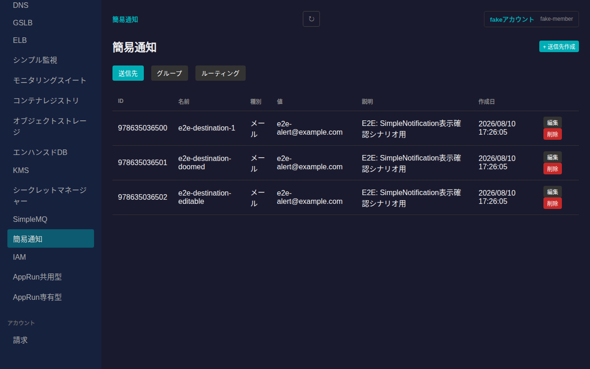
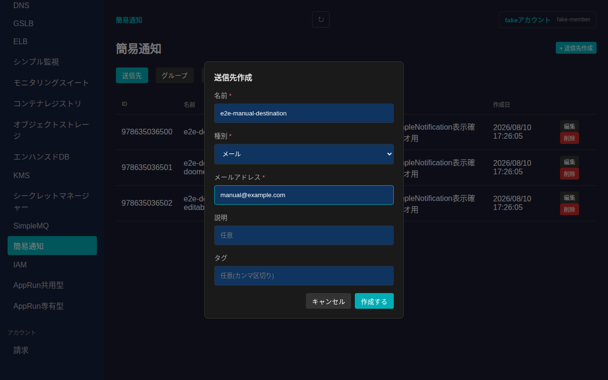
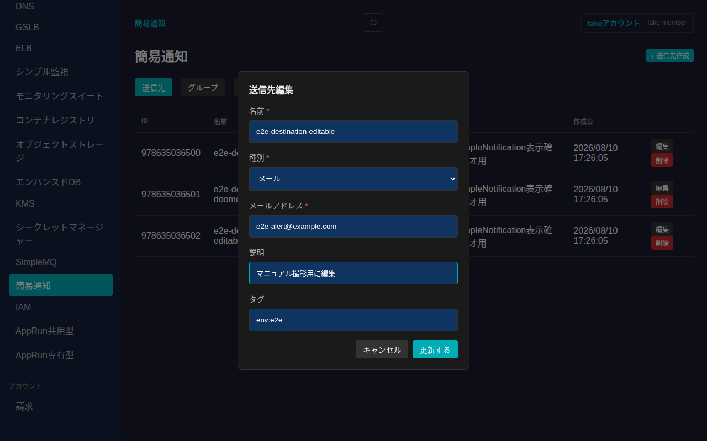
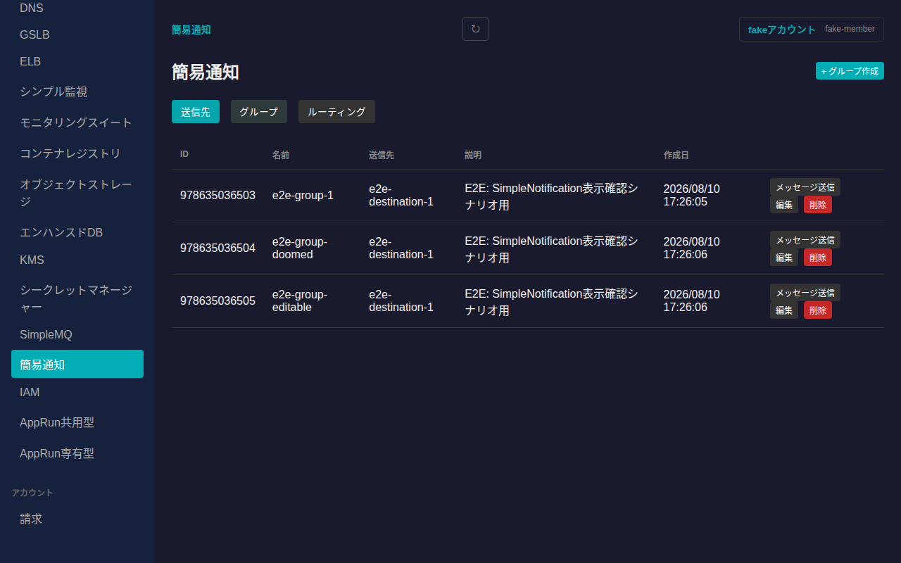
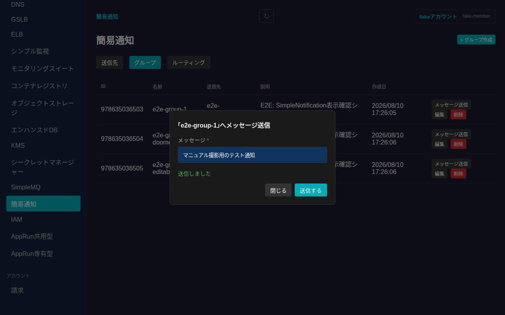
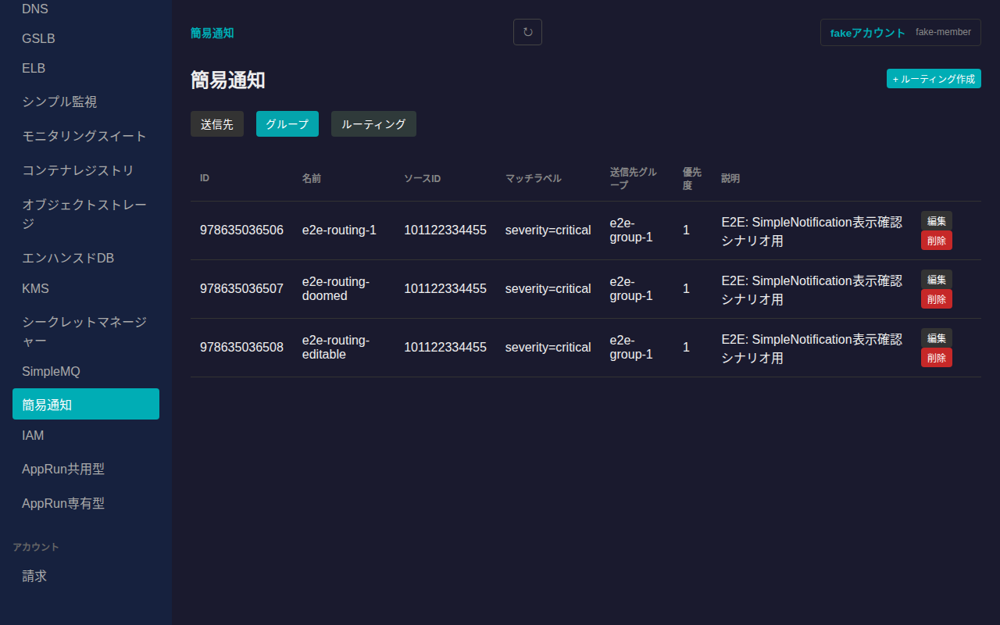
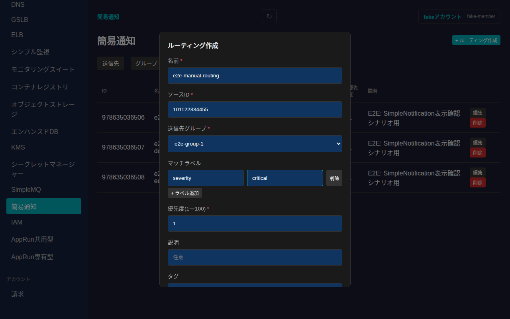
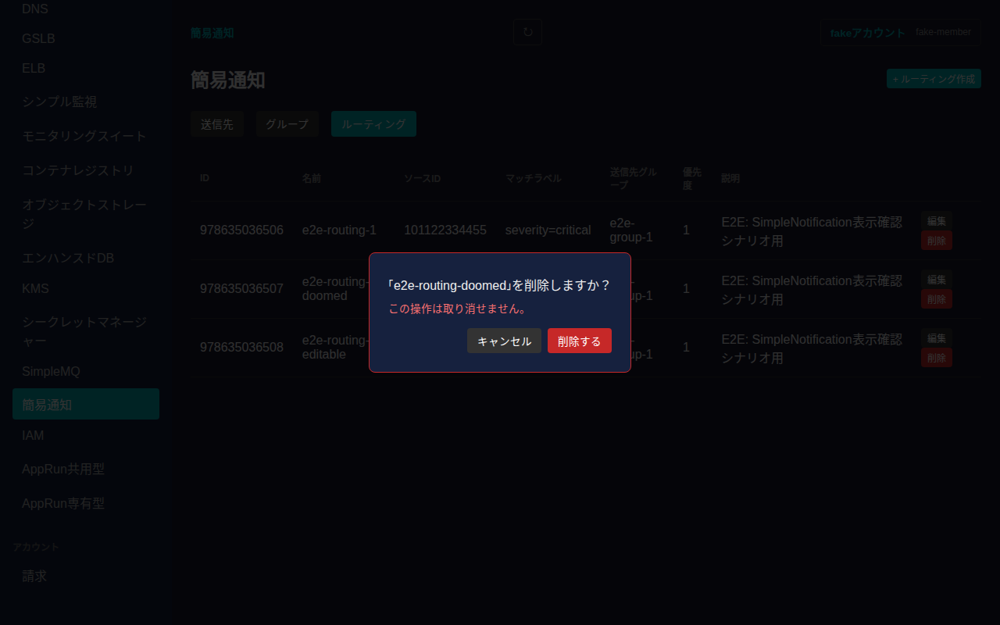

# 簡易通知(Simple Notification)

さくらのクラウドの簡易通知(Simple Notification)サービスの送信先(Destination)・グループ(Group)・ルーティング(Routing)を管理できます。サーバー監視等のアラートを、メールやWebhookに転送する仕組みです。

## 全体像

- **送信先(Destination)**: 通知の送り先そのもの(メールアドレスまたはWebhook URL)
- **グループ(Group)**: 1つ以上の送信先をまとめたもの。通知はグループ単位で送信される
- **ルーティング(Routing)**: どの発生源(ソースID)からの通知を、どのラベル条件でどのグループへ振り分けるかの設定

いずれもゾーンに依存しないグローバルリソースで、サイドバーの「グローバルリソース」内「簡易通知」から一覧に入り、タブで切り替えます。

## 送信先(Destination)

一覧には各送信先の名前・種別(メール/Webhook)・値・説明・作成日が表示されます。

「+ 送信先作成」から新規作成できます。名前・種別・値(メールアドレスまたはWebhook URL)が必須です。

各行の「編集」から名前・種別・値・説明・タグを変更できます。

## グループ(Group)

一覧には各グループの名前・所属する送信先・説明・作成日が表示されます。

「+ グループ作成」から、既存の送信先をチェックボックスで選んでグループを作成できます。「編集」から所属送信先の変更も可能です。

### テストメッセージの送信

各行の「メッセージ送信」から、グループ宛にテスト通知を即時送信できます。

## ルーティング(Routing)

一覧には各ルーティングのソースID・マッチラベル・送信先グループ・優先度・説明が表示されます。

「+ ルーティング作成」から、ソースID・送信先グループ・マッチラベル(キーと値の組を複数追加可能)・優先度を指定して作成できます。

> ソースIDは通知の発生源となるリソースのIDです。現時点のSakPilotではソース一覧の取得APIに未対応のため、数値IDを直接入力する形式になっています。

## 削除

送信先・グループ・ルーティングいずれも、各行の「削除」ボタンから削除できます。取り消し不可である旨を明記した確認ダイアログが表示されます。

「削除する」を押すと削除され、一覧から消えます。

## 未対応の機能

以下はさくらのクラウドAPI自体には存在しますが、開発・テストに使っているモックサーバー(sakumock)が現時点で未対応のため、SakPilotでも未実装です。

- 通知履歴(History)の一覧・詳細表示
- ルーティングのソース一覧取得(ソースIDの選択UI)
- ルーティングの並び替え(Reorder)
- 送信先/グループの有効性ステータス確認(GetStatus)
