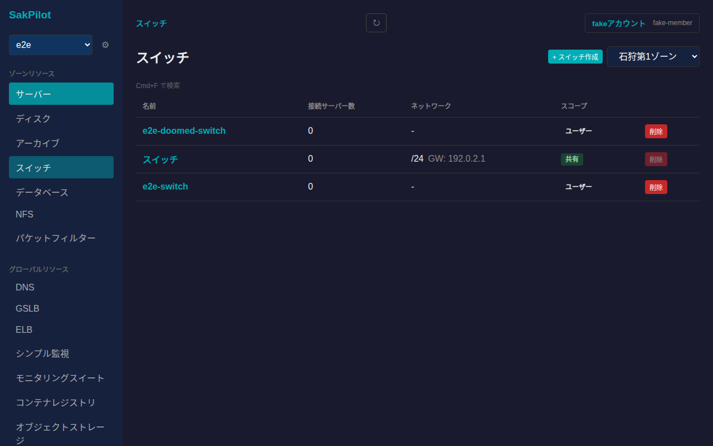
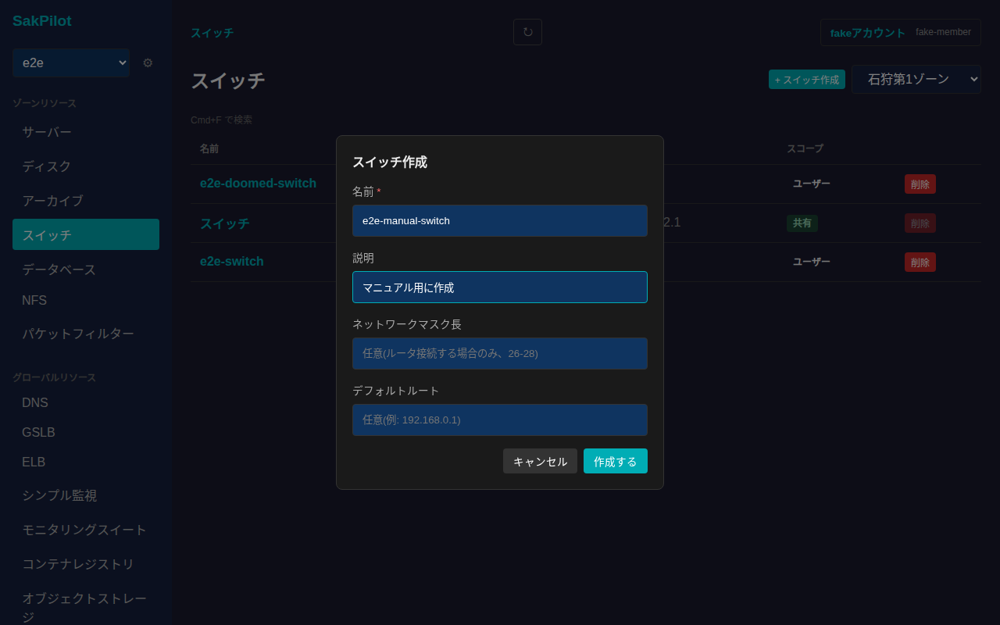
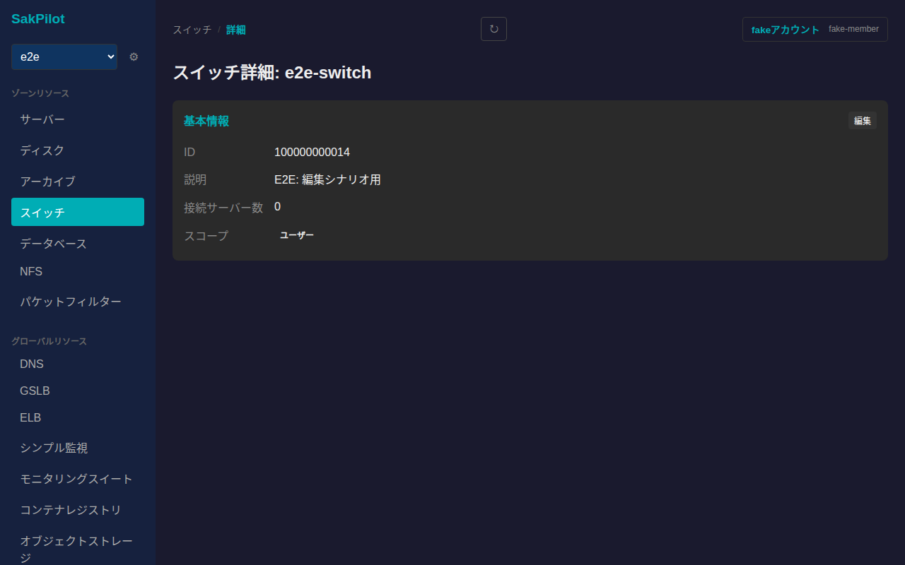
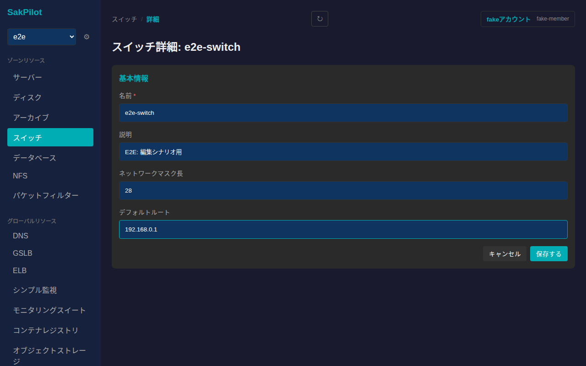
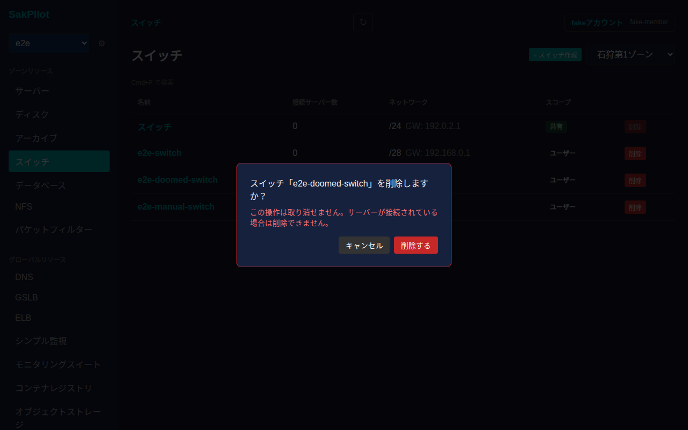

# スイッチ

さくらのクラウドのスイッチを一覧・作成・編集・削除し、接続サーバー数やネットワーク設定(マスク長・デフォルトルート)を確認できます。

## 一覧画面

サイドバーの「スイッチ」から一覧に入ります。ゾーンごとにスイッチが表示され、右上のゾーン切り替えで対象ゾーンを変更できます。テーブルには名前・接続サーバー数・ネットワーク(マスク長とデフォルトルート)・スコープが表示されます。

スコープが「共有」のスイッチ(ルータに紐づくデフォルトスイッチなど)は削除できません。該当行の「削除」ボタンは無効化されており、ホバーすると「共有スイッチは削除できません」と表示されます。

## 作成

一覧右上の「+ スイッチ作成」からモーダルを開きます。名前は必須、説明・ネットワークマスク長(ルータに接続する場合のみ、26〜28)・デフォルトルートは任意です。

入力後「作成する」を押すと一覧に反映されます。

## 詳細画面

一覧で行をクリックすると詳細画面に遷移します。基本情報(ID・説明・接続サーバー数・スコープ)に加えて、ネットワークマスク長が設定されている場合は「ネットワーク設定」カード、サブネットが割り当てられている場合は「サブネット」テーブルが表示されます。

### 名前・説明・ネットワーク設定の編集

「基本情報」カードの「編集」から、名前・説明・ネットワークマスク長・デフォルトルートを編集できます。

値を入力してから「保存する」を押すと反映されます。

## 削除

一覧の「削除」ボタンから削除確認ダイアログが表示されます。取り消し不可であることと、サーバーが接続されている場合は削除できないことが明記されています。

「削除する」を押すとスイッチが削除され、一覧から消えます。
