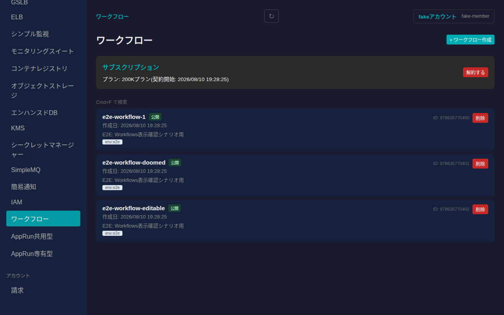
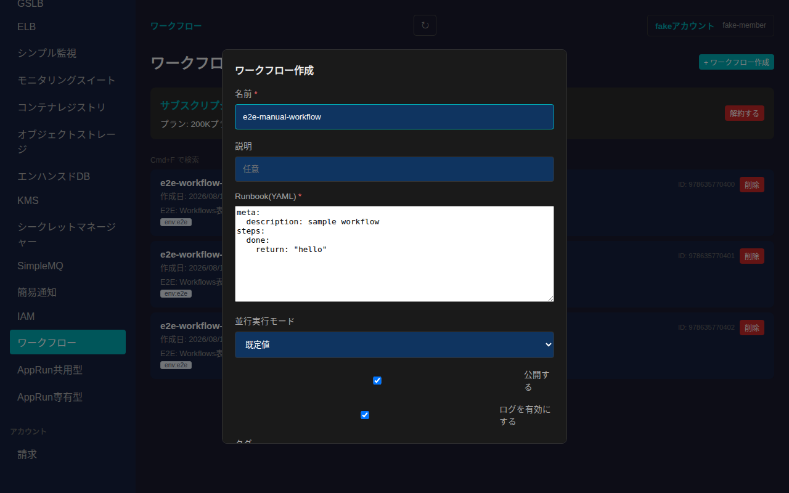
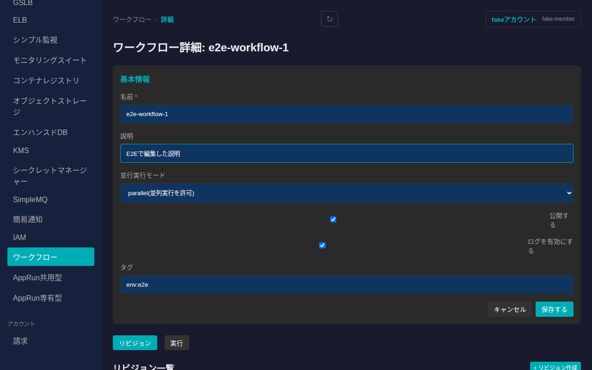
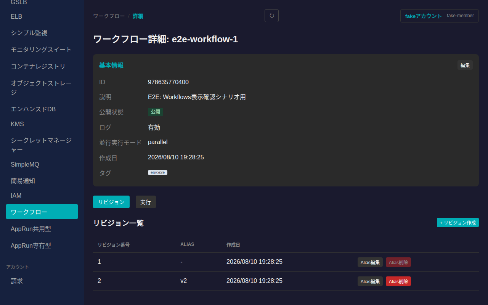
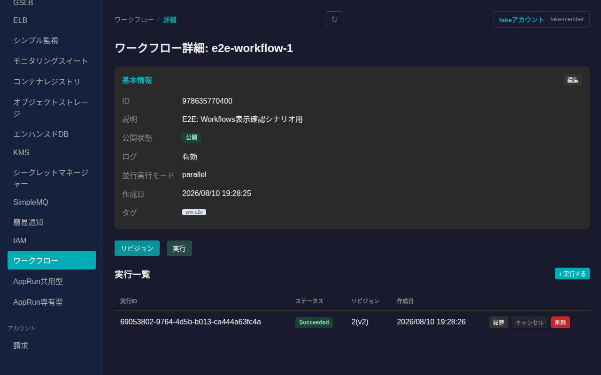
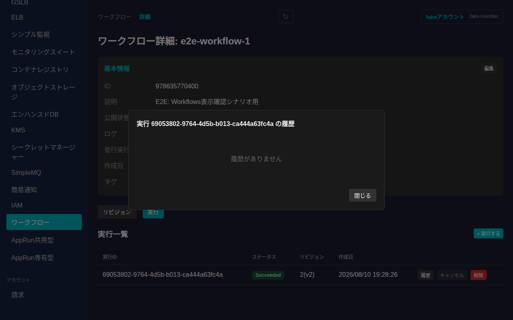
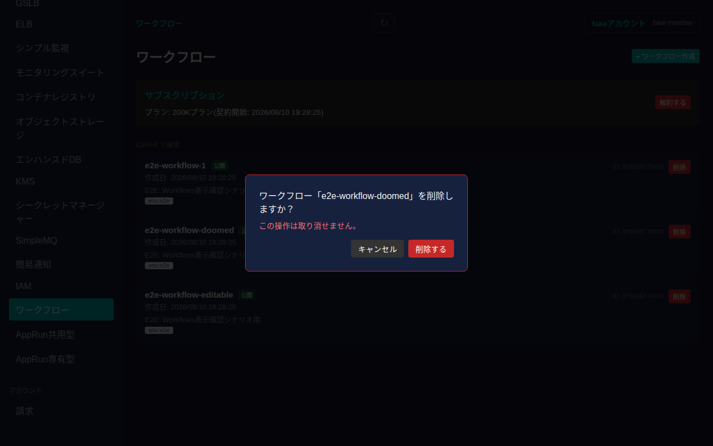

# ワークフロー

さくらのクラウドのWorkflows(YAML DSLによる宣言的ワークフロー実行サービス)を一覧・作成・削除し、詳細画面からリビジョン管理・実行ができます。ワークフローの作成・実行にはサブスクリプション(プラン契約)が必要です。

## 一覧画面

サイドバーの「グローバルリソース」内「ワークフロー」から一覧に入ります。上部にサブスクリプションの契約状況(プラン名・契約開始日、または未契約であることと「契約する」ボタン)が表示され、その下にワークフローのカード一覧(名前・公開状態・作成日・説明・タグ)が並びます。未契約の場合は「+ ワークフロー作成」ボタンが無効化されます。

## サブスクリプション契約

未契約時に「契約する」を押すと、利用可能なプラン(月額料金・含まれるステップ数を表示)を選択して契約できます。契約済みの場合は「解約する」から解約できます(解約するとワークフローの実行ができなくなります)。

## 作成

一覧右上の「+ ワークフロー作成」からワークフローを新規作成できます。名前とRunbook(YAML DSLで記述する実行ステップ定義)が必須項目です。説明・並行実行モード(parallel/lock/queue)・公開設定・ログ設定・タグは任意で指定できます。

「作成する」を押すと一覧に反映されます。

## 詳細画面

一覧でカードをクリックすると詳細画面に遷移します。基本情報(ID・説明・公開状態・ログ設定・並行実行モード・作成日・タグ)が表示され、「編集」から名前・説明・公開設定・ログ設定・並行実行モード・タグを変更できます。

### リビジョン

「リビジョン」タブでは、ワークフローに紐づくRunbookの各バージョン(リビジョン番号・Alias・作成日)を確認できます。「+ リビジョン作成」から新しいRunbookを投入してリビジョンを追加できます。各リビジョンのAliasは「Alias編集」から変更、「Alias削除」から削除できます。

### 実行

「実行」タブでは、ワークフローの実行履歴(実行ID・ステータス・対象リビジョン・作成日)を確認できます。「+ 実行する」から対象リビジョン(未指定時は最新リビジョン)・Args(JSON)・実行名を指定して新規実行を開始できます。実行中(Queued/Running)の実行は「キャンセル」できます。「削除」で実行記録を削除できます。

各実行の「履歴」ボタンから、ステップ単位のイベント履歴(種別・時刻・Meta情報)をモーダルで確認できます。

## 削除

一覧の各カードにある「削除」ボタンを押すと確認ダイアログが表示されます。

「削除する」を押すとワークフローが削除され、一覧から消えます。

## 未対応の機能

- `ListSuggest`(ワークフロー名のオートコンプリート検索)は管理UIの通常操作に不要な補助APIのため対象外としています。
- サービスプリンシパルを使ったワークフロー実行権限の紐付け(`ServicePrincipalId`)は、IAMのサービスプリンシパル管理機能と合わせて別途検討する想定で今回は作成フォームに含めていません。
